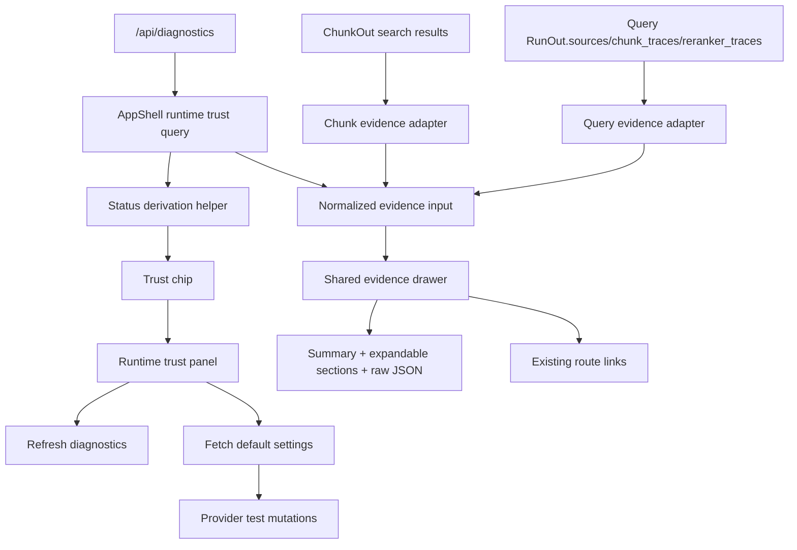

# Phase 6: App Evidence Viewer and Runtime Trust Banner - Research

**Researched:** 2026-05-16
**Domain:** React Studio UI, diagnostics polling, modal/drawer accessibility, evidence normalization
**Confidence:** HIGH

## User Constraints

### Locked Requirements

- [VERIFIED: 06-SPEC.md] App shell runtime trust chip derived from diagnostics.
- [VERIFIED: 06-SPEC.md] Auto-polling diagnostics for shell status.
- [VERIFIED: 06-SPEC.md] Runtime trust detail panel with grouped health sections.
- [VERIFIED: 06-SPEC.md] Manual actions for refresh, Diagnostics navigation, and LLM/embedding/reranker/MinerU provider tests.
- [VERIFIED: 06-SPEC.md] Evidence viewer opened from Query sources and Chunk Inspector rows.
- [VERIFIED: 06-SPEC.md] Human-readable evidence sections for chunk text, source location, metadata, parser warnings, quality status, reranker context, graph neighbors, and raw JSON fallback.
- [VERIFIED: 06-SPEC.md] Links from the viewer to existing Documents, Chunks, Query, Graph, and Diagnostics surfaces.
- [VERIFIED: 06-SPEC.md] Frontend tests for status states, panel actions, evidence entry points, and accessibility-critical interactions.

### Locked Implementation Decisions

- [VERIFIED: 06-CONTEXT.md] Trust chip priority ladder: `Blocked` > `Provider issue` > `Indexing` > `Graph pending` > `Degraded` > `Ready`.
- [VERIFIED: 06-CONTEXT.md] Chip is compact and color-coded.
- [VERIFIED: 06-CONTEXT.md] Diagnostics load failure shows `Blocked` with `Diagnostics unavailable`.
- [VERIFIED: 06-CONTEXT.md] Shell polls diagnostics every 30 seconds and polling must not trigger provider tests or mutations.
- [VERIFIED: 06-CONTEXT.md] Trust panel uses separate provider test actions with separate inline results.
- [VERIFIED: 06-CONTEXT.md] Provider tests may run independently in parallel and use saved default settings only.
- [VERIFIED: 06-CONTEXT.md] Evidence viewer is a shared right drawer on desktop and full-screen sheet on mobile.
- [VERIFIED: 06-CONTEXT.md] Evidence viewer summary opens first; details and raw JSON are expandable.
- [VERIFIED: 06-CONTEXT.md] Query gets compact readable source rows while raw Sources JSON remains.
- [VERIFIED: 06-CONTEXT.md] Missing graph context uses diagnostics when available, reranker fallback is marked `not source-specific`, and missing parser/quality/location fields show `Not recorded`.
- [VERIFIED: 06-CONTEXT.md] Exportable reports, public-site work, new routes, full PDF preview, and full graph fetch-on-open are deferred.

## Summary

Phase 6 is a frontend-heavy Studio enhancement with no required backend schema change. The existing API already exposes diagnostics and evidence payloads, and the frontend already has the necessary client methods, generated types, TanStack Query patterns, local UI primitives, and modal/focus patterns. [VERIFIED: codebase grep]

**Primary recommendation:** implement this as two shared frontend primitives plus page adapters: a runtime trust status/panel module integrated into `AppShell`, and a shared evidence drawer module consumed by Query and Chunk Inspector. Keep backend changes out unless a planner/executor discovers an existing payload truly cannot express a locked requirement. [VERIFIED: 06-SPEC.md, 06-CONTEXT.md]

The safest plan shape is vertical: first establish shared status/evidence utilities and tests, then integrate runtime trust into the shell, then integrate evidence entry points into Query and Chunk Inspector, finishing with accessibility/mobile verification. [VERIFIED: ROADMAP.md Mode mvp]

## Architectural Responsibility Map

| Capability | Primary Tier | Secondary Tier | Rationale |
|------------|--------------|----------------|-----------|
| Runtime status derivation | Frontend utility | Backend diagnostics payload | Labels are Phase 6 UI labels; backend already exposes `overall_status`, `checks`, warnings, dependency status, graph projection, and job counts. |
| Runtime trust polling | App shell frontend | TanStack Query | Existing frontend uses `useQuery` and `refetchInterval`; polling should be diagnostics-only. |
| Provider retests | Frontend trust panel | Existing settings API | Client already exposes default settings and four provider test methods. |
| Evidence normalization | Frontend shared module | Query/Chunk adapters | Query sources are loose records; chunks are typed `ChunkOut`; a normalized view prevents duplicate drawer logic. |
| Graph unavailable explanation | Frontend evidence viewer | Diagnostics payload | Existing Graph page already derives unavailable detail from diagnostics warnings/checks. |
| Accessibility behavior | Frontend shared modal/drawer shell | AppShell mobile nav pattern | AppShell has current focus trap/restore behavior that should be extracted or mirrored. |

## Standard Stack

### Core

| Library | Version | Purpose | Why Standard |
|---------|---------|---------|--------------|
| React | 19.2.6 | Component state/rendering | Existing Studio frontend uses React. [VERIFIED: package-lock] |
| @tanstack/react-query | 5.100.9 | Diagnostics polling, default settings fetch, provider test mutations | Existing frontend server-state pattern. [VERIFIED: package-lock, codebase grep] |
| TypeScript | package-managed | Static contracts from `frontend/src/api/generated.ts` | Existing generated API types define diagnostics, settings tests, runs, and chunks. [VERIFIED: generated.ts] |
| lucide-react | 1.14.0 | Icons in chip, actions, and evidence controls | Existing route/sidebar/buttons use lucide icons. [VERIFIED: package-lock, routes.ts] |
| Vitest + Testing Library | Vitest 4.1.5, Testing Library 16.3.2 | Component behavior, fake timers, focus tests | Existing frontend tests use these tools. [VERIFIED: package-lock, frontend/tests] |

### Supporting

| Library | Version | Purpose | When to Use |
|---------|---------|---------|-------------|
| @radix-ui/react-slot | 1.2.4 | Existing `Button asChild` support | Reuse only through existing `Button`; do not add new Radix primitives. [VERIFIED: package-lock, button.tsx] |
| class-variance-authority | package-managed | Button variant composition | Existing `Button` uses it; no new variant system required. [VERIFIED: button.tsx] |
| clsx / tailwind-merge | package-managed | `cn` class composition | Existing local utility. [VERIFIED: utils.ts] |

### Alternatives Considered

| Instead of | Could Use | Tradeoff |
------------|-----------|----------|
| Local drawer/dialog shell | Radix Dialog | Radix would reduce focus-trap edge cases, but adding new primitives is outside UI-SPEC and unnecessary because AppShell already has modal behavior. |
| TanStack Query polling | Manual `setInterval` | Query polling composes with existing query cache and tests; manual interval risks duplicated fetch state and cleanup bugs. |
| Shared evidence normalizer | Per-page viewer logic | Per-page logic is faster initially but duplicates accessibility, missing-state, and raw JSON behavior. |

**Installation:** No new packages required. [VERIFIED: package-lock, UI-SPEC.md]

## Architecture Patterns

### System Architecture Diagram



### Recommended Project Structure

```text
frontend/src/
├── components/
│   ├── app-shell.tsx                         # integrate trust chip and panel
│   └── modal-shell.tsx or evidence drawer    # shared focus/overlay helper if extracted
├── features/
│   ├── diagnostics/runtime-trust.tsx         # status mapping/panel helpers, if feature-local
│   ├── evidence/evidence-viewer.tsx          # shared drawer and evidence sections
│   ├── query/query-page.tsx                  # source rows + adapter
│   └── chunks/chunk-inspector.tsx            # chunk inspect action + adapter
└── tests/
    ├── app-shell.test.tsx
    ├── query-page.test.tsx
    └── chunk-inspector.test.tsx
```

Use the exact final path names that best fit imports, but keep the shared evidence viewer and status derivation out of page-local duplication. [VERIFIED: 06-CONTEXT.md]

### Pattern 1: Query Polling With TanStack Query

**What:** Use `useQuery` with a fixed `refetchInterval: 30000` for shell diagnostics status.

**When to use:** Trust chip status needs automatic refresh across all routes.

**Existing analog:** Dashboard/Documents polling use `refetchInterval` for active jobs. [VERIFIED: dashboard-page.tsx, documents-page.tsx]

**Pitfall:** The diagnostics polling query must not call default settings or provider test APIs. Test with fake timers and API mocks. [VERIFIED: 06-SPEC.md]

### Pattern 2: Local Accessible Overlay

**What:** Mirror or extract AppShell's current modal behavior: store previous active element, set body overflow hidden, focus first control, trap Tab, close on Escape, restore focus on close.

**When to use:** Runtime trust panel and evidence drawer.

**Existing analog:** Mobile navigation in `AppShell` uses `role="dialog"`, `aria-modal`, body overflow lock, Escape handling, Tab trap, and focus restoration. [VERIFIED: app-shell.tsx]

**Pitfall:** If two modal surfaces can open from the shell, keep each overlay's state isolated and avoid orphaned body overflow changes. [VERIFIED: code review inference]

### Pattern 3: Native Expandable Evidence Sections

**What:** Use native `details/summary` or equivalently accessible controls for evidence sections.

**When to use:** Drawer sections such as chunk text, source location, parser quality, reranker, graph, metadata, raw JSON.

**Existing analog:** Diagnostics, optimizer, comparison, evaluation, and document warning panels use `details/summary`. [VERIFIED: codebase grep]

**Pitfall:** Only the `Summary` section opens by default; do not make raw JSON the default. [VERIFIED: 06-CONTEXT.md]

### Pattern 4: Evidence Normalization

**What:** Convert loose Query `Record<string, unknown>` sources and typed `ChunkOut` cards into one normalized evidence shape consumed by the shared viewer.

**When to use:** Query source rows and Chunk Inspector rows both need the same drawer.

**Evidence fields to normalize:** source/chunk id, document id/name when available, runtime profile id, source location, exact text, metadata, parser warning codes, quality action/status, retrieval explain, relationship refs, reranker summary, raw payload. [VERIFIED: 06-SPEC.md, generated.ts]

**Pitfall:** Query source payloads are untyped records; every lookup must be guarded with helper functions such as `isRecord`, `textValue`, `numberValue`, and array checks. [VERIFIED: query-page.tsx existing helper pattern]

## Don't Hand-Roll

| Problem | Don't Build | Use Instead | Why |
|---------|-------------|-------------|-----|
| Server-state polling | Manual interval and custom fetch cache | TanStack Query `useQuery` + `refetchInterval` | Existing app pattern, easier fake-timer tests, fewer cleanup bugs. |
| Buttons and icon actions | New button styles | Existing `Button` + lucide-react icons | UI-SPEC requires current primitives and lucide icons. |
| Evidence section disclosure | Custom div toggles without keyboard semantics | Native `details/summary` or fully accessible button/region pairs | Avoids keyboard and screen-reader regressions. |
| Raw JSON rendering | Ad hoc unbounded pre blocks | Existing bounded `pre` style used in Diagnostics/Query | Prevents horizontal overflow and preserves raw fallback. |
| Provider test endpoints | New API routes | Existing `apiClient.defaultSettings` and provider test methods | SPEC says use current APIs where possible. |

## Common Pitfalls

### Pitfall 1: Treating `overall_status` As The Whole Product Status

**What goes wrong:** Chip only shows `ready/degraded/failed`, missing graph pending, indexing, or provider-specific states.

**Why it happens:** Backend `RuntimeOverallStatus` only has `ready`, `degraded`, and `failed`.

**How to avoid:** Build a frontend status derivation helper that reads diagnostics dependency keys, warnings, and checks, then applies the locked priority ladder. [VERIFIED: generated.ts, 06-CONTEXT.md]

**Warning signs:** Tests for pending graph projection or stale jobs still show `Ready`.

### Pitfall 2: Polling Triggers Side Effects

**What goes wrong:** The shell poll accidentally tests providers or fetches settings every 30 seconds.

**Why it happens:** Trust panel actions and chip status share too much effect logic.

**How to avoid:** Keep diagnostics query/polling separate from provider mutations; provider tests only run from button handlers. [VERIFIED: 06-SPEC.md]

**Warning signs:** Fake-timer tests show calls to `defaultSettings` or test APIs after polling.

### Pitfall 3: Source-Specific Reranker Claims Without Source Match

**What goes wrong:** The drawer implies a reranker rank belongs to a selected source when only run-level traces exist.

**Why it happens:** `RunOut.reranker_traces` is a loose list and may not link directly to every source row.

**How to avoid:** If exact source matching is unavailable, show run-level summary and `Run-level reranker summary; not source-specific`. [VERIFIED: 06-CONTEXT.md]

### Pitfall 4: Hiding Missing Evidence

**What goes wrong:** Older payloads look healthy because absent parser/quality/graph fields are not rendered.

**Why it happens:** Conditional rendering skips missing sections.

**How to avoid:** Render explicit `Not recorded` states for parser warning, quality, source location, graph, and link context. [VERIFIED: 06-CONTEXT.md]

### Pitfall 5: Drawer Breaks Mobile Header Or Focus

**What goes wrong:** The trust chip overlaps the page title or drawer controls are clipped at 320px.

**Why it happens:** Header controls are added without responsive constraints or overlay focus behavior.

**How to avoid:** Preserve `AppShell` `min-h-16`, wrap controls intentionally, and test Escape/focus restoration in component tests plus a mobile viewport smoke check. [VERIFIED: UI-SPEC.md]

## Code Examples

Verified patterns from this codebase:

### Existing Focus Trap Pattern

```typescript
// Source: frontend/src/components/app-shell.tsx
const previousActiveElement = document.activeElement instanceof HTMLElement
  ? document.activeElement
  : null;
const previousOverflow = document.body.style.overflow;
document.body.style.overflow = "hidden";
// Keydown handler traps Tab and closes on Escape; cleanup restores overflow and focus.
```

### Existing Polling Pattern

```typescript
// Source: frontend/src/features/dashboard/dashboard-page.tsx
const jobsQuery = useQuery({
  queryKey: queryKeys.jobs,
  queryFn: () => apiClient.jobs(),
  refetchInterval: (query) => (hasActiveJobs(query.state.data?.items ?? []) ? 2000 : false),
});
```

### Existing Raw JSON Pattern

```tsx
// Source: frontend/src/features/diagnostics/diagnostics-page.tsx
<details className="rounded-md border border-[#d6dde1] bg-white p-4">
  <summary className="cursor-pointer text-sm font-semibold text-[#1f2933]">Raw diagnostics</summary>
  <pre className="mt-3 max-h-96 overflow-auto whitespace-pre-wrap break-words rounded-md bg-[#f8fafb] p-3 text-xs leading-5 text-[#3a4a53]">
    {JSON.stringify(diagnosticsQuery.data, null, 2)}
  </pre>
</details>
```

## State of the Art

| Old Approach | Current Approach | When Changed | Impact |
|--------------|------------------|--------------|--------|
| Raw JSON-only evidence | Human-readable summary with raw fallback | Phase 6 decision | Faster debugging and clearer local trust. |
| Diagnostics page-only runtime state | Global shell trust chip + detail panel | Phase 6 decision | Trust state visible across all Studio routes. |
| Page-specific evidence views | Shared normalized evidence viewer | Phase 6 decision | Prevents drift between Query and Chunk Inspector. |

## Assumptions Log

| # | Claim | Section | Risk if Wrong |
|---|-------|---------|---------------|

All claims in this research were verified against project artifacts or local package lock data; no user confirmation is required before planning.

## Open Questions

1. **Should a backend field be added if frontend mapping cannot reliably detect `Provider issue`?**
   - What we know: The SPEC says use existing diagnostics/settings APIs where possible and add backend fields only when existing payload cannot express required status.
   - What's unclear: The exact provider-failure diagnostic shapes may vary with runtime health checks.
   - Recommendation: Planner should start with frontend mapping and include an executor decision point: add a small backend diagnostics field only if tests prove the current payload cannot deterministically identify provider issues.

## Environment Availability

| Dependency | Required By | Available | Version | Fallback |
|------------|-------------|-----------|---------|----------|
| React | Frontend UI | yes | 19.2.6 | none needed |
| TanStack Query | Polling/mutations | yes | 5.100.9 | none needed |
| Vitest | Component tests | yes | 4.1.5 | none needed |
| Testing Library | Component tests | yes | 16.3.2 | none needed |
| Playwright | Responsive smoke checks | yes | package-managed | component tests if full e2e stack unavailable |

**Missing dependencies with no fallback:** none.

**Missing dependencies with fallback:** none.

## Validation Architecture

### Test Framework

| Property | Value |
|----------|-------|
| Framework | Vitest 4.1.5 + Testing Library 16.3.2 |
| Config file | `frontend/vite.config.ts` |
| Quick run command | `npm test -- --run app-shell.test.tsx query-page.test.tsx chunk-inspector.test.tsx graph-page.test.tsx settings-page.test.tsx` |
| Full suite command | `npm test && npm run build` |

### Phase Requirements -> Test Map

| Req ID | Behavior | Test Type | Automated Command | File Exists? |
|--------|----------|-----------|-------------------|-------------|
| APP-UI-02 | Shell chip maps diagnostics to `Ready`, `Degraded`, `Blocked`, `Indexing`, `Graph pending`, and `Provider issue` | unit/component | `npm test -- --run app-shell.test.tsx` | yes |
| APP-UI-02 | Shell diagnostics polling runs initially and after 30 seconds without provider test calls | unit/component | `npm test -- --run app-shell.test.tsx` | yes |
| APP-UI-02 | Trust panel actions refresh diagnostics, navigate to `/diagnostics`, and call provider test APIs with saved default settings | unit/component | `npm test -- --run app-shell.test.tsx settings-page.test.tsx` | yes |
| APP-UI-01 | Query source row opens shared evidence viewer and shows selected source id plus human-readable evidence states | unit/component | `npm test -- --run query-page.test.tsx` | yes |
| APP-UI-01 | Chunk Inspector row opens shared evidence viewer and shows selected chunk id plus retrieval/relationship context | unit/component | `npm test -- --run chunk-inspector.test.tsx` | yes |
| APP-UI-01, APP-UI-02 | Drawer/panel Escape close, focus restoration, and missing graph/reranker/parser states | unit/component | `npm test -- --run app-shell.test.tsx query-page.test.tsx chunk-inspector.test.tsx graph-page.test.tsx` | yes |

### Sampling Rate

- **Per task commit:** `npm test -- --run <changed-test-file>`
- **Per wave merge:** `npm test -- --run app-shell.test.tsx query-page.test.tsx chunk-inspector.test.tsx graph-page.test.tsx settings-page.test.tsx`
- **Phase gate:** From `frontend/`, run `npm test && npm run build`; run Playwright/browser smoke only if a dev server is started for visual/mobile checks.

### Wave 0 Gaps

None - existing Vitest, jsdom, Testing Library, and frontend test files cover the phase test infrastructure. New tests should extend existing files rather than adding a new framework.

## Security Domain

Security enforcement is enabled by default because `.planning/config.json` does not disable it. This phase is frontend-only unless diagnostics payload gaps force a minimal backend change. [VERIFIED: .planning/config.json]

### Applicable ASVS Categories

| ASVS Category | Applies | Standard Control |
|---------------|---------|------------------|
| V2 Authentication | no | No auth/session behavior in scope. |
| V3 Session Management | no | No session management in scope. |
| V4 Access Control | no | Local Studio navigation only; no new authorization surface. |
| V5 Input Validation | yes | Guard loose `Record<string, unknown>` source payloads with local type guards before rendering. |
| V6 Cryptography | no | No cryptography in scope. |
| V9 Communications | indirect | Existing API client paths only; no new external endpoints. |
| V12 File and Resources | no | No upload/download/export in scope. |
| V14 Configuration | yes | Provider tests must use saved default settings only and must not expose secret values. |

### Known Threat Patterns for This Stack

| Pattern | STRIDE | Standard Mitigation |
|---------|--------|---------------------|
| Secret leakage in provider test payload display | Information Disclosure | Never render API keys; use `SettingsProfileOut` `has_*_api_key` flags and avoid dumping settings payloads in the panel. |
| Misleading health state from partial diagnostics | Tampering/Integrity | Deterministic status helper plus tests for graph pending, stale jobs, provider failures, and diagnostics failures. |
| Rendering unsafe loose metadata | Information Disclosure | React escapes strings by default; render metadata as text/JSON only, never as HTML. |
| Unintended side effects during polling | Denial of Service | Poll diagnostics only; test that provider endpoints are not called by fake timers. |

## Sources

### Primary (HIGH confidence)

- `.planning/phases/06-app-evidence-viewer-and-runtime-trust-banner/06-SPEC.md` - locked requirements and acceptance criteria.
- `.planning/phases/06-app-evidence-viewer-and-runtime-trust-banner/06-CONTEXT.md` - locked implementation decisions.
- `.planning/phases/06-app-evidence-viewer-and-runtime-trust-banner/06-UI-SPEC.md` - visual and interaction contract.
- `frontend/package-lock.json` - verified package versions.
- `frontend/src/components/app-shell.tsx` - modal/focus pattern and shell integration point.
- `frontend/src/api/generated.ts` - diagnostics, settings test, run, and chunk contracts.
- `frontend/src/api/client.ts` - API client methods for diagnostics/settings/provider tests.
- `frontend/src/features/query/query-page.tsx` - Query evidence/raw JSON/reranker patterns.
- `frontend/src/features/chunks/chunk-inspector.tsx` - chunk card/retrieval explain patterns.
- `frontend/src/features/graph/graph-page.tsx` - graph unavailable diagnostics pattern.
- `frontend/tests/*.test.tsx` - existing test framework and fake timer patterns.

### Secondary (MEDIUM confidence)

- None.

### Tertiary (LOW confidence)

- None.

## Metadata

**Confidence breakdown:**
- Standard stack: HIGH - verified from `frontend/package-lock.json` and existing imports.
- Architecture: HIGH - direct fit to locked SPEC/CONTEXT plus existing frontend patterns.
- Pitfalls: HIGH - derived from current schema/payload shape and user-locked decisions.

**Research date:** 2026-05-16
**Valid until:** 2026-06-15 for local codebase patterns; re-check package versions if dependencies are updated.

## RESEARCH COMPLETE
