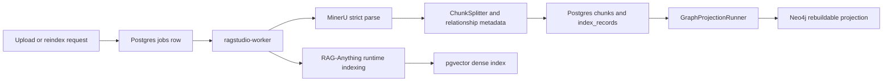

# Durable RAG Indexing Architecture

## Goal

Ragstudio keeps the API responsive while long document indexing runs. Upload and reindex requests persist work in Postgres. A separate worker process claims jobs, writes heartbeats, and resumes graph projection from persisted chunks after restart.

This avoids the earlier failure mode where a browser request could show "backend not available" or "Latest graph projection is pending" because the API process was also responsible for long-running indexing work.

## Ingestion Pipeline

## Vector Store Decision

Ragstudio uses Postgres plus pgvector because documents, chunks, index records, jobs, and retrieval metadata need transactional consistency. This matches the product's local-first operational model and avoids a second vector database while still supporting SQL metadata filters, trigram lexical search, token search, and embedding search.

Neo4j is not the source of truth. It is a rebuildable projection built from canonical chunks and `relationship_metadata.graph_relationships`.

## Chunking Strategy

MinerU strict parsing remains the ingestion gate. `ChunkSplitter` creates canonical chunks with `source_location`, `metadata_json`, `text_search_ar`, `tokens_ar`, `runtime_source_id`, and parser quality metadata.

Ragstudio does not use a blind default chunk size. It uses profile settings from `SettingsProfile.chunk_token_size` and `SettingsProfile.chunk_overlap_token_size`, then records parser quality warnings on the job result.

## Retrieval Pipeline

1. Apply selected-document metadata filters.
2. Retrieve lexical and token candidates from canonical chunks.
3. Retrieve dense candidates from the runtime pgvector index.
4. Fuse candidates in the retrieval orchestrator.
5. Use reranker settings from the active runtime profile when enabled.
6. Expand with Neo4j only when the latest graph projection is `succeeded`.
7. Degrade explicitly to metadata fallback when runtime or graph projection is unavailable.

## Evaluation Gates

Use the existing evaluation set workflow to track:

- `precision@10 >= 0.70`
- `recall@10 >= 0.60`
- `mrr@10 >= 0.60`
- graph projection status is `succeeded` for documents with relationship metadata
- p95 `/api/query` latency stays within the profile target for the selected model and reranker settings

Every indexing job stores:

- parser mode and domain metadata
- canonical chunk count
- parser quality warnings
- graph node and edge counts
- in-flight recovery action while an interrupted job is pending or running again

Runtime profile id and embedding dimensions are stored with the persisted index records and index shape, not as permanent job result fields.

## Restart Behavior

Workers claim one `index_document` job at a time and refresh `heartbeat_at` plus `lease_expires_at` while the job runs. If a worker dies, `JobQueueService.recover_expired_jobs()` releases the stale lease.

If the worker dies before chunks are persisted, the expired lease returns the job to `ready` with `recovery_action=retry_full_index`.

If the worker dies after the search index is ready, the expired lease returns the job to `ready` with `recovery_action=resume_graph_projection`; the worker finishes Neo4j projection from persisted chunks without rerunning MinerU.

Diagnostics expose `ready_index_jobs` and `stale_running_jobs` so pending or stalled work is visible instead of silently looking like backend failure. Job responses expose worker ids, lease timestamps, attempts, and recovery actions for per-job inspection.
