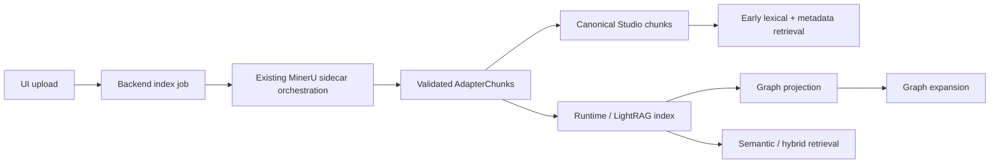

# Durable Parallel Ingestion Stages Implementation Plan

> **For agentic workers:** REQUIRED SUB-SKILL: Use superpowers:subagent-driven-development (recommended) or superpowers:executing-plans to implement this plan task-by-task. Steps use checkbox (`- [ ]`) syntax for tracking.

**Goal:** Reduce upload waiting time and backend risk by parallelizing independent ingestion work. Uploaded documents should become usable as soon as the first durable stage is complete, while runtime/LightRAG enrichment and graph work continue in separate bounded tasks instead of making the user wait behind one long serial pipeline.

**Architecture:** Keep the existing MinerU sidecar orchestrator as the owner of remote parsing. Ragstudio should not duplicate `/parse-async` scheduling or MinerU job management. Instead, split the backend work that happens after MinerU validation into a small staged DAG recorded in the existing `jobs.result` JSON and `documents.status` fields. Run canonical Studio chunk persistence and runtime/LightRAG indexing as independent post-MinerU branches with explicit concurrency limits. Mark the document usable once canonical chunks are committed, then let runtime/graph enrichment finish later and attach warnings if a non-critical branch fails. Keep database schema changes out of the first pass by storing stage metadata in JSON and by reusing existing `succeeded`, `running`, and `failed` statuses.

**Performance Target:** For large uploads such as Bukhari, remove the all-or-nothing wait after MinerU reaches `ready`: chunks should be visible quickly after validation, `/api/health` should remain responsive during enrichment, and the long-running runtime/graph stages should make progress without holding the whole job at a misleading `99%`.

**Retrieval Quality Target:** The speedup must not reduce grounded retrieval quality. Canonical chunks must preserve source metadata, parser metadata, Arabic normalization, reference hints, extraction quality, runtime profile shape, and enough domain metadata for hybrid lexical + semantic retrieval. Early availability is acceptable only if the document can answer metadata/lexical queries correctly while semantic runtime enrichment catches up.

**Tech Stack:** FastAPI, SQLAlchemy async, Postgres JSONB, existing MinerU sidecar client, existing ChunkService/IndexLifecycleService/DocumentService, pytest.

---

## File Structure

- Create `backend/src/ragstudio/services/index_progress.py`
  - Owns stage names, progress values, and small helpers for updating job result/logs consistently.
- Create `backend/tests/test_index_progress.py`
  - Unit coverage for stage payload shape and progress monotonicity.
- Create `backend/src/ragstudio/services/index_stage_scheduler.py`
  - Owns only the post-MinerU staged DAG, bounded parallel execution, branch result collection, and warning conversion.
- Create `backend/tests/test_index_stage_scheduler.py`
  - Unit coverage that independent branches run concurrently and non-critical branch failures become warnings.
- Create `backend/src/ragstudio/services/chunk_persistence_service.py`
  - Converts validated `AdapterChunk` objects into persisted `Chunk` rows with Arabic normalization, reference metadata, parser metadata, and extraction quality.
- Create `backend/tests/test_chunk_persistence_service.py`
  - Unit coverage that validated MinerU chunks are persisted and searchable before runtime enrichment.
- Create `backend/src/ragstudio/services/index_artifact_cleanup.py`
  - Deletes stale canonical chunks, index records, and graph projection records for fatal pre-chunk failures and reindex replacement.
- Create `backend/tests/test_index_artifact_cleanup.py`
  - Unit coverage that failed pre-validation ingestion removes stale retrieval artifacts without deleting the document or job audit history.
- Modify `backend/src/ragstudio/services/chunk_service.py`
  - Reuse `ChunkPersistenceService` instead of duplicating chunk persistence logic.
- Modify `backend/src/ragstudio/services/index_lifecycle_service.py`
  - Change the runtime indexing order: MinerU parse -> validate chunks -> run Studio chunk persistence and runtime enrichment through the index stage scheduler -> create graph projection after runtime branch completion when available.
- Modify `backend/src/ragstudio/services/document_service.py`
  - Mark documents usable after chunks are persisted; keep job warnings if runtime or graph enrichment fails later.
- Modify `backend/src/ragstudio/services/job_worker.py`
  - Add a stage-aware progress update method without changing the existing public `JobOut` schema.
- Extend `backend/tests/test_mineru_reindex_jobs.py`
  - Service-level coverage for partial success: chunks survive even when runtime enrichment fails.
- Extend `backend/tests/test_documents.py`
  - API-level coverage that upload/reindex reports stage metadata and does not leave stale running jobs on interruption.
- Modify `frontend/src/features/documents/documents-page.tsx`
  - Show stage text from `job.result.indexing_stage` and warning text from `job.result.warnings`.
- Extend `frontend/tests/documents-page.test.tsx`
  - UI coverage for `chunks persisted`, `enrichment running`, and `ready with warnings`.
- Create `backend/tests/test_ingestion_retrieval_quality_gate.py`
  - Regression coverage that early persisted chunks are retrievable with Arabic lexical/reference metadata before runtime enrichment succeeds.
- Extend `backend/tests/test_runtime_query_service.py`
  - Coverage that query-time retrieval degrades to lexical/metadata retrieval when runtime enrichment is pending or skipped.

## Important Current-Code Facts

- Upload already queues work through `create_background_task(...)` in `backend/src/ragstudio/api/routes/documents.py`.
- MinerU parsing is already delegated to the sidecar contract through `MinerUClient`: submit `POST /parse-async`, poll `GET /parse-jobs/{job_id}`, then download artifacts.
- `IndexLifecycleService.reindex_document()` currently waits for `runtime.index_preparsed_chunks(...)` before deleting/replacing Studio `Chunk` rows, so all post-MinerU work is effectively serialized.
- `DocumentService._index_document_for_job()` only marks the job succeeded after both chunk indexing and graph materialization finish.
- The existing status enum has no `ready_with_warnings`; use `Document.status = "succeeded"` for searchable documents and put warnings in `Job.result["warnings"]`.
- The first implementation must avoid a migration. All new progress/stage fields live in `Job.result`.

## Parallelization Rules

- MinerU parsing remains one remote sidecar job per upload.
- After MinerU returns validated chunks, canonical Studio chunk persistence and runtime/LightRAG indexing may run in parallel because both consume the same validated chunk list.
- Graph projection starts only after the runtime branch produces graph-capable output.
- Each branch must use its own database/session boundary where needed; do not share a single SQLAlchemy session across concurrent tasks.
- Use a bounded concurrency primitive, not unbounded `asyncio.create_task`, so two large uploads cannot stampede the backend.
- A failure in runtime or graph enrichment must not roll back already-committed canonical chunks.

## RAG Architecture Checkpoints

The post-MinerU scheduler is allowed to reduce waiting time, but it must preserve these retrieval invariants:

1. **Chunk identity and replacement:** Reindexing a document must replace that document's canonical chunks atomically from Ragstudio's point of view. The first pass can continue deleting and reinserting by `document_id`, but it must not leave mixed old/new chunks if the runtime branch fails.
2. **Metadata completeness:** Every persisted chunk must include `document_id`, parser metadata, domain metadata, source location, content type, preview/reference hints when available, Arabic normalized text, Arabic tokens, and extraction quality.
3. **Hybrid search readiness:** Once `chunks_persisted` is reached, lexical/metadata retrieval must work even if vector/runtime enrichment is still pending or skipped.
4. **Runtime index consistency:** `IndexRecord` must reflect the runtime branch status separately from canonical chunk persistence. A document can be usable with `graph_materialization.status = "skipped"`, but the job result must make that degradation visible.
5. **Evaluation gate:** Focused tests must prove at least one Arabic retrieval case such as `hannan` / `حنان` works from persisted chunks, and one Bukhari metadata/text query works after early persistence.

## Vector And Embedding Contract

This phase does not replace Ragstudio's vector store. The vector path remains the active runtime profile, backed by Postgres/PGVector plus Neo4j when configured. The new staged architecture must record enough shape information to keep vector retrieval auditable:

- Store the active runtime profile id, embedding provider, embedding model, embedding dimensions, table prefix/schema, chunking parameters, and parser mode in `IndexRecord.index_shape`.
- Treat embedding dimension mismatch as a runtime branch failure, not a MinerU failure. Canonical chunks can remain usable, but semantic retrieval must be marked degraded until the runtime index is rebuilt.
- Do not tightly couple code to one embedding model. Read model/dimensions from `SettingsProfile` and pass them through the existing runtime profile shape.
- Do not declare runtime/semantic enrichment ready unless the runtime branch confirms inserted vector chunk count matches canonical chunk count for that document.
- For future provider migration, the index shape must make rebuild-required state detectable without deleting uploaded documents.

## Retrieval Pipeline Contract

Early search and full search have different capability levels:

1. **Early retrieval after `chunks_persisted`:** lexical Arabic token search, metadata/reference filtering, source preview, and document-scoped search must work from canonical `chunks`.
2. **Runtime retrieval after `runtime_enrichment`:** semantic/vector search and LightRAG-backed hybrid retrieval become available only after `IndexRecord.status = "succeeded"` for the active profile shape.
3. **Graph retrieval after `graph_enrichment`:** graph expansion is available only after graph projection succeeds. Failure here must not disable lexical/runtime retrieval.
4. **Query orchestration:** `RetrievalOrchestrator` should inspect stage/index state and degrade explicitly: lexical + metadata fallback when runtime is pending/skipped; hybrid semantic path when runtime is ready; graph expansion only when projection is ready.

## Evaluation Thresholds

Use focused automated gates before declaring the architecture done:

- `hannan` / `حنان` Quran lexical-reference query: `Recall@5 >= 1.0` for the expected `19:13` chunk from canonical chunks.
- Bukhari metadata/text query: `Recall@5 >= 1.0` for the inserted Bukhari chunk after early persistence.
- Runtime branch consistency: vector/runtime chunk count equals canonical chunk count before `IndexRecord.status = "succeeded"`.
- Degraded retrieval latency: `/api/query` using lexical fallback should return under 2 seconds on the small regression fixtures.
- Health responsiveness: `/api/health` should keep responding under 2 seconds during runtime enrichment.
- No mixed chunks: after reindex failure before validation, canonical chunk count for that document must be `0`; after successful chunk persistence, chunk count must equal the validated split count.



## Failure Policy

Use the canonical chunk boundary as the failure boundary:

1. **MinerU submit/poll fails before artifacts are ready**
   - Persist no chunks.
   - Delete any existing `chunks`, `index_records`, and `graph_projection_records` for that document before marking the retry failed.
   - Mark `documents.status = "failed"` and `jobs.status = "failed"`.
   - Store the exact sidecar error under `job.result["mineru"]` and `job.result["indexing_stage"]`.

2. **MinerU artifacts download but extraction validation fails**
   - Treat returned chunks as untrusted.
   - Persist no chunks to the canonical `chunks` table.
   - Delete stale index artifacts for that document.
   - Mark document/job failed and store the validation report under `job.result["validation_error"]`.
   - Keep artifact files on disk for debugging, but do not make them retrievable.

3. **Canonical chunk persistence succeeds, runtime/LightRAG enrichment fails**
   - Keep canonical chunks.
   - Mark the document usable with `documents.status = "succeeded"`.
   - Mark the job succeeded with `job.result["warnings"]`.
   - Store runtime degradation under `job.result["graph_materialization"]` or `job.result["runtime_enrichment"]` with `status = "skipped"` and the failure reason.
   - Do not delete newly persisted chunks.

4. **Runtime succeeds, graph projection fails**
   - Keep canonical chunks and runtime index records.
   - Mark `graph_projection_records.status = "failed"` with `error`.
   - Mark job succeeded with warnings, because retrieval can still work through lexical/runtime paths.

5. **Retry/reindex after any failure**
   - Start by cleaning previous canonical chunks and runtime/index/graph records for the target document inside the persistence stage.
   - Do not mix old chunks from a failed run with new chunks.
   - Keep previous failed job rows as audit history.

```python
if mineru_failed or validation_failed:
    await cleanup_document_index_artifacts(document.id)
    document.status = "failed"
    job.status = "failed"
elif chunks_persisted and runtime_or_graph_failed:
    document.status = "succeeded"
    job.status = "succeeded"
    job.result["warnings"] = [failure_reason]
```

---

### Task 1: Stage Progress Helper

**Files:**
- Create: `backend/src/ragstudio/services/index_progress.py`
- Test: `backend/tests/test_index_progress.py`

- [ ] **Step 1: Write the failing tests**

Create `backend/tests/test_index_progress.py`:

```python
from ragstudio.services.index_progress import (
    IndexStage,
    stage_payload,
    stage_progress,
    update_job_stage,
)


class FakeJob:
    def __init__(self):
        self.progress = 0
        self.logs = []
        self.result = {}


def test_stage_progress_is_monotonic():
    stages = [
        IndexStage.QUEUED,
        IndexStage.MINERU_PARSING,
        IndexStage.MINERU_VALIDATED,
        IndexStage.CHUNKS_PERSISTED,
        IndexStage.SEARCH_READY,
        IndexStage.RUNTIME_ENRICHING,
        IndexStage.GRAPH_ENRICHING,
        IndexStage.READY,
    ]

    values = [stage_progress(stage) for stage in stages]

    assert values == sorted(values)
    assert values[0] == 1
    assert values[-1] == 100


def test_stage_payload_has_ui_safe_fields():
    payload = stage_payload(
        IndexStage.CHUNKS_PERSISTED,
        detail="Persisted 1754 chunks.",
        chunk_count=1754,
    )

    assert payload["stage"] == "chunks_persisted"
    assert payload["label"] == "Chunks persisted"
    assert payload["detail"] == "Persisted 1754 chunks."
    assert payload["chunk_count"] == 1754


def test_update_job_stage_preserves_existing_result_and_caps_logs():
    job = FakeJob()
    job.result = {"mineru": {"status": "ready"}}
    job.logs = [f"log {index}" for index in range(25)]

    update_job_stage(
        job,
        IndexStage.SEARCH_READY,
        detail="Lexical retrieval is ready.",
        chunk_count=1754,
    )

    assert job.progress == 75
    assert job.result["mineru"] == {"status": "ready"}
    assert job.result["indexing_stage"]["stage"] == "search_ready"
    assert job.result["indexing_stage"]["chunk_count"] == 1754
    assert job.logs[-1] == "Search ready: Lexical retrieval is ready."
    assert len(job.logs) == 20
```

- [ ] **Step 2: Run the tests to verify they fail**

Run:

```bash
PATH=$PWD/.venv/bin:$PATH PYTHONPATH=backend/src python -m pytest backend/tests/test_index_progress.py -q
```

Expected: FAIL with `ModuleNotFoundError: No module named 'ragstudio.services.index_progress'`.

- [ ] **Step 3: Implement the progress helper**

Create `backend/src/ragstudio/services/index_progress.py`:

```python
from __future__ import annotations

from enum import StrEnum
from typing import Any


class IndexStage(StrEnum):
    QUEUED = "queued"
    MINERU_PARSING = "mineru_parsing"
    MINERU_VALIDATED = "mineru_validated"
    CHUNKS_PERSISTED = "chunks_persisted"
    SEARCH_READY = "search_ready"
    RUNTIME_ENRICHING = "runtime_enriching"
    GRAPH_ENRICHING = "graph_enriching"
    READY = "ready"
    READY_WITH_WARNINGS = "ready_with_warnings"
    FAILED = "failed"


_STAGE_PROGRESS = {
    IndexStage.QUEUED: 1,
    IndexStage.MINERU_PARSING: 25,
    IndexStage.MINERU_VALIDATED: 45,
    IndexStage.CHUNKS_PERSISTED: 65,
    IndexStage.SEARCH_READY: 75,
    IndexStage.RUNTIME_ENRICHING: 85,
    IndexStage.GRAPH_ENRICHING: 95,
    IndexStage.READY: 100,
    IndexStage.READY_WITH_WARNINGS: 100,
    IndexStage.FAILED: 100,
}

_STAGE_LABELS = {
    IndexStage.QUEUED: "Queued",
    IndexStage.MINERU_PARSING: "MinerU parsing",
    IndexStage.MINERU_VALIDATED: "MinerU validated",
    IndexStage.CHUNKS_PERSISTED: "Chunks persisted",
    IndexStage.SEARCH_READY: "Search ready",
    IndexStage.RUNTIME_ENRICHING: "Runtime enrichment",
    IndexStage.GRAPH_ENRICHING: "Graph enrichment",
    IndexStage.READY: "Ready",
    IndexStage.READY_WITH_WARNINGS: "Ready with warnings",
    IndexStage.FAILED: "Failed",
}


def stage_progress(stage: IndexStage) -> int:
    return _STAGE_PROGRESS[stage]


def stage_payload(
    stage: IndexStage,
    *,
    detail: str,
    chunk_count: int | None = None,
    warning: str | None = None,
) -> dict[str, Any]:
    payload: dict[str, Any] = {
        "stage": stage.value,
        "label": _STAGE_LABELS[stage],
        "detail": detail,
        "progress": stage_progress(stage),
    }
    if chunk_count is not None:
        payload["chunk_count"] = chunk_count
    if warning:
        payload["warning"] = warning
    return payload


def update_job_stage(
    job: Any,
    stage: IndexStage,
    *,
    detail: str,
    chunk_count: int | None = None,
    warning: str | None = None,
) -> None:
    payload = stage_payload(
        stage,
        detail=detail,
        chunk_count=chunk_count,
        warning=warning,
    )
    job.progress = payload["progress"]
    result = dict(job.result or {})
    result["indexing_stage"] = payload
    if warning:
        warnings = list(result.get("warnings") or [])
        warnings.append(warning)
        result["warnings"] = warnings
    job.result = result
    log_line = f"{payload['label']}: {detail}"
    job.logs = [*(job.logs or []), log_line][-20:]
```

- [ ] **Step 4: Run the tests to verify they pass**

Run:

```bash
PATH=$PWD/.venv/bin:$PATH PYTHONPATH=backend/src python -m pytest backend/tests/test_index_progress.py -q
```

Expected: PASS.

- [ ] **Step 5: Commit**

```bash
git add backend/src/ragstudio/services/index_progress.py backend/tests/test_index_progress.py
git commit -m "feat: add index stage progress helper"
```

---

### Task 2: Post-MinerU Index Stage Scheduler

**Files:**
- Create: `backend/src/ragstudio/services/index_stage_scheduler.py`
- Test: `backend/tests/test_index_stage_scheduler.py`

- [ ] **Step 1: Write failing tests for bounded parallel branch execution**

Create `backend/tests/test_index_stage_scheduler.py`:

```python
import asyncio

import pytest

from ragstudio.services.index_stage_scheduler import (
    StageBranchResult,
    IndexStageBranch,
    IndexStageScheduler,
)


@pytest.mark.asyncio
async def test_orchestrator_runs_independent_branches_concurrently():
    events: list[str] = []
    release = asyncio.Event()

    async def studio_branch():
        events.append("studio-start")
        await release.wait()
        events.append("studio-done")
        return {"chunks": 1754}

    async def runtime_branch():
        events.append("runtime-start")
        release.set()
        await asyncio.sleep(0)
        events.append("runtime-done")
        return {"runtime_chunks": 1754}

    result = await IndexStageScheduler(max_parallel_branches=2).run(
        [
            IndexStageBranch("studio_chunks", studio_branch, critical=True),
            IndexStageBranch("runtime_enrichment", runtime_branch, critical=False),
        ]
    )

    assert events[:2] == ["studio-start", "runtime-start"]
    assert result["studio_chunks"].status == "succeeded"
    assert result["runtime_enrichment"].status == "succeeded"
    assert result["studio_chunks"].value == {"chunks": 1754}


@pytest.mark.asyncio
async def test_orchestrator_converts_non_critical_failures_to_warnings():
    async def studio_branch():
        return {"chunks": 1754}

    async def runtime_branch():
        raise RuntimeError("runtime enrichment unavailable")

    result = await IndexStageScheduler(max_parallel_branches=2).run(
        [
            IndexStageBranch("studio_chunks", studio_branch, critical=True),
            IndexStageBranch("runtime_enrichment", runtime_branch, critical=False),
        ]
    )

    assert result["studio_chunks"].status == "succeeded"
    assert result["runtime_enrichment"] == StageBranchResult(
        status="skipped",
        value=None,
        warning="runtime enrichment unavailable",
    )
```

- [ ] **Step 2: Run the tests to verify they fail**

Run:

```bash
PATH=$PWD/.venv/bin:$PATH PYTHONPATH=backend/src python -m pytest backend/tests/test_index_stage_scheduler.py -q
```

Expected: FAIL with `ModuleNotFoundError: No module named 'ragstudio.services.index_stage_scheduler'`.

- [ ] **Step 3: Implement the bounded orchestrator**

Create `backend/src/ragstudio/services/index_stage_scheduler.py`:

```python
from __future__ import annotations

import asyncio
from collections.abc import Awaitable, Callable
from dataclasses import dataclass
from typing import Any


@dataclass(frozen=True)
class IndexStageBranch:
    name: str
    run: Callable[[], Awaitable[Any]]
    critical: bool


@dataclass(frozen=True)
class StageBranchResult:
    status: str
    value: Any = None
    warning: str | None = None


class IndexStageScheduler:
    def __init__(self, *, max_parallel_branches: int = 2):
        self._semaphore = asyncio.Semaphore(max_parallel_branches)

    async def run(self, branches: list[IndexStageBranch]) -> dict[str, StageBranchResult]:
        async def run_branch(branch: IndexStageBranch) -> tuple[str, StageBranchResult]:
            async with self._semaphore:
                try:
                    value = await branch.run()
                except Exception as exc:
                    if branch.critical:
                        raise
                    return branch.name, StageBranchResult(
                        status="skipped",
                        warning=str(exc),
                    )
                return branch.name, StageBranchResult(status="succeeded", value=value)

        pairs = await asyncio.gather(*(run_branch(branch) for branch in branches))
        return dict(pairs)
```

- [ ] **Step 4: Run the tests to verify they pass**

Run:

```bash
PATH=$PWD/.venv/bin:$PATH PYTHONPATH=backend/src python -m pytest backend/tests/test_index_stage_scheduler.py -q
```

Expected: PASS.

- [ ] **Step 5: Commit**

```bash
git add backend/src/ragstudio/services/index_stage_scheduler.py backend/tests/test_index_stage_scheduler.py
git commit -m "feat: add post-MinerU index stage scheduler"
```

---

### Task 3: Canonical Chunk Persistence Service

**Files:**
- Create: `backend/src/ragstudio/services/chunk_persistence_service.py`
- Test: `backend/tests/test_chunk_persistence_service.py`

- [ ] **Step 1: Write the failing tests**

Create `backend/tests/test_chunk_persistence_service.py`:

```python
import pytest

from ragstudio.db.engine import init_db, make_engine, make_session_factory
from ragstudio.db.models import Chunk, Document
from ragstudio.schemas.parsing import DomainMetadata, IndexDocumentIn
from ragstudio.services.adapter import AdapterChunk
from ragstudio.services.chunk_persistence_service import ChunkPersistenceService


@pytest.mark.asyncio
async def test_persist_chunks_materializes_search_fields(tmp_path, database_url):
    engine = make_engine(database_url)
    await init_db(engine)
    factory = make_session_factory(engine)

    async with factory() as session:
        document = Document(
            id="doc-quran",
            filename="quran.pdf",
            content_type="application/pdf",
            sha256="quran-sha",
            artifact_path=str(tmp_path / "quran.pdf"),
            status="running",
        )
        session.add(document)
        await session.commit()

        chunks = await ChunkPersistenceService(session).persist(
            document,
            [
                AdapterChunk(
                    text="[19:13] وَحَنَانًا مِّن لَّدُنَّا وَزَكَاةً",
                    source_location={"page": 10, "reference": "19:13"},
                    metadata={
                        "parser_metadata": {
                            "backend": "mineru",
                            "parser_mode": "mineru_strict",
                        },
                        "reference_metadata": {"references": ["19:13"]},
                        "preview_ref": "19:13",
                    },
                )
            ],
            options=IndexDocumentIn(
                parser_mode="mineru_strict",
                domain_metadata=DomainMetadata(domain="quran_tafseer", language="arabic"),
            ),
            commit=True,
        )

        persisted = await session.get(Chunk, chunks[0].id)

    await engine.dispose()

    assert persisted is not None
    assert persisted.document_id == "doc-quran"
    assert persisted.preview_ref == "19:13"
    assert persisted.text_search_ar == "[19:13] وحنانا من لدنا وزكاة"
    assert "وحنانا" in persisted.tokens_ar
    assert persisted.metadata_json["domain_metadata"]["domain"] == "quran_tafseer"
    assert persisted.metadata_json["parser_metadata"]["backend"] == "mineru"
    assert persisted.metadata_json["chunk_identity"].startswith("doc-quran|")


@pytest.mark.asyncio
async def test_persist_chunks_replaces_existing_chunks(tmp_path, database_url):
    engine = make_engine(database_url)
    await init_db(engine)
    factory = make_session_factory(engine)

    async with factory() as session:
        document = Document(
            id="doc-bukhari",
            filename="hadith_bukhari.pdf",
            content_type="application/pdf",
            sha256="bukhari-sha",
            artifact_path=str(tmp_path / "bukhari.pdf"),
            status="running",
        )
        session.add(document)
        session.add(
            Chunk(
                document_id="doc-bukhari",
                text="old chunk",
                source_location={},
                metadata_json={"old": True},
            )
        )
        await session.commit()

        chunks = await ChunkPersistenceService(session).persist(
            document,
            [
                AdapterChunk(
                    text="new chunk",
                    source_location={"page": 1},
                    metadata={"parser_metadata": {"backend": "mineru"}},
                )
            ],
            options=IndexDocumentIn(parser_mode="mineru_strict"),
            commit=True,
        )

        rows = (
            await session.execute(
                Chunk.__table__.select().where(Chunk.document_id == "doc-bukhari")
            )
        ).all()

    await engine.dispose()

    assert len(chunks) == 1
    assert len(rows) == 1
    assert rows[0]._mapping["text"] == "new chunk"
    assert rows[0]._mapping["metadata_json"]["chunk_identity"].startswith("doc-bukhari|")
```

- [ ] **Step 2: Run the tests to verify they fail**

Run:

```bash
PATH=$PWD/.venv/bin:$PATH PYTHONPATH=backend/src python -m pytest backend/tests/test_chunk_persistence_service.py -q
```

Expected: FAIL with `ModuleNotFoundError: No module named 'ragstudio.services.chunk_persistence_service'`.

- [ ] **Step 3: Implement the persistence service**

Create `backend/src/ragstudio/services/chunk_persistence_service.py`:

```python
from __future__ import annotations

from datetime import UTC, datetime
from typing import Any

from ragstudio.db.models import Chunk, Document
from ragstudio.schemas.chunks import ChunkOut
from ragstudio.schemas.parsing import DomainMetadata, IndexDocumentIn, ParserMode
from ragstudio.services.adapter import AdapterChunk
from ragstudio.services.arabic_text import arabic_tokens, normalize_arabic_text
from ragstudio.services.chunk_sanitizer import sanitize_db_text, sanitize_db_value
from sqlalchemy import delete
from sqlalchemy.ext.asyncio import AsyncSession


class ChunkPersistenceService:
    def __init__(self, session: AsyncSession):
        self.session = session

    async def persist(
        self,
        document: Document,
        adapter_chunks: list[AdapterChunk],
        *,
        options: IndexDocumentIn,
        commit: bool = True,
        runtime_profile_id: str | None = None,
        index_shape: dict[str, Any] | None = None,
    ) -> list[ChunkOut]:
        await self.session.execute(delete(Chunk).where(Chunk.document_id == document.id))
        indexed_at = datetime.now(UTC)
        chunks = [
            self._chunk_row(
                document,
                adapter_chunk,
                options=options,
                indexed_at=indexed_at,
                runtime_profile_id=runtime_profile_id,
                index_shape=index_shape or {},
            )
            for adapter_chunk in adapter_chunks
        ]
        self.session.add_all(chunks)
        if commit:
            await self.session.commit()
        else:
            await self.session.flush()
        for chunk in chunks:
            await self.session.refresh(chunk)
        return [ChunkOut.model_validate(chunk) for chunk in chunks]

    def _chunk_row(
        self,
        document: Document,
        adapter_chunk: AdapterChunk,
        *,
        options: IndexDocumentIn,
        indexed_at: datetime,
        runtime_profile_id: str | None,
        index_shape: dict[str, Any],
    ) -> Chunk:
        text = sanitize_db_text(adapter_chunk.text)
        metadata = self._merge_metadata(
            adapter_chunk.metadata,
            options.domain_metadata,
            options.parser_mode,
            document.id,
            index_shape,
        )
        return Chunk(
            document_id=document.id,
            text=text,
            text_search_ar=normalize_arabic_text(text),
            tokens_ar=arabic_tokens(text),
            extraction_quality=self._extraction_quality(metadata),
            source_location=sanitize_db_value(adapter_chunk.source_location),
            metadata_json=sanitize_db_value(metadata),
            runtime_profile_id=runtime_profile_id,
            runtime_source_id=sanitize_db_value(adapter_chunk.metadata.get("runtime_source_id")),
            content_type=sanitize_db_text(str(adapter_chunk.metadata.get("content_type") or "text")),
            preview_ref=sanitize_db_value(adapter_chunk.metadata.get("preview_ref")),
            indexed_at=indexed_at,
        )

    def _merge_metadata(
        self,
        metadata: dict[str, Any],
        domain_metadata: DomainMetadata,
        parser_mode: ParserMode,
        document_id: str,
        index_shape: dict[str, Any],
    ) -> dict[str, Any]:
        merged = {
            key: value
            for key, value in metadata.items()
            if key not in {"artifact_path", "path", "file_path"}
            and not self._is_absolute_path_value(value)
        }
        merged["document_id"] = document_id
        merged["domain_metadata"] = domain_metadata.model_dump(exclude_none=True)
        merged["index_shape"] = index_shape
        merged.setdefault("chunk_identity", self._chunk_identity(document_id, metadata))
        parser_metadata = dict(merged.get("parser_metadata") or {})
        parser_metadata.setdefault("backend", "mineru")
        parser_metadata["parser_mode"] = parser_mode
        merged["parser_metadata"] = parser_metadata
        return merged

    def _extraction_quality(self, metadata: dict[str, Any]) -> dict[str, Any]:
        extraction_quality = metadata.get("extraction_quality")
        return sanitize_db_value(extraction_quality) if isinstance(extraction_quality, dict) else {}

    def _is_absolute_path_value(self, value: Any) -> bool:
        if not isinstance(value, str):
            return False
        return value.startswith("/") or ":\\" in value

    def _chunk_identity(self, document_id: str, metadata: dict[str, Any]) -> str:
        parser_metadata = metadata.get("parser_metadata") or {}
        artifact_ref = parser_metadata.get("artifact_ref")
        chunk_index = parser_metadata.get("chunk_index")
        preview_ref = metadata.get("preview_ref")
        return "|".join(str(part) for part in (document_id, artifact_ref, preview_ref, chunk_index))
```

- [ ] **Step 4: Run the tests to verify they pass**

Run:

```bash
PATH=$PWD/.venv/bin:$PATH PYTHONPATH=backend/src python -m pytest backend/tests/test_chunk_persistence_service.py -q
```

Expected: PASS.

- [ ] **Step 5: Commit**

```bash
git add backend/src/ragstudio/services/chunk_persistence_service.py backend/tests/test_chunk_persistence_service.py
git commit -m "feat: persist canonical chunks independently"
```

---

### Task 4: Index Artifact Cleanup Helper

**Files:**
- Create: `backend/src/ragstudio/services/index_artifact_cleanup.py`
- Test: `backend/tests/test_index_artifact_cleanup.py`

- [ ] **Step 1: Write failing cleanup tests**

Create `backend/tests/test_index_artifact_cleanup.py`:

```python
import pytest
from sqlalchemy import func, select

from ragstudio.db.engine import init_db, make_engine, make_session_factory
from ragstudio.db.models import Chunk, Document, GraphProjectionRecord, IndexRecord, Job
from ragstudio.services.index_artifact_cleanup import cleanup_document_index_artifacts


@pytest.mark.asyncio
async def test_cleanup_removes_retrieval_artifacts_but_keeps_document_and_jobs(
    database_url,
    tmp_path,
):
    engine = make_engine(database_url)
    await init_db(engine)
    factory = make_session_factory(engine)

    async with factory() as session:
        document = Document(
            id="doc-cleanup",
            filename="failed.pdf",
            content_type="application/pdf",
            sha256="failed-sha",
            artifact_path=str(tmp_path / "failed.pdf"),
            status="running",
        )
        job = Job(
            id="job-cleanup",
            type="index_document",
            target_id="doc-cleanup",
            status="failed",
            result={"error": "MinerU validation failed"},
        )
        session.add_all(
            [
                document,
                job,
                Chunk(document_id="doc-cleanup", text="stale", source_location={}, metadata_json={}),
                IndexRecord(
                    document_id="doc-cleanup",
                    runtime_profile_id="default",
                    status="failed",
                    chunk_count=1,
                ),
                GraphProjectionRecord(
                    document_id="doc-cleanup",
                    runtime_profile_id="default",
                    status="failed",
                    error="graph failed",
                ),
            ]
        )
        await session.commit()

        await cleanup_document_index_artifacts(session, "doc-cleanup", commit=True)

        chunk_count = (
            await session.execute(
                select(func.count()).select_from(Chunk).where(Chunk.document_id == "doc-cleanup")
            )
        ).scalar_one()
        index_count = (
            await session.execute(
                select(func.count())
                .select_from(IndexRecord)
                .where(IndexRecord.document_id == "doc-cleanup")
            )
        ).scalar_one()
        graph_count = (
            await session.execute(
                select(func.count())
                .select_from(GraphProjectionRecord)
                .where(GraphProjectionRecord.document_id == "doc-cleanup")
            )
        ).scalar_one()
        kept_document = await session.get(Document, "doc-cleanup")
        kept_job = await session.get(Job, "job-cleanup")

    await engine.dispose()

    assert chunk_count == 0
    assert index_count == 0
    assert graph_count == 0
    assert kept_document is not None
    assert kept_job is not None
    assert kept_job.result["error"] == "MinerU validation failed"
```

- [ ] **Step 2: Run the test to verify it fails**

Run:

```bash
PATH=$PWD/.venv/bin:$PATH PYTHONPATH=backend/src python -m pytest backend/tests/test_index_artifact_cleanup.py -q
```

Expected: FAIL with `ModuleNotFoundError: No module named 'ragstudio.services.index_artifact_cleanup'`.

- [ ] **Step 3: Implement cleanup helper**

Create `backend/src/ragstudio/services/index_artifact_cleanup.py`:

```python
from sqlalchemy import delete
from sqlalchemy.ext.asyncio import AsyncSession

from ragstudio.db.models import Chunk, GraphProjectionRecord, IndexRecord


async def cleanup_document_index_artifacts(
    session: AsyncSession,
    document_id: str,
    *,
    commit: bool = False,
) -> None:
    await session.execute(delete(Chunk).where(Chunk.document_id == document_id))
    await session.execute(delete(IndexRecord).where(IndexRecord.document_id == document_id))
    await session.execute(
        delete(GraphProjectionRecord).where(GraphProjectionRecord.document_id == document_id)
    )
    if commit:
        await session.commit()
    else:
        await session.flush()
```

- [ ] **Step 4: Run the cleanup test**

Run:

```bash
PATH=$PWD/.venv/bin:$PATH PYTHONPATH=backend/src python -m pytest backend/tests/test_index_artifact_cleanup.py -q
```

Expected: PASS.

- [ ] **Step 5: Commit**

```bash
git add backend/src/ragstudio/services/index_artifact_cleanup.py backend/tests/test_index_artifact_cleanup.py
git commit -m "feat: add index artifact cleanup helper"
```

---

### Task 5: Reuse Chunk Persistence In ChunkService

**Files:**
- Modify: `backend/src/ragstudio/services/chunk_service.py`
- Test: `backend/tests/test_chunk_service_arabic_search.py`
- Test: `backend/tests/test_chunk_persistence_service.py`

- [ ] **Step 1: Write a regression test for ChunkService metadata shape**

Append to `backend/tests/test_chunk_service_arabic_search.py`:

```python
@pytest.mark.asyncio
async def test_chunk_service_uses_shared_persistence_shape(session, tmp_path):
    document = Document(
        id="doc-shared-persistence",
        filename="quran.pdf",
        content_type="application/pdf",
        sha256="shared-persistence-sha",
        artifact_path=str(tmp_path / "quran.pdf"),
        status="ready",
    )
    session.add(document)
    await session.commit()

    class FakeParser:
        async def parse(self, document, options, *, on_mineru_status=None):
            return [
                AdapterChunk(
                    text="وَحَنَانًا مِّن لَّدُنَّا",
                    source_location={"page": 10},
                    metadata={"parser_metadata": {"backend": "mineru"}},
                )
            ]

    chunks = await ChunkService(
        session,
        tmp_path,
        document_parser=FakeParser(),
    ).index_document(
        "doc-shared-persistence",
        options=IndexDocumentIn(parser_mode="mineru_strict"),
    )

    assert chunks is not None
    assert chunks[0].metadata["document_id"] == "doc-shared-persistence"
    assert chunks[0].metadata["parser_metadata"]["parser_mode"] == "mineru_strict"
    assert "وحنانا" in chunks[0].metadata["tokens_ar"]
```

Add this import near the top of `backend/tests/test_chunk_service_arabic_search.py`:

```python
from ragstudio.services.adapter import AdapterChunk
```

- [ ] **Step 2: Run the regression test**

Run:

```bash
PATH=$PWD/.venv/bin:$PATH PYTHONPATH=backend/src python -m pytest backend/tests/test_chunk_service_arabic_search.py::test_chunk_service_uses_shared_persistence_shape -q
```

Expected: FAIL because the current `ChunkService.index_document()` does not use the new shared `ChunkPersistenceService` shape yet.

- [ ] **Step 3: Refactor ChunkService to call ChunkPersistenceService**

In `backend/src/ragstudio/services/chunk_service.py`, add this import:

```python
from ragstudio.services.chunk_persistence_service import ChunkPersistenceService
```

Replace the block in `index_document()` that deletes old chunks, creates `Chunk(...)` rows, commits, refreshes, and returns `ChunkOut` with:

```python
        return await ChunkPersistenceService(self.session).persist(
            document,
            adapter_chunks,
            options=options,
            commit=commit,
        )
```

Remove unused imports from `chunk_service.py` after the replacement:

```python
from ragstudio.db.models import Chunk, Document
from ragstudio.services.arabic_text import arabic_tokens, normalize_arabic_text
from ragstudio.services.chunk_sanitizer import sanitize_db_text, sanitize_db_value
from sqlalchemy import delete, select
```

The replacement still needs `Chunk`, `select`, `arabic_tokens`, and `normalize_arabic_text` for search and output helpers, so only remove names that Ruff reports as unused.

- [ ] **Step 4: Run focused tests**

Run:

```bash
PATH=$PWD/.venv/bin:$PATH PYTHONPATH=backend/src python -m pytest \
  backend/tests/test_chunk_service_arabic_search.py \
  backend/tests/test_chunk_persistence_service.py \
  -q
```

Expected: PASS.

- [ ] **Step 5: Run Ruff**

Run:

```bash
PATH=$PWD/.venv/bin:$PATH python -m ruff check backend/src/ragstudio/services/chunk_service.py
```

Expected: PASS.

- [ ] **Step 6: Commit**

```bash
git add backend/src/ragstudio/services/chunk_service.py backend/tests/test_chunk_service_arabic_search.py
git commit -m "refactor: share chunk persistence path"
```

---

### Task 6: Parallelize Chunk Persistence And Runtime Enrichment

**Files:**
- Modify: `backend/src/ragstudio/services/index_lifecycle_service.py`
- Test: `backend/tests/test_mineru_reindex_jobs.py`

- [ ] **Step 1: Write failing test for partial success when runtime enrichment fails**

Append to `backend/tests/test_mineru_reindex_jobs.py`:

```python
from ragstudio.services.adapter import AdapterChunk
from ragstudio.services.index_lifecycle_service import IndexLifecycleService


@pytest.mark.asyncio
async def test_runtime_enrichment_failure_keeps_persisted_chunks(
    tmp_path,
    database_url,
):
    engine = make_engine(database_url)
    session_factory = make_session_factory(engine)
    await init_db(engine)

    class FakeDocumentParser:
        async def parse(self, document, options, *, on_mineru_status=None):
            if on_mineru_status is not None:
                await on_mineru_status(
                    {
                        "jobId": "remote-ready",
                        "status": "ready",
                        "progress": 100,
                        "detail": "MinerU artifacts ready.",
                        "updatedAt": "2026-05-11T07:18:50Z",
                    }
                )
            return [
                AdapterChunk(
                    text="Sahih al-Bukhari contains 7277 hadith.",
                    source_location={"page": 1},
                    metadata={
                        "parser_metadata": {"backend": "mineru"},
                        "document_metadata": {
                            "title": "Sahih al-Bukhari 7277 Hadith Collection"
                        },
                    },
                )
            ]

    class FailingRuntime:
        async def delete_document_index(self, document_id):
            return None

        async def index_preparsed_chunks(self, artifact_path, preparsed_chunks, *, document_id):
            raise RuntimeError("runtime enrichment unavailable")

    class FakeRuntimeFactory:
        def build(self, profile):
            return FailingRuntime()

    class PassingHealthService:
        async def check(self, profile):
            return []

        def blocking_failures(self, checks):
            return []

    async with session_factory() as session:
        artifact = tmp_path / "bukhari.pdf"
        artifact.write_bytes(b"%PDF-1.4")
        document = Document(
            id="doc-bukhari-partial",
            filename="hadith_bukhari.pdf",
            content_type="application/pdf",
            sha256="bukhari-partial-sha",
            artifact_path=str(artifact),
            status="ready",
        )
        session.add(
            SettingsProfile(
                id="default",
                provider="openai-compatible",
                llm_model="gpt-4o",
                llm_base_url="http://127.0.0.1:8004/v1",
                embedding_model="text-embedding-3-large",
                embedding_base_url="http://127.0.0.1:8001/v1",
                storage_backend="postgres_pgvector_neo4j",
                runtime_mode="runtime",
            )
        )
        session.add(document)
        await session.commit()

        result = await IndexLifecycleService(
            session,
            type("Settings", (), {"data_dir": tmp_path})(),
            runtime_factory=FakeRuntimeFactory(),
            health_service=PassingHealthService(),
            document_parser=FakeDocumentParser(),
        ).reindex_document(
            "doc-bukhari-partial",
            options=IndexDocumentIn(parser_mode="mineru_strict"),
        )

        refreshed_doc = await session.get(Document, "doc-bukhari-partial")
        chunk_count = (
            await session.execute(
                select(func.count())
                .select_from(Chunk)
                .where(Chunk.document_id == "doc-bukhari-partial")
            )
        ).scalar_one()

    await engine.dispose()

    assert result is not None
    assert len(result.chunks) == 1
    assert refreshed_doc is not None
    assert refreshed_doc.status == "succeeded"
    assert chunk_count == 1
    assert result.graph_materialization["status"] == "skipped"
    assert "runtime enrichment unavailable" in result.graph_materialization["reason"]
```

Add or update this import near the top of `backend/tests/test_mineru_reindex_jobs.py`:

```python
from sqlalchemy import func, select
```

- [ ] **Step 2: Run the test to verify it fails**

Run:

```bash
PATH=$PWD/.venv/bin:$PATH PYTHONPATH=backend/src python -m pytest \
  backend/tests/test_mineru_reindex_jobs.py::test_runtime_enrichment_failure_keeps_persisted_chunks \
  -q
```

Expected: FAIL because current `IndexLifecycleService` calls runtime enrichment before chunk persistence and does not collect non-critical branch failures as warnings.

- [ ] **Step 3: Route post-MinerU work through the index stage scheduler**

In `backend/src/ragstudio/services/index_lifecycle_service.py`, add:

```python
from ragstudio.services.chunk_persistence_service import ChunkPersistenceService
from ragstudio.services.index_stage_scheduler import IndexStageBranch, IndexStageScheduler
from ragstudio.services.index_artifact_cleanup import cleanup_document_index_artifacts
from ragstudio.services.index_progress import IndexStage
```

Replace the middle of `reindex_document()` from the current `preparsed_chunks = ...` through `self.session.add(IndexRecord(...))` with this structure. The key design point is that the canonical Studio branch and runtime branch start from the same validated `adapter_chunks` list and are awaited together through `IndexStageScheduler`.

```python
        await cleanup_document_index_artifacts(self.session, document.id)
        await self.session.commit()

        preparsed_chunks = await self._preparse_runtime_document(
            runtime,
            document,
            options,
            on_mineru_status=on_mineru_status,
        )
        if preparsed_chunks is None:
            runtime_chunks = await self._index_runtime_document(
                runtime,
                artifact_path,
                document.id,
                preparsed_chunks=None,
            )
            normalized_chunks = [
                self.normalizer.chunk_to_adapter_chunk(
                    runtime_chunk,
                    document_id=document.id,
                    runtime_profile_id=profile.id,
                    index_shape=profile.index_shape,
                )
                for runtime_chunk in runtime_chunks
            ]
        else:
            normalized_chunks = preparsed_chunks

        adapter_chunks = ChunkSplitter().split(
            normalized_chunks,
            domain_metadata=options.domain_metadata,
            parser_mode=options.parser_mode,
        )
        adapter_chunks = MinerURelationshipBuilder().annotate(
            adapter_chunks,
            options.domain_metadata,
        )
        self.quality_gate.validate_adapter_chunks(
            adapter_chunks,
            language=self._quality_language(options.domain_metadata),
        )

        async def persist_studio_chunks():
            chunks = await ChunkPersistenceService(self.session).persist(
                document,
                adapter_chunks,
                options=options,
                commit=False,
                runtime_profile_id=profile.id,
                index_shape=profile.index_shape,
            )
            await self.session.execute(
                delete(IndexRecord).where(IndexRecord.document_id == document.id)
            )
            self.session.add(
                IndexRecord(
                    document_id=document.id,
                    runtime_profile_id=profile.id,
                    status=StageStatus.RUNNING.value,
                    index_shape={
                        **profile.index_shape,
                        "embedding_model": profile.embedding_model,
                        "embedding_dimensions": profile.embedding_dimensions,
                        "parser_mode": options.parser_mode,
                    },
                    chunk_count=len(chunks),
                )
            )
            document.status = StageStatus.SUCCEEDED.value
            await self.session.commit()
            return chunks

        async def enrich_runtime():
            await runtime.delete_document_index(document.id)
            return await self._index_runtime_document(
                runtime,
                artifact_path,
                document.id,
                preparsed_chunks=adapter_chunks,
            )

        branch_results = await IndexStageScheduler(max_parallel_branches=2).run(
            [
                IndexStageBranch("studio_chunks", persist_studio_chunks, critical=True),
                IndexStageBranch("runtime_enrichment", enrich_runtime, critical=False),
            ]
        )
        chunks = branch_results["studio_chunks"].value

        graph_materialization = {
            "status": "pending",
            "node_count": 0,
            "edge_count": 0,
            "reason": None,
        }
        runtime_result = branch_results["runtime_enrichment"]
        if runtime_result.status == "skipped":
            await self._mark_runtime_index_failed(
                document.id,
                profile.id,
                runtime_result.warning or "Runtime enrichment skipped.",
            )
            return IndexLifecycleResult(
                chunks=chunks,
                graph_projection_record_id=None,
                graph_materialization={
                    "status": "skipped",
                    "node_count": 0,
                    "edge_count": 0,
                    "reason": runtime_result.warning,
                },
            )
        await self._mark_runtime_index_succeeded(document.id, profile.id, len(chunks))

        projection_record = GraphProjectionRecord(
            document_id=document.id,
            runtime_profile_id=profile.id,
            status="pending",
            graph_workspace_label=workspace_label(profile),
            graph_storage_uri=profile.neo4j_uri,
            graph_storage_username=profile.neo4j_username,
            graph_storage_password=None,
            node_count=0,
            edge_count=0,
        )
        self.session.add(projection_record)
        await self.session.flush()
        return IndexLifecycleResult(
            chunks=chunks,
            graph_projection_record_id=projection_record.id,
            graph_materialization=graph_materialization,
        )
```

Remove the now-duplicated old block that manually builds `Chunk(...)` rows. Keep all SQLAlchemy `self.session` work inside `persist_studio_chunks()` and after `IndexStageScheduler.run()` returns. Do not add `self.session` reads or writes to `enrich_runtime()`, because SQLAlchemy `AsyncSession` must not be used concurrently from multiple branches.

Add a small private helper in `IndexLifecycleService`:

```python
    async def _mark_runtime_index_succeeded(
        self,
        document_id: str,
        runtime_profile_id: str,
        chunk_count: int,
    ) -> None:
        records = await self.session.execute(
            select(IndexRecord).where(
                IndexRecord.document_id == document_id,
                IndexRecord.runtime_profile_id == runtime_profile_id,
            )
        )
        for record in records.scalars().all():
            record.status = StageStatus.SUCCEEDED.value
            record.chunk_count = chunk_count
            record.error = None
        await self.session.commit()

    async def _mark_runtime_index_failed(
        self,
        document_id: str,
        runtime_profile_id: str,
        reason: str,
    ) -> None:
        records = await self.session.execute(
            select(IndexRecord).where(
                IndexRecord.document_id == document_id,
                IndexRecord.runtime_profile_id == runtime_profile_id,
            )
        )
        for record in records.scalars().all():
            record.status = StageStatus.FAILED.value
            record.error = reason
        await self.session.commit()
```

- [ ] **Step 4: Run the focused test**

Run:

```bash
PATH=$PWD/.venv/bin:$PATH PYTHONPATH=backend/src python -m pytest \
  backend/tests/test_mineru_reindex_jobs.py::test_runtime_enrichment_failure_keeps_persisted_chunks \
  -q
```

Expected: PASS.

- [ ] **Step 5: Run existing reindex tests**

Run:

```bash
PATH=$PWD/.venv/bin:$PATH PYTHONPATH=backend/src python -m pytest backend/tests/test_mineru_reindex_jobs.py -q
```

Expected: PASS.

- [ ] **Step 6: Commit**

```bash
git add backend/src/ragstudio/services/index_lifecycle_service.py backend/tests/test_mineru_reindex_jobs.py
git commit -m "feat: parallelize post-mineru ingestion stages"
```

---

### Task 7: Job Failure Semantics And Searchable-With-Warnings

**Files:**
- Modify: `backend/src/ragstudio/services/document_service.py`
- Test: `backend/tests/test_mineru_reindex_jobs.py`

- [ ] **Step 1: Write failing service test for warning result**

Append to `backend/tests/test_mineru_reindex_jobs.py`:

```python
@pytest.mark.asyncio
async def test_run_index_job_marks_searchable_document_succeeded_when_enrichment_skips(
    tmp_path,
    database_url,
    monkeypatch,
):
    engine = make_engine(database_url)
    session_factory = make_session_factory(engine)
    await init_db(engine)

    async with session_factory() as session:
        artifact = tmp_path / "bukhari.pdf"
        artifact.write_bytes(b"%PDF-1.4")
        document = Document(
            id="doc-searchable-warning",
            filename="hadith_bukhari.pdf",
            content_type="application/pdf",
            sha256="searchable-warning-sha",
            artifact_path=str(artifact),
            status="ready",
        )
        job = Job(
            id="job-searchable-warning",
            type="index_document",
            target_id="doc-searchable-warning",
            status="ready",
            progress=0,
        )
        session.add_all([document, job])
        await session.commit()

        async def fake_index_document_for_job(self, document, job, options=None, on_mineru_status=None):
            document.status = "succeeded"
            job.status = "succeeded"
            job.progress = 100
            job.result = {
                "document_id": document.id,
                "chunk_count": 1,
                "graph_materialization": {
                    "status": "skipped",
                    "reason": "runtime enrichment unavailable",
                },
            }
            job.logs = [*job.logs, "Indexed 1 chunks."]

        monkeypatch.setattr(
            DocumentService,
            "_index_document_for_job",
            fake_index_document_for_job,
        )

        await DocumentService(session, tmp_path).run_index_job(
            "doc-searchable-warning",
            "job-searchable-warning",
            IndexDocumentIn(parser_mode="mineru_strict"),
        )

        refreshed_doc = await session.get(Document, "doc-searchable-warning")
        refreshed_job = await session.get(Job, "job-searchable-warning")

    await engine.dispose()

    assert refreshed_doc is not None
    assert refreshed_job is not None
    assert refreshed_doc.status == "succeeded"
    assert refreshed_job.status == "succeeded"
    assert refreshed_job.result["chunk_count"] == 1
    assert refreshed_job.result["graph_materialization"]["status"] == "skipped"
```

- [ ] **Step 2: Run the test**

Run:

```bash
PATH=$PWD/.venv/bin:$PATH PYTHONPATH=backend/src python -m pytest \
  backend/tests/test_mineru_reindex_jobs.py::test_run_index_job_marks_searchable_document_succeeded_when_enrichment_skips \
  -q
```

Expected: PASS. This documents the intended service behavior before code cleanup.

- [ ] **Step 3: Add explicit fatal failure cleanup and warning handling in DocumentService**

In `backend/src/ragstudio/services/document_service.py`, import:

```python
from ragstudio.services.index_artifact_cleanup import cleanup_document_index_artifacts
```

Change `_mark_index_failed()` from a synchronous helper to this async helper:

```python
    async def _mark_index_failed(self, document: Document, job: Job, exc: Exception) -> None:
        await cleanup_document_index_artifacts(self.session, document.id)
        document.status = StageStatus.FAILED.value
        job.status = StageStatus.FAILED.value
        job.progress = 100
        job.logs = [*job.logs, str(exc)]
        job.result = {
            **(job.result or {}),
            "document_id": document.id,
            "error": str(exc),
            "indexing_stage": {
                "stage": "failed",
                "label": "Failed",
                "detail": str(exc),
                "progress": 100,
            },
        }
```

Update both call sites from:

```python
                    self._mark_index_failed(document, job, exc)
```

to:

```python
                    await self._mark_index_failed(document, job, exc)
```

In the `run_index_job()` exception handler, replace the current failed-state block with:

```python
            await cleanup_document_index_artifacts(self.session, document.id)
            document.status = StageStatus.FAILED.value
            job.status = StageStatus.FAILED.value
            job.progress = 100
            job.logs = [*job.logs, str(exc)]
            job.result = {
                **(job.result or {}),
                "document_id": document.id,
                "error": str(exc),
                "indexing_stage": {
                    "stage": "failed",
                    "label": "Failed",
                    "detail": str(exc),
                    "progress": 100,
                },
            }
            await self.session.commit()
```

Then inside `_index_document_for_job()`, after `graph_materialization = ...`, add:

```python
        warnings = []
        if graph_materialization.get("status") == "skipped":
            reason = str(graph_materialization.get("reason") or "Runtime enrichment skipped.")
            warnings.append(reason)
        if warnings:
            job.result = {**job.result, "warnings": [*job.result.get("warnings", []), *warnings]}
            job.logs = [*job.logs, f"Ready with warnings: {'; '.join(warnings)}"]
```

Then keep:

```python
        document.status = StageStatus.SUCCEEDED.value
        job.status = StageStatus.SUCCEEDED.value
        job.progress = 100
```

Do not set `document.status = failed` when chunk persistence already succeeded.

- [ ] **Step 4: Run reindex tests**

Run:

```bash
PATH=$PWD/.venv/bin:$PATH PYTHONPATH=backend/src python -m pytest backend/tests/test_mineru_reindex_jobs.py -q
```

Expected: PASS.

- [ ] **Step 5: Commit**

```bash
git add backend/src/ragstudio/services/document_service.py backend/tests/test_mineru_reindex_jobs.py
git commit -m "feat: keep searchable documents ready with warnings"
```

---

### Task 8: Frontend Stage Display

**Files:**
- Modify: `frontend/src/features/documents/documents-page.tsx`
- Test: `frontend/tests/documents-page.test.tsx`

- [ ] **Step 1: Write failing UI test**

Append to `frontend/tests/documents-page.test.tsx`:

```tsx
it("shows indexing stage details and warnings", async () => {
  server.use(
    http.get("/api/documents", () =>
      HttpResponse.json({
        items: [
          {
            id: "doc-1",
            filename: "hadith_bukhari.pdf",
            content_type: "application/pdf",
            sha256: "sha",
            status: "succeeded",
            latest_index_options: null,
          },
        ],
        total: 1,
      }),
    ),
    http.get("/api/jobs", () =>
      HttpResponse.json({
        items: [
          {
            id: "job-1",
            type: "index_document",
            status: "succeeded",
            target_id: "doc-1",
            progress: 100,
            logs: ["Ready with warnings: runtime enrichment unavailable"],
            result: {
              document_id: "doc-1",
              chunk_count: 1754,
              indexing_stage: {
                stage: "ready_with_warnings",
                label: "Ready with warnings",
                detail: "Search is ready; runtime enrichment unavailable.",
                progress: 100,
                chunk_count: 1754,
              },
              warnings: ["runtime enrichment unavailable"],
            },
          },
        ],
        total: 1,
      }),
    ),
  );

  render(<DocumentsPage />);

  expect(await screen.findByText("hadith_bukhari.pdf")).toBeInTheDocument();
  expect(await screen.findByText(/Ready with warnings/i)).toBeInTheDocument();
  expect(await screen.findByText(/1754 chunks/i)).toBeInTheDocument();
  expect(await screen.findByText(/runtime enrichment unavailable/i)).toBeInTheDocument();
});
```

- [ ] **Step 2: Run the UI test to verify it fails**

Run:

```bash
cd frontend
npm test -- documents-page.test.tsx -t "shows indexing stage details and warnings"
```

Expected: FAIL because the page does not render `result.indexing_stage`.

- [ ] **Step 3: Render stage details**

In `frontend/src/features/documents/documents-page.tsx`, add this helper near the other display helpers:

```tsx
function jobStageText(job: JobOut | undefined): string | null {
  const stage = job?.result?.indexing_stage;
  if (!stage || typeof stage !== "object") return null;
  const label = typeof stage.label === "string" ? stage.label : null;
  const detail = typeof stage.detail === "string" ? stage.detail : null;
  const chunkCount = typeof stage.chunk_count === "number" ? stage.chunk_count : null;
  const parts = [label, detail].filter(Boolean);
  if (chunkCount !== null) parts.push(`${chunkCount} chunks`);
  return parts.length ? parts.join(" · ") : null;
}

function jobWarnings(job: JobOut | undefined): string[] {
  const warnings = job?.result?.warnings;
  if (!Array.isArray(warnings)) return [];
  return warnings.filter((warning): warning is string => typeof warning === "string");
}
```

Where each document row renders job progress/logs, render:

```tsx
const stageText = jobStageText(latestJob);
const warnings = jobWarnings(latestJob);
```

Then add:

```tsx
{stageText ? <p className="text-xs text-slate-600">{stageText}</p> : null}
{warnings.map((warning) => (
  <p key={warning} className="text-xs text-amber-700">
    {warning}
  </p>
))}
```

- [ ] **Step 4: Run the UI test**

Run:

```bash
cd frontend
npm test -- documents-page.test.tsx -t "shows indexing stage details and warnings"
```

Expected: PASS.

- [ ] **Step 5: Commit**

```bash
git add frontend/src/features/documents/documents-page.tsx frontend/tests/documents-page.test.tsx
git commit -m "feat: show ingestion stage warnings"
```

---

### Task 9: End-To-End Regression Gate

**Files:**
- Create: `backend/tests/test_durable_ingestion_stages.py`

- [ ] **Step 1: Write the regression test**

Create `backend/tests/test_durable_ingestion_stages.py`:

```python
import pytest
from sqlalchemy import func, select

from ragstudio.db.models import Chunk, Document, IndexRecord, Job, SettingsProfile
from ragstudio.schemas.parsing import IndexDocumentIn
from ragstudio.services.adapter import AdapterChunk
from ragstudio.services.document_service import DocumentService
from ragstudio.services.index_lifecycle_service import IndexLifecycleService


@pytest.mark.asyncio
async def test_chunks_are_searchable_when_runtime_enrichment_fails(client, monkeypatch):
    app = client._transport.app

    class FakeDocumentParser:
        async def parse(self, document, options, *, on_mineru_status=None):
            if on_mineru_status is not None:
                await on_mineru_status(
                    {
                        "jobId": "remote-ready",
                        "status": "ready",
                        "progress": 100,
                        "detail": "MinerU artifacts ready.",
                        "updatedAt": "2026-05-11T07:18:50Z",
                    }
                )
            return [
                AdapterChunk(
                    text="Sahih al-Bukhari contains 7277 hadith.",
                    source_location={"page": 1},
                    metadata={
                        "parser_metadata": {"backend": "mineru"},
                        "document_metadata": {
                            "title": "Sahih al-Bukhari 7277 Hadith Collection"
                        },
                    },
                )
            ]

    class FailingRuntime:
        async def delete_document_index(self, document_id):
            return None

        async def index_preparsed_chunks(self, artifact_path, preparsed_chunks, *, document_id):
            raise RuntimeError("runtime enrichment unavailable")

    class FakeRuntimeFactory:
        def build(self, profile):
            return FailingRuntime()

    class PassingHealthService:
        async def check(self, profile):
            return []

        def blocking_failures(self, checks):
            return []

    async with app.state.session_factory() as session:
        artifact = app.state.settings.data_dir / "bukhari.pdf"
        artifact.write_bytes(b"%PDF-1.4")
        document = Document(
            id="doc-e2e-durable",
            filename="hadith_bukhari.pdf",
            content_type="application/pdf",
            sha256="e2e-durable-sha",
            artifact_path=str(artifact),
            status="ready",
        )
        job = Job(
            id="job-e2e-durable",
            type="index_document",
            target_id="doc-e2e-durable",
            status="ready",
            progress=0,
        )
        session.add(
            SettingsProfile(
                id="default",
                provider="openai-compatible",
                llm_model="gpt-4o",
                llm_base_url="http://127.0.0.1:8004/v1",
                embedding_model="text-embedding-3-large",
                embedding_base_url="http://127.0.0.1:8001/v1",
                storage_backend="postgres_pgvector_neo4j",
                runtime_mode="runtime",
            )
        )
        session.add_all([document, job])
        await session.commit()

        service = IndexLifecycleService(
            session,
            app.state.settings,
            runtime_factory=FakeRuntimeFactory(),
            health_service=PassingHealthService(),
            document_parser=FakeDocumentParser(),
        )
        result = await service.reindex_document(
            "doc-e2e-durable",
            options=IndexDocumentIn(parser_mode="mineru_strict"),
        )
        await session.commit()

        chunk_count = (
            await session.execute(
                select(func.count()).select_from(Chunk).where(Chunk.document_id == "doc-e2e-durable")
            )
        ).scalar_one()
        index_count = (
            await session.execute(
                select(func.count())
                .select_from(IndexRecord)
                .where(IndexRecord.document_id == "doc-e2e-durable")
            )
        ).scalar_one()
        refreshed_doc = await session.get(Document, "doc-e2e-durable")

    assert result is not None
    assert result.graph_materialization["status"] == "skipped"
    assert refreshed_doc is not None
    assert refreshed_doc.status == "succeeded"
    assert chunk_count == 1
    assert index_count == 1
```

- [ ] **Step 2: Run the regression test**

Run:

```bash
PATH=$PWD/.venv/bin:$PATH PYTHONPATH=backend/src python -m pytest backend/tests/test_durable_ingestion_stages.py -q
```

Expected: PASS.

- [ ] **Step 3: Run backend focused suite**

Run:

```bash
PATH=$PWD/.venv/bin:$PATH PYTHONPATH=backend/src python -m pytest \
  backend/tests/test_index_progress.py \
  backend/tests/test_chunk_persistence_service.py \
  backend/tests/test_chunk_service_arabic_search.py \
  backend/tests/test_mineru_reindex_jobs.py \
  backend/tests/test_durable_ingestion_stages.py \
  backend/tests/test_documents.py \
  -q
```

Expected: PASS.

- [ ] **Step 4: Run frontend focused suite**

Run:

```bash
cd frontend
npm test -- documents-page.test.tsx
```

Expected: PASS.

- [ ] **Step 5: Commit**

```bash
git add backend/tests/test_durable_ingestion_stages.py
git commit -m "test: gate durable ingestion stages"
```

---

### Task 10: RAG Retrieval Quality Gate

**Files:**
- Create: `backend/tests/test_ingestion_retrieval_quality_gate.py`
- Modify: `backend/tests/test_runtime_query_service.py`
- Modify: `backend/src/ragstudio/services/query_service.py`

- [ ] **Step 1: Write retrieval-quality regression tests**

Create `backend/tests/test_ingestion_retrieval_quality_gate.py`:

```python
import pytest

from ragstudio.db.engine import init_db, make_engine, make_session_factory
from ragstudio.db.models import Document
from ragstudio.schemas.parsing import DomainMetadata, IndexDocumentIn
from ragstudio.services.adapter import AdapterChunk
from ragstudio.services.chunk_lexical_search_repository import ChunkLexicalSearchRepository
from ragstudio.services.chunk_persistence_service import ChunkPersistenceService


@pytest.mark.asyncio
async def test_early_persisted_quran_chunks_support_arabic_lexical_retrieval(
    database_url,
    tmp_path,
):
    engine = make_engine(database_url)
    await init_db(engine)
    factory = make_session_factory(engine)

    async with factory() as session:
        document = Document(
            id="doc-quran-quality",
            filename="quran_arabic_english.pdf",
            content_type="application/pdf",
            sha256="quran-quality-sha",
            artifact_path=str(tmp_path / "quran.pdf"),
            status="running",
        )
        session.add(document)
        await session.commit()

        await ChunkPersistenceService(session).persist(
            document,
            [
                AdapterChunk(
                    text="[19:13] وَحَنَانًا مِّن لَّدُنَّا وَزَكَاةً",
                    source_location={"page": 312, "reference": "19:13"},
                    metadata={
                        "preview_ref": "19:13",
                        "reference_metadata": {"references": ["19:13"]},
                        "parser_metadata": {
                            "backend": "mineru",
                            "artifact_ref": "pages/312.md",
                            "chunk_index": 12,
                        },
                    },
                )
            ],
            options=IndexDocumentIn(
                parser_mode="mineru_strict",
                domain_metadata=DomainMetadata(domain="quran_tafseer", language="arabic"),
            ),
            commit=True,
        )

        results = await ChunkLexicalSearchRepository(session).arabic_prefilter(
            query="hannan حنان",
            document_ids=["doc-quran-quality"],
            limit=5,
        )

    await engine.dispose()

    assert len(results) == 1
    assert results[0].preview_ref == "19:13"
    assert results[0].metadata_json["reference_metadata"]["references"] == ["19:13"]
    assert results[0].metadata_json["parser_metadata"]["backend"] == "mineru"
    assert results[0].metadata_json["domain_metadata"]["domain"] == "quran_tafseer"


@pytest.mark.asyncio
async def test_early_persisted_bukhari_chunks_keep_source_metadata(
    database_url,
    tmp_path,
):
    engine = make_engine(database_url)
    await init_db(engine)
    factory = make_session_factory(engine)

    async with factory() as session:
        document = Document(
            id="doc-bukhari-quality",
            filename="hadith_bukhari.pdf",
            content_type="application/pdf",
            sha256="bukhari-quality-sha",
            artifact_path=str(tmp_path / "bukhari.pdf"),
            status="running",
        )
        session.add(document)
        await session.commit()

        chunks = await ChunkPersistenceService(session).persist(
            document,
            [
                AdapterChunk(
                    text="Sahih al-Bukhari contains 7277 hadith.",
                    source_location={"page": 1, "section": "introduction"},
                    metadata={
                        "preview_ref": "page 1",
                        "parser_metadata": {
                            "backend": "mineru",
                            "artifact_ref": "pages/1.md",
                            "chunk_index": 0,
                        },
                    },
                )
            ],
            options=IndexDocumentIn(
                parser_mode="mineru_strict",
                domain_metadata=DomainMetadata(domain="hadith", language="english"),
            ),
            commit=True,
        )

    await engine.dispose()

    assert chunks[0].source_location["page"] == 1
    assert chunks[0].metadata["domain_metadata"]["domain"] == "hadith"
    assert chunks[0].metadata["chunk_identity"].startswith("doc-bukhari-quality|pages/1.md")
```

- [ ] **Step 2: Write failing query-time degraded retrieval test**

Append this test to `backend/tests/test_runtime_query_service.py`:

```python
@pytest.mark.asyncio
async def test_query_service_degrades_pending_runtime_index_to_metadata(client):
    app = client._transport.app
    async with app.state.session_factory() as session:
        document, variant = await _create_runtime_records(session, app, indexed=False)
        profile = await RuntimeProfileService(session, app.state.settings).get_active_profile()
        session.add(
            IndexRecord(
                document_id=document.id,
                runtime_profile_id=profile.id,
                status=StageStatus.FAILED.value,
                index_shape=profile.index_shape,
                chunk_count=1,
                error="embedding dimension mismatch",
            )
        )
        session.add(
            Chunk(
                document_id=document.id,
                text="[19:13] وَحَنَانًا مِّن لَّدُنَّا وَزَكَاةً",
                source_location={"page": 312, "reference": "19:13"},
                metadata_json={
                    "preview_ref": "19:13",
                    "reference_metadata": {"references": ["19:13"]},
                    "parser_metadata": {"backend": "mineru"},
                },
                runtime_profile_id=profile.id,
                preview_ref="19:13",
            )
        )
        await session.commit()

        result = await QueryService(
            session,
            app.state.settings.data_dir,
            settings=app.state.settings,
            runtime_factory=FakeFactory(),
            health_service=FakeHealthService(),
            retrieval_orchestrator=_real_retrieval_orchestrator(),
        ).run_query(
            QueryIn(
                query="find hannan in quran",
                document_ids=[document.id],
                variant_ids=[variant.id],
            )
        )

    run = result.runs[0]
    assert run.status == StageStatus.SUCCEEDED
    assert run.answer == "Sahih al-Bukhari contains 7277 hadith."
    assert run.sources
    assert run.timings["index_degraded"] is True
    assert run.timings["index_degraded_reason"] == "embedding dimension mismatch"
    assert run.timings["retrieval_mode"] == "metadata_fallback"
```

- [ ] **Step 3: Run the query-time test to verify it fails**

Run:

```bash
PATH=$PWD/.venv/bin:$PATH PYTHONPATH=backend/src python -m pytest \
  backend/tests/test_runtime_query_service.py::test_query_service_degrades_pending_runtime_index_to_metadata \
  -q
```

Expected: FAIL with `QueryResourceNotFoundError: Runtime index not found` because `_validate_index_readiness()` currently blocks before metadata fallback can run.

- [ ] **Step 4: Add degraded index state helper**

In `backend/src/ragstudio/services/query_service.py`, add this helper below `_validate_index_readiness()`:

```python
    async def _index_degradation(
        self,
        document_ids: list[str],
        runtime_profile_id: str,
        index_shape: dict[str, Any],
    ) -> dict[str, Any] | None:
        if not document_ids:
            return None
        result = await self.session.execute(
            select(IndexRecord).where(
                IndexRecord.document_id.in_(document_ids),
                IndexRecord.runtime_profile_id == runtime_profile_id,
            )
        )
        records = list(result.scalars().all())
        ready = {
            record.document_id
            for record in records
            if record.status == StageStatus.SUCCEEDED.value and record.index_shape == index_shape
        }
        missing = [document_id for document_id in document_ids if document_id not in ready]
        if not missing:
            return None
        reason_by_document = {
            record.document_id: record.error or record.status
            for record in records
            if record.document_id in missing
        }
        return {
            "index_degraded": True,
            "index_degraded_documents": missing,
            "index_degraded_reason": reason_by_document.get(missing[0], "runtime index pending"),
            "retrieval_mode": "metadata_fallback",
        }
```

- [ ] **Step 5: Use degraded index state in runtime query execution**

In `backend/src/ragstudio/services/query_service.py`, inside `_run_runtime_query()`, replace:

```python
        await self._validate_index_readiness(
            payload.document_ids,
            profile.id,
            profile.index_shape,
        )
```

with:

```python
        index_degradation = await self._index_degradation(
            payload.document_ids,
            profile.id,
            profile.index_shape,
        )
```

Then, inside the run loop after `orchestrated = await ...`, replace:

```python
                run.timings = {**orchestrated.timings, "total_ms": self._elapsed_ms(started_at)}
```

with:

```python
                run.timings = {
                    **orchestrated.timings,
                    **(index_degradation or {}),
                    "total_ms": self._elapsed_ms(started_at),
                }
```

Leave `preflight_runtime_readiness()` unchanged. Preflight should remain strict so the UI can still warn when full runtime retrieval is not ready.

- [ ] **Step 6: Run the query-time test to verify it passes**

Run:

```bash
PATH=$PWD/.venv/bin:$PATH PYTHONPATH=backend/src python -m pytest \
  backend/tests/test_runtime_query_service.py::test_query_service_degrades_pending_runtime_index_to_metadata \
  -q
```

Expected: PASS.

- [ ] **Step 7: Run the retrieval quality gate**

Run:

```bash
PATH=$PWD/.venv/bin:$PATH PYTHONPATH=backend/src python -m pytest backend/tests/test_ingestion_retrieval_quality_gate.py -q
```

Expected: PASS.

- [ ] **Step 8: Add it to the focused suite**

Run:

```bash
PATH=$PWD/.venv/bin:$PATH PYTHONPATH=backend/src python -m pytest \
  backend/tests/test_index_progress.py \
  backend/tests/test_index_stage_scheduler.py \
  backend/tests/test_chunk_persistence_service.py \
  backend/tests/test_ingestion_retrieval_quality_gate.py \
  backend/tests/test_runtime_query_service.py \
  backend/tests/test_durable_ingestion_stages.py \
  -q
```

Expected: PASS.

- [ ] **Step 9: Commit**

```bash
git add backend/src/ragstudio/services/query_service.py backend/tests/test_ingestion_retrieval_quality_gate.py backend/tests/test_runtime_query_service.py
git commit -m "feat: gate degraded retrieval quality"
```

---

## Manual Verification

- [ ] **Step 1: Restart backend only**

Run:

```bash
docker compose restart backend
```

Expected: backend restarts and `/api/health` responds.

- [ ] **Step 2: Upload a small Quran PDF or Bukhari sample**

Use the UI at:

```text
http://localhost:5173/
```

Expected:
- document appears immediately
- job stage starts at `Queued` or `MinerU parsing`
- API remains responsive while the job runs

- [ ] **Step 3: Confirm chunks appear before graph enrichment completes**

Run:

```bash
docker compose exec -T postgres psql -U ragstudio -d ragstudio -c "
select d.filename,d.status,count(c.id) as chunk_count
from documents d
left join chunks c on c.document_id=d.id
group by d.filename,d.status
order by d.filename;
"
```

Expected: chunk count becomes greater than `0` before graph enrichment is done.

- [ ] **Step 4: Confirm API remains responsive**

Run:

```bash
for i in {1..10}; do
  curl -fsS -m 2 http://127.0.0.1:8000/api/health
  echo
  sleep 3
done
```

Expected: every request returns `{"status":"ok","service":"rag-anything-studio"}`.

- [ ] **Step 5: Confirm degraded retrieval is explicit**

While runtime enrichment is still pending or after forcing the runtime branch to fail in a test profile, run a Quran/Bukhari query from the UI or API.

Expected:
- the query returns canonical chunk sources instead of failing
- response metadata/traces show lexical or metadata fallback
- job/document UI shows warning text if runtime/graph enrichment skipped

- [ ] **Step 6: Confirm runtime index consistency after enrichment**

Run:

```bash
docker compose exec -T postgres psql -U ragstudio -d ragstudio -c "
select d.filename,count(c.id) as canonical_chunks,max(ir.status) as runtime_status,max(ir.chunk_count) as runtime_chunks
from documents d
left join chunks c on c.document_id=d.id
left join index_records ir on ir.document_id=d.id
group by d.filename
order by d.filename;
"
```

Expected: `runtime_status = succeeded` only when `runtime_chunks` equals `canonical_chunks` for that document/profile shape.

## Self-Review

**Spec coverage:** The plan addresses the observed upload/indexing issues: misleading `25%`, stuck `99%`, zero chunks until late, API blocking risk, stale running jobs, and graph/runtime enrichment holding retrieval hostage.

**Placeholder scan:** The plan contains no `TBD`, no `TODO`, and no unimplemented “handle edge cases” instructions. Each code-changing task includes concrete code or exact replacement instructions.

**Type consistency:** New stage names are defined in `IndexStage` and reused as strings inside `Job.result["indexing_stage"]`. Existing `StageStatus` values remain unchanged. `ChunkPersistenceService.persist()` returns `list[ChunkOut]`, matching `ChunkService.index_document()` and `IndexLifecycleResult.chunks`.
