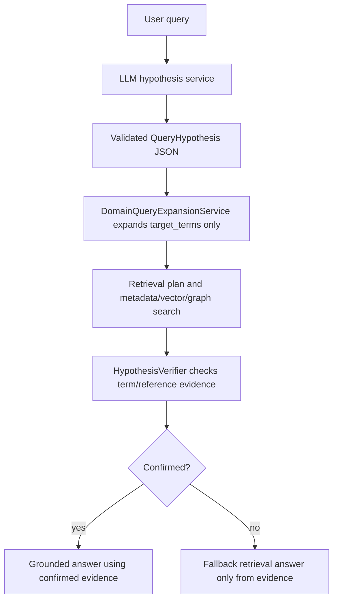

# LLM-Assisted Domain Query Understanding Implementation Plan

> **For agentic workers:** REQUIRED SUB-SKILL: Use superpowers:subagent-driven-development (recommended) or superpowers:executing-plans to implement this plan task-by-task. Steps use checkbox (`- [ ]`) syntax for tracking.

**Goal:** Add an LLM-assisted query-understanding layer that proposes target terms and probable answers, then require deterministic retrieval evidence to confirm or reject the hypothesis before the final answer.

**Architecture:** The LLM produces a structured, non-authoritative hypothesis: intent, target terms, probable Arabic terms, and optional probable reference. Deterministic services validate the JSON, expand only approved target terms, run metadata/vector/graph retrieval, and mark the hypothesis confirmed only when retrieved evidence contains the target term and source reference. If the LLM is unavailable, invalid, slow, or unconfirmed, retrieval falls back to current deterministic behavior without guessing.

**Tech Stack:** Python 3.12, FastAPI service layer, Pydantic/dataclasses, httpx OpenAI-compatible chat completions, SQLAlchemy async tests, pytest/pytest-asyncio, Ruff.

---

## Current Problem

The current domain-aware layer works for direct tokens:

- `hanan` -> expands to `حنانا`, `وحنانا` -> retrieves Quran chunk page 412.
- `حنانا` alone -> Arabic exact token path.

It fails for natural-language wrappers:

- `in which surah the word hanan is mentioned`
- `where is حنانا mentioned`

Reason: `DomainQueryExpansionService.expand()` receives the whole query. It can expand direct `hanan`, but it does not extract the target term from a sentence. For Arabic mixed with English, it expands the whole sentence as one Arabic query.

The target design:



Important rule: the LLM hypothesis is never final truth. It is only a search plan and probable answer candidate.

---

## File Structure

### Create

- `backend/src/ragstudio/services/query_hypothesis_service.py`
  - Owns LLM-assisted structured query understanding.
  - Defines `QueryHypothesis`, `QueryTargetTerm`, and `ProbableAnswer` dataclasses.
  - Calls OpenAI-compatible `/chat/completions` with JSON-only prompt.
  - Validates and sanitizes model output.
  - Returns a null-safe hypothesis on timeout/error/invalid JSON.

- `backend/src/ragstudio/services/query_hypothesis_verifier.py`
  - Verifies a hypothesis against retrieved `EvidenceCandidate` objects.
  - Confirms target term presence, reference match, and document scope.
  - Produces a trace with `confirmed`, `rejected`, or `not_applicable`.

- `backend/tests/test_query_hypothesis_service.py`
  - Unit tests for LLM JSON parsing, invalid output, timeout fallback, Arabic token extraction, transliteration extraction, and probable answer parsing.

- `backend/tests/test_query_hypothesis_verifier.py`
  - Unit tests for deterministic confirmation/rejection from evidence.

### Modify

- `backend/src/ragstudio/services/domain_query_expansion_service.py`
  - Accept optional `query_hypothesis`.
  - Expand target terms from the hypothesis instead of the full query when valid.
  - Preserve existing direct-query behavior when no hypothesis exists.

- `backend/src/ragstudio/services/query_understanding.py`
  - Carry target terms/probable references in `QueryUnderstanding.expansion_trace`.
  - Keep existing direct expansion behavior unchanged.

- `backend/src/ragstudio/services/retrieval_orchestrator.py`
  - Add optional `query_hypothesis_service` and `query_hypothesis_verifier`.
  - Run LLM hypothesis before domain expansion under a small budget.
  - Add traces: `query_hypothesis`, `domain_query_expansion`, `hypothesis_verification`.
  - Never fail the query if hypothesis service fails.

- `backend/src/ragstudio/services/evidence_first_answer_service.py`
  - If verifier confirms a probable reference/answer, render a concise evidence-first answer: “The word حنانا is mentioned in Surah Maryam, 19:13.”
  - Only use this when verifier status is `confirmed`.

- `backend/tests/test_domain_query_expansion_service.py`
  - Add tests for expanding extracted target terms from hypothesis.

- `backend/tests/test_retrieval_orchestrator.py`
  - Add integration tests for:
    - `in which surah the word hanan is mentioned`
    - `where is حنانا mentioned`
    - invalid/timeout LLM fallback.

- `backend/tests/test_runtime_answer_service.py`
  - Reuse patterns for OpenAI-compatible chat call testing if needed.

---

## Public Contracts

### Query Hypothesis JSON

The LLM must return only this JSON shape:

```json
{
  "intent": "find_word_occurrence",
  "target_terms": [
    {
      "surface": "hanan",
      "script": "latin",
      "language_hint": "arabic",
      "term_type": "transliteration"
    }
  ],
  "domain_hint": "quran",
  "answer_shape": "surah_and_verse",
  "probable_answer": {
    "surah": "Maryam",
    "surah_number": 19,
    "ayah": 13,
    "matched_term": "حنانا"
  },
  "confidence": 0.82,
  "needs_clarification": false
}
```

Allowed enum values:

- `intent`: `find_word_occurrence`, `reference_lookup`, `explain_reference`, `semantic_question`, `unknown`
- `script`: `arabic`, `latin`, `mixed`, `unknown`
- `term_type`: `exact_text`, `transliteration`, `reference`, `unknown`
- `domain_hint`: `quran`, `tafseer`, `hadith`, `research`, `legal`, `generic`, `unknown`
- `answer_shape`: `surah_and_verse`, `reference`, `short_answer`, `explanation`, `unknown`

The deterministic validator must drop:

- target terms longer than 80 characters
- terms containing URLs
- path-like terms
- more than 5 target terms
- probable answers with non-integer `surah_number` or `ayah`
- confidence outside `0.0..1.0`

---

## Task 1: Add Query Hypothesis Dataclasses and Parser

**Files:**
- Create: `backend/src/ragstudio/services/query_hypothesis_service.py`
- Test: `backend/tests/test_query_hypothesis_service.py`

- [ ] **Step 1: Write failing parser tests**

Add this file:

```python
import pytest

from ragstudio.services.query_hypothesis_service import (
    ProbableAnswer,
    QueryHypothesis,
    QueryHypothesisService,
    QueryTargetTerm,
)


def test_parse_hypothesis_extracts_transliteration_target_and_probable_answer():
    raw = {
        "intent": "find_word_occurrence",
        "target_terms": [
            {
                "surface": "hanan",
                "script": "latin",
                "language_hint": "arabic",
                "term_type": "transliteration",
            }
        ],
        "domain_hint": "quran",
        "answer_shape": "surah_and_verse",
        "probable_answer": {
            "surah": "Maryam",
            "surah_number": 19,
            "ayah": 13,
            "matched_term": "حنانا",
        },
        "confidence": 0.82,
        "needs_clarification": False,
    }

    hypothesis = QueryHypothesisService.parse_hypothesis(raw, original_query="where is hanan")

    assert hypothesis.intent == "find_word_occurrence"
    assert hypothesis.target_terms == [
        QueryTargetTerm(
            surface="hanan",
            script="latin",
            language_hint="arabic",
            term_type="transliteration",
        )
    ]
    assert hypothesis.domain_hint == "quran"
    assert hypothesis.answer_shape == "surah_and_verse"
    assert hypothesis.probable_answer == ProbableAnswer(
        surah="Maryam",
        surah_number=19,
        ayah=13,
        matched_term="حنانا",
    )
    assert hypothesis.confidence == pytest.approx(0.82)
    assert hypothesis.needs_clarification is False
    assert hypothesis.valid is True


def test_parse_hypothesis_drops_unsafe_and_oversized_terms():
    raw = {
        "intent": "find_word_occurrence",
        "target_terms": [
            {"surface": "/Users/meet/private.pdf", "script": "latin", "term_type": "exact_text"},
            {"surface": "http://example.com", "script": "latin", "term_type": "exact_text"},
            {"surface": "x" * 81, "script": "latin", "term_type": "exact_text"},
            {"surface": "حنانا", "script": "arabic", "term_type": "exact_text"},
        ],
        "domain_hint": "quran",
        "answer_shape": "surah_and_verse",
        "confidence": 2,
        "needs_clarification": False,
    }

    hypothesis = QueryHypothesisService.parse_hypothesis(raw, original_query="where is حنانا")

    assert [term.surface for term in hypothesis.target_terms] == ["حنانا"]
    assert hypothesis.confidence == 1.0
    assert hypothesis.valid is True


def test_parse_hypothesis_returns_invalid_for_non_dict():
    hypothesis = QueryHypothesisService.parse_hypothesis(["bad"], original_query="hello")

    assert hypothesis == QueryHypothesis.empty("hello", reason="invalid_hypothesis_shape")
```

- [ ] **Step 2: Run parser tests and verify they fail**

Run:

```bash
PYTHONPATH=$PWD/backend/src .venv/bin/python -m pytest backend/tests/test_query_hypothesis_service.py -q
```

Expected: fail with `ModuleNotFoundError: No module named 'ragstudio.services.query_hypothesis_service'`.

- [ ] **Step 3: Implement dataclasses and parser**

Create `backend/src/ragstudio/services/query_hypothesis_service.py`:

```python
from __future__ import annotations

import json
from dataclasses import dataclass, field
from pathlib import PureWindowsPath
from typing import Any

import httpx

_INTENTS = {
    "find_word_occurrence",
    "reference_lookup",
    "explain_reference",
    "semantic_question",
    "unknown",
}
_SCRIPTS = {"arabic", "latin", "mixed", "unknown"}
_TERM_TYPES = {"exact_text", "transliteration", "reference", "unknown"}
_DOMAIN_HINTS = {"quran", "tafseer", "hadith", "research", "legal", "generic", "unknown"}
_ANSWER_SHAPES = {"surah_and_verse", "reference", "short_answer", "explanation", "unknown"}
_UNSAFE_KEYS = {"path", "file_path", "artifact_path"}
_MAX_TERMS = 5
_MAX_TERM_LENGTH = 80


@dataclass(frozen=True)
class QueryTargetTerm:
    surface: str
    script: str = "unknown"
    language_hint: str = "unknown"
    term_type: str = "unknown"


@dataclass(frozen=True)
class ProbableAnswer:
    surah: str | None = None
    surah_number: int | None = None
    ayah: int | None = None
    reference: str | None = None
    matched_term: str | None = None


@dataclass(frozen=True)
class QueryHypothesis:
    original_query: str
    intent: str = "unknown"
    target_terms: list[QueryTargetTerm] = field(default_factory=list)
    domain_hint: str = "unknown"
    answer_shape: str = "unknown"
    probable_answer: ProbableAnswer | None = None
    confidence: float = 0.0
    needs_clarification: bool = False
    valid: bool = False
    reason: str | None = None
    trace: dict[str, Any] = field(default_factory=dict)

    @classmethod
    def empty(cls, original_query: str, *, reason: str) -> QueryHypothesis:
        return cls(
            original_query=original_query,
            valid=False,
            reason=reason,
            trace={
                "stage": "query_hypothesis",
                "status": "skipped",
                "reason": reason,
                "target_terms": [],
            },
        )


class QueryHypothesisService:
    def __init__(self, *, timeout_ms: int = 700):
        self.timeout_ms = timeout_ms

    async def hypothesize(
        self,
        query: str,
        *,
        profile: Any,
        domain_metadata: list[dict[str, Any]],
    ) -> QueryHypothesis:
        if not _profile_has_llm(profile):
            return QueryHypothesis.empty(query, reason="llm_profile_unavailable")

        payload = self._payload(query, domain_metadata, profile)
        timeout_s = max(self.timeout_ms, 1) / 1000
        try:
            async with httpx.AsyncClient(timeout=timeout_s) as client:
                response = await client.post(
                    _chat_url(str(profile.llm_base_url)),
                    headers=_headers(getattr(profile, "llm_api_key", None)),
                    json=payload,
                )
                response.raise_for_status()
                body = response.json()
        except (httpx.HTTPError, json.JSONDecodeError, TimeoutError) as exc:
            return QueryHypothesis.empty(query, reason=exc.__class__.__name__)

        content = _content(body)
        try:
            parsed = json.loads(content)
        except json.JSONDecodeError:
            return QueryHypothesis.empty(query, reason="invalid_json")
        return self.parse_hypothesis(parsed, original_query=query)

    @staticmethod
    def parse_hypothesis(raw: Any, *, original_query: str) -> QueryHypothesis:
        if not isinstance(raw, dict):
            return QueryHypothesis.empty(original_query, reason="invalid_hypothesis_shape")

        terms = [
            term
            for item in raw.get("target_terms", [])
            if isinstance(item, dict)
            if (term := _target_term(item)) is not None
        ][: _MAX_TERMS]
        probable_answer = _probable_answer(raw.get("probable_answer"))
        intent = _enum(raw.get("intent"), _INTENTS, "unknown")
        domain_hint = _enum(raw.get("domain_hint"), _DOMAIN_HINTS, "unknown")
        answer_shape = _enum(raw.get("answer_shape"), _ANSWER_SHAPES, "unknown")
        confidence = _confidence(raw.get("confidence"))
        needs_clarification = bool(raw.get("needs_clarification", False))
        valid = bool(terms) and not needs_clarification
        return QueryHypothesis(
            original_query=original_query,
            intent=intent,
            target_terms=terms,
            domain_hint=domain_hint,
            answer_shape=answer_shape,
            probable_answer=probable_answer,
            confidence=confidence,
            needs_clarification=needs_clarification,
            valid=valid,
            reason=None if valid else "no_valid_target_terms",
            trace={
                "stage": "query_hypothesis",
                "status": "ok" if valid else "no_valid_target_terms",
                "intent": intent,
                "domain_hint": domain_hint,
                "answer_shape": answer_shape,
                "target_terms": [term.__dict__ for term in terms],
                "probable_answer": probable_answer.__dict__ if probable_answer else None,
                "confidence": confidence,
            },
        )

    def _payload(
        self,
        query: str,
        domain_metadata: list[dict[str, Any]],
        profile: Any,
    ) -> dict[str, Any]:
        domain_hints = _compact_domain_hints(domain_metadata)
        return {
            "model": profile.llm_model,
            "messages": [
                {"role": "system", "content": _SYSTEM_PROMPT},
                {
                    "role": "user",
                    "content": json.dumps(
                        {"query": query, "domain_metadata": domain_hints},
                        ensure_ascii=False,
                    ),
                },
            ],
            "temperature": 0.0,
            "response_format": {"type": "json_object"},
        }


_SYSTEM_PROMPT = """Extract a non-authoritative search hypothesis for a RAG system.
Return only JSON. Do not answer the user.
Find target words inside natural-language questions.
For Quran/Tafseer word occurrence questions, identify transliterated Arabic words and Arabic words.
Include a probable answer only if it is a hypothesis that must be verified by retrieval.
If unsure, return target_terms: [] and needs_clarification: true."""


def _target_term(raw: dict[str, Any]) -> QueryTargetTerm | None:
    surface = raw.get("surface")
    if not isinstance(surface, str):
        return None
    surface = " ".join(surface.strip().split())
    if not surface or len(surface) > _MAX_TERM_LENGTH:
        return None
    if "://" in surface or _is_absolute_path_value(surface):
        return None
    return QueryTargetTerm(
        surface=surface,
        script=_enum(raw.get("script"), _SCRIPTS, "unknown"),
        language_hint=_safe_short(raw.get("language_hint"), fallback="unknown"),
        term_type=_enum(raw.get("term_type"), _TERM_TYPES, "unknown"),
    )


def _probable_answer(raw: Any) -> ProbableAnswer | None:
    if not isinstance(raw, dict):
        return None
    surah_number = _int_or_none(raw.get("surah_number"))
    ayah = _int_or_none(raw.get("ayah"))
    return ProbableAnswer(
        surah=_str_or_none(raw.get("surah")),
        surah_number=surah_number,
        ayah=ayah,
        reference=_str_or_none(raw.get("reference")),
        matched_term=_str_or_none(raw.get("matched_term")),
    )


def _enum(value: Any, allowed: set[str], fallback: str) -> str:
    if not isinstance(value, str):
        return fallback
    normalized = value.strip().casefold()
    return normalized if normalized in allowed else fallback


def _confidence(value: Any) -> float:
    try:
        parsed = float(value)
    except (TypeError, ValueError):
        return 0.0
    return min(max(parsed, 0.0), 1.0)


def _safe_short(value: Any, *, fallback: str) -> str:
    if not isinstance(value, str):
        return fallback
    normalized = value.strip().casefold()
    return normalized[:40] if normalized else fallback


def _str_or_none(value: Any) -> str | None:
    if not isinstance(value, str):
        return None
    stripped = value.strip()
    return stripped[:120] if stripped else None


def _int_or_none(value: Any) -> int | None:
    try:
        parsed = int(value)
    except (TypeError, ValueError):
        return None
    return parsed if parsed > 0 else None


def _profile_has_llm(profile: Any) -> bool:
    return bool(getattr(profile, "llm_base_url", None) and getattr(profile, "llm_model", None))


def _chat_url(base_url: str) -> str:
    normalized = base_url.rstrip("/")
    if normalized.endswith("/chat/completions"):
        return normalized
    return f"{normalized}/chat/completions"


def _headers(api_key: str | None) -> dict[str, str]:
    headers = {"content-type": "application/json"}
    if api_key:
        headers["authorization"] = f"Bearer {api_key}"
    return headers


def _content(body: Any) -> str:
    if not isinstance(body, dict):
        return ""
    choices = body.get("choices")
    if not isinstance(choices, list) or not choices:
        return ""
    first = choices[0]
    if not isinstance(first, dict):
        return ""
    message = first.get("message")
    if isinstance(message, dict) and isinstance(message.get("content"), str):
        return message["content"]
    return ""


def _compact_domain_hints(domain_metadata: list[dict[str, Any]]) -> list[dict[str, Any]]:
    compact: list[dict[str, Any]] = []
    for item in domain_metadata[:5]:
        compact.append(
            {
                key: item.get(key)
                for key in (
                    "document_id",
                    "domain",
                    "document_type",
                    "content_role",
                    "language",
                    "script",
                    "tags",
                    "citation_style",
                )
                if key in item
            }
        )
    return compact


def _is_absolute_path_value(value: Any) -> bool:
    if not isinstance(value, str):
        return False
    return value.startswith("/") or PureWindowsPath(value).is_absolute()
```

- [ ] **Step 4: Run parser tests**

Run:

```bash
PYTHONPATH=$PWD/backend/src .venv/bin/python -m pytest backend/tests/test_query_hypothesis_service.py -q
```

Expected: `3 passed`.

- [ ] **Step 5: Commit**

```bash
git add backend/src/ragstudio/services/query_hypothesis_service.py backend/tests/test_query_hypothesis_service.py
git commit -m "feat: add query hypothesis parser"
```

---

## Task 2: Add LLM Call Tests and Timeout Fallback

**Files:**
- Modify: `backend/tests/test_query_hypothesis_service.py`
- Modify: `backend/src/ragstudio/services/query_hypothesis_service.py`

- [ ] **Step 1: Add fake httpx client tests**

Append to `backend/tests/test_query_hypothesis_service.py`:

```python
import httpx


class FakeResponse:
    def __init__(self, body):
        self._body = body

    def raise_for_status(self):
        return None

    def json(self):
        return self._body


class FakeClient:
    def __init__(self, response=None, error=None):
        self.response = response
        self.error = error
        self.requests = []

    async def __aenter__(self):
        return self

    async def __aexit__(self, exc_type, exc, tb):
        return None

    async def post(self, url, headers, json):
        self.requests.append({"url": url, "headers": headers, "json": json})
        if self.error:
            raise self.error
        return FakeResponse(self.response)


def profile():
    return type(
        "Profile",
        (),
        {
            "llm_model": "test-model",
            "llm_base_url": "http://llm.example/v1",
            "llm_api_key": "secret",
        },
    )()


@pytest.mark.asyncio
async def test_hypothesize_calls_llm_json_endpoint(monkeypatch):
    fake_client = FakeClient(
        {
            "choices": [
                {
                    "message": {
                        "content": (
                            '{"intent":"find_word_occurrence",'
                            '"target_terms":[{"surface":"hanan","script":"latin",'
                            '"language_hint":"arabic","term_type":"transliteration"}],'
                            '"domain_hint":"quran","answer_shape":"surah_and_verse",'
                            '"confidence":0.8,"needs_clarification":false}'
                        )
                    }
                }
            ]
        }
    )
    monkeypatch.setattr(
        "ragstudio.services.query_hypothesis_service.httpx.AsyncClient",
        lambda *, timeout: fake_client,
    )

    result = await QueryHypothesisService(timeout_ms=700).hypothesize(
        "in which surah the word hanan is mentioned",
        profile=profile(),
        domain_metadata=[{"domain": "quran_tafseer", "tags": ["quran"]}],
    )

    assert result.valid is True
    assert result.target_terms[0].surface == "hanan"
    assert fake_client.requests[0]["url"] == "http://llm.example/v1/chat/completions"
    assert fake_client.requests[0]["json"]["response_format"] == {"type": "json_object"}


@pytest.mark.asyncio
async def test_hypothesize_falls_back_on_timeout(monkeypatch):
    fake_client = FakeClient(error=httpx.TimeoutException("too slow"))
    monkeypatch.setattr(
        "ragstudio.services.query_hypothesis_service.httpx.AsyncClient",
        lambda *, timeout: fake_client,
    )

    result = await QueryHypothesisService(timeout_ms=10).hypothesize(
        "where is حنانا mentioned",
        profile=profile(),
        domain_metadata=[{"domain": "quran_tafseer"}],
    )

    assert result.valid is False
    assert result.reason == "TimeoutException"
```

- [ ] **Step 2: Run LLM call tests**

Run:

```bash
PYTHONPATH=$PWD/backend/src .venv/bin/python -m pytest backend/tests/test_query_hypothesis_service.py -q
```

Expected: all tests pass.

- [ ] **Step 3: Commit**

```bash
git add backend/src/ragstudio/services/query_hypothesis_service.py backend/tests/test_query_hypothesis_service.py
git commit -m "test: cover query hypothesis llm fallback"
```

---

## Task 3: Expand Domain Query Service from Hypothesis Target Terms

**Files:**
- Modify: `backend/src/ragstudio/services/domain_query_expansion_service.py`
- Modify: `backend/tests/test_domain_query_expansion_service.py`

- [ ] **Step 1: Add failing domain expansion tests**

Append to `backend/tests/test_domain_query_expansion_service.py`:

```python
from ragstudio.services.query_hypothesis_service import QueryHypothesis, QueryTargetTerm


def test_domain_expansion_uses_hypothesis_transliteration_target_from_sentence():
    hypothesis = QueryHypothesis(
        original_query="in which surah the word hanan is mentioned",
        intent="find_word_occurrence",
        target_terms=[
            QueryTargetTerm(
                surface="hanan",
                script="latin",
                language_hint="arabic",
                term_type="transliteration",
            )
        ],
        domain_hint="quran",
        valid=True,
    )

    result = DomainQueryExpansionService().expand(
        "in which surah the word hanan is mentioned",
        domain_metadata=[{"domain": "quran_tafseer", "tags": ["quran"]}],
        query_hypothesis=hypothesis,
    )

    assert result.original_query == "in which surah the word hanan is mentioned"
    assert result.expanded_terms == ["حنانا", "وحنانا"]
    assert [item.query for item in result.retrieval_passes] == ["حنانا", "وحنانا"]
    assert result.trace["hypothesis_target_terms"] == ["hanan"]


def test_domain_expansion_uses_hypothesis_arabic_target_from_sentence():
    hypothesis = QueryHypothesis(
        original_query="where is حنانا mentioned",
        intent="find_word_occurrence",
        target_terms=[
            QueryTargetTerm(
                surface="حنانا",
                script="arabic",
                language_hint="arabic",
                term_type="exact_text",
            )
        ],
        domain_hint="quran",
        valid=True,
    )

    result = DomainQueryExpansionService().expand(
        "where is حنانا mentioned",
        domain_metadata=[{"domain": "quran_tafseer"}],
        query_hypothesis=hypothesis,
    )

    assert result.expanded_terms == ["حنانا", "وحنانا"]
    assert all(item.match_type == "exact_script" for item in result.retrieval_passes)


def test_domain_expansion_ignores_invalid_hypothesis_and_preserves_direct_fallback():
    hypothesis = QueryHypothesis.empty("where is حنانا mentioned", reason="invalid_json")

    result = DomainQueryExpansionService().expand(
        "hanan",
        domain_metadata=[{"domain": "quran_tafseer"}],
        query_hypothesis=hypothesis,
    )

    assert result.expanded_terms == ["حنانا", "وحنانا"]
```

- [ ] **Step 2: Run tests to verify failure**

Run:

```bash
PYTHONPATH=$PWD/backend/src .venv/bin/python -m pytest backend/tests/test_domain_query_expansion_service.py -q
```

Expected: fail because `expand()` does not accept `query_hypothesis`.

- [ ] **Step 3: Update `DomainQueryExpansion` and expansion service**

Modify `backend/src/ragstudio/services/domain_query_expansion_service.py`:

```python
@dataclass(frozen=True)
class DomainQueryExpansion:
    original_query: str
    domain_family: str
    expansions: list[LexicalExpansion] = field(default_factory=list)
    retrieval_passes: list[RetrievalPass] = field(default_factory=list)
    trace: dict[str, object] = field(default_factory=dict)

    @property
    def expanded_terms(self) -> list[str]:
        return [term for expansion in self.expansions for term in expansion.terms]
```

Change `expand()` signature and core loop:

```python
    def expand(
        self,
        query: str,
        *,
        domain_metadata: list[dict[str, Any]],
        query_hypothesis: Any | None = None,
    ) -> DomainQueryExpansion:
        domain_family = _domain_family(domain_metadata)
        expansions: list[LexicalExpansion] = []
        retrieval_passes: list[RetrievalPass] = []
        candidate_queries = _candidate_queries(query, query_hypothesis)

        if domain_family == "arabic_religious":
            for candidate_query in candidate_queries:
                if not self.arabic_adapter.supports_query(candidate_query):
                    continue
                expansion = self.arabic_adapter.expand_query(candidate_query)
                if expansion.terms and expansion.match_type in {"exact_script", "transliteration"}:
                    expansions.append(expansion)
                    retrieval_passes.extend(
                        RetrievalPass(
                            "lexical_expanded_token",
                            term,
                            direct_evidence=True,
                            match_type=expansion.match_type,
                        )
                        for term in expansion.terms
                    )

        expanded_terms = [term for expansion in expansions for term in expansion.terms]
        return DomainQueryExpansion(
            original_query=query,
            domain_family=domain_family,
            expansions=expansions,
            retrieval_passes=_dedupe_passes(retrieval_passes),
            trace={
                "stage": "domain_query_expansion",
                "original_query": query,
                "domain_family": domain_family,
                "expanded_terms": expanded_terms,
                "hypothesis_target_terms": candidate_queries if _valid_hypothesis(query_hypothesis) else [],
                "expansions": [
                    {
                        "language": expansion.language,
                        "script": expansion.script,
                        "match_type": expansion.match_type,
                        "confidence": expansion.confidence,
                        "source": expansion.source,
                        "terms": list(expansion.terms),
                    }
                    for expansion in expansions
                ],
            },
        )
```

Add helpers below `_domain_family()`:

```python
def _candidate_queries(query: str, query_hypothesis: Any | None) -> list[str]:
    if _valid_hypothesis(query_hypothesis):
        terms = [
            str(term.surface).strip()
            for term in getattr(query_hypothesis, "target_terms", [])
            if str(getattr(term, "surface", "")).strip()
        ]
        if terms:
            return list(dict.fromkeys(terms))
    return [query]


def _valid_hypothesis(query_hypothesis: Any | None) -> bool:
    return bool(getattr(query_hypothesis, "valid", False))


def _dedupe_passes(passes: list[RetrievalPass]) -> list[RetrievalPass]:
    deduped: list[RetrievalPass] = []
    seen: set[tuple[str, str, str | None]] = set()
    for retrieval_pass in passes:
        key = (retrieval_pass.name, retrieval_pass.query, retrieval_pass.match_type)
        if key in seen:
            continue
        seen.add(key)
        deduped.append(retrieval_pass)
    return deduped
```

- [ ] **Step 4: Run domain expansion tests**

Run:

```bash
PYTHONPATH=$PWD/backend/src .venv/bin/python -m pytest backend/tests/test_domain_query_expansion_service.py -q
```

Expected: all pass.

- [ ] **Step 5: Commit**

```bash
git add backend/src/ragstudio/services/domain_query_expansion_service.py backend/tests/test_domain_query_expansion_service.py
git commit -m "feat: expand domain queries from llm target terms"
```

---

## Task 4: Add Deterministic Hypothesis Verifier

**Files:**
- Create: `backend/src/ragstudio/services/query_hypothesis_verifier.py`
- Test: `backend/tests/test_query_hypothesis_verifier.py`

- [ ] **Step 1: Write verifier tests**

Create `backend/tests/test_query_hypothesis_verifier.py`:

```python
from ragstudio.services.query_hypothesis_service import (
    ProbableAnswer,
    QueryHypothesis,
    QueryTargetTerm,
)
from ragstudio.services.query_hypothesis_verifier import QueryHypothesisVerifier
from ragstudio.services.retrieval_evidence import EvidenceCandidate


def candidate(text, *, reference="19:13", retrieval_pass="lexical_expanded_token"):
    return EvidenceCandidate(
        candidate_id="metadata:chunk-19-13",
        text=text,
        document_id="doc-quran",
        chunk_id="chunk-19-13",
        source_location={"reference": reference, "page": 412},
        metadata={},
        tool="metadata",
        tool_rank=1,
        base_score=90.0,
        retrieval_pass=retrieval_pass,
        match_features={
            "lexical_expanded": True,
            "expanded_token": "حنانا",
            "match_type": "transliteration",
        },
        canonical_reference=reference,
    )


def test_verifier_confirms_probable_surah_ayah_when_evidence_contains_term():
    hypothesis = QueryHypothesis(
        original_query="in which surah the word hanan is mentioned",
        intent="find_word_occurrence",
        target_terms=[QueryTargetTerm("hanan", "latin", "arabic", "transliteration")],
        domain_hint="quran",
        answer_shape="surah_and_verse",
        probable_answer=ProbableAnswer(
            surah="Maryam",
            surah_number=19,
            ayah=13,
            matched_term="حنانا",
        ),
        valid=True,
    )

    result = QueryHypothesisVerifier().verify(
        hypothesis,
        [candidate("وَحَنَانًا مِّن لَّدُنَّا وَزَكَاةً")],
    )

    assert result["status"] == "confirmed"
    assert result["reference"] == "19:13"
    assert result["matched_term"] == "حنانا"
    assert result["answer"] == "The word حنانا is mentioned in Surah Maryam, 19:13."


def test_verifier_rejects_when_term_is_not_in_evidence():
    hypothesis = QueryHypothesis(
        original_query="where is hanan",
        target_terms=[QueryTargetTerm("hanan", "latin", "arabic", "transliteration")],
        probable_answer=ProbableAnswer(surah="Maryam", surah_number=19, ayah=13, matched_term="حنانا"),
        valid=True,
    )

    result = QueryHypothesisVerifier().verify(
        hypothesis,
        [candidate("Verse 19:12 about Yahya", reference="19:12")],
    )

    assert result["status"] == "rejected"
    assert result["reason"] == "target_term_not_found_in_evidence"


def test_verifier_returns_not_applicable_for_invalid_hypothesis():
    result = QueryHypothesisVerifier().verify(QueryHypothesis.empty("q", reason="timeout"), [])

    assert result["status"] == "not_applicable"
```

- [ ] **Step 2: Run tests and verify failure**

Run:

```bash
PYTHONPATH=$PWD/backend/src .venv/bin/python -m pytest backend/tests/test_query_hypothesis_verifier.py -q
```

Expected: fail with missing module.

- [ ] **Step 3: Implement verifier**

Create `backend/src/ragstudio/services/query_hypothesis_verifier.py`:

```python
from __future__ import annotations

from typing import Any

from ragstudio.services.arabic_text import normalize_arabic_text
from ragstudio.services.query_hypothesis_service import QueryHypothesis
from ragstudio.services.retrieval_evidence import EvidenceCandidate


class QueryHypothesisVerifier:
    def verify(
        self,
        hypothesis: QueryHypothesis,
        evidence: list[EvidenceCandidate],
    ) -> dict[str, Any]:
        if not hypothesis.valid:
            return {
                "stage": "hypothesis_verification",
                "status": "not_applicable",
                "reason": hypothesis.reason or "invalid_hypothesis",
            }

        target_terms = _target_terms(hypothesis, evidence)
        if not target_terms:
            return {
                "stage": "hypothesis_verification",
                "status": "rejected",
                "reason": "no_target_terms",
            }

        for candidate in evidence:
            matched_term = _matched_term(candidate, target_terms)
            if not matched_term:
                continue
            reference = candidate.canonical_reference or _source_reference(candidate)
            answer = _confirmed_answer(hypothesis, matched_term, reference)
            return {
                "stage": "hypothesis_verification",
                "status": "confirmed",
                "matched_term": matched_term,
                "reference": reference,
                "candidate_id": candidate.candidate_id,
                "chunk_id": candidate.chunk_id,
                "answer": answer,
                "probable_answer": (
                    hypothesis.probable_answer.__dict__
                    if hypothesis.probable_answer
                    else None
                ),
            }

        return {
            "stage": "hypothesis_verification",
            "status": "rejected",
            "reason": "target_term_not_found_in_evidence",
            "target_terms": target_terms,
        }


def _target_terms(
    hypothesis: QueryHypothesis,
    evidence: list[EvidenceCandidate],
) -> list[str]:
    terms: list[str] = []
    if hypothesis.probable_answer and hypothesis.probable_answer.matched_term:
        terms.append(hypothesis.probable_answer.matched_term)
    for candidate in evidence:
        expanded = candidate.match_features.get("expanded_token")
        if isinstance(expanded, str):
            terms.append(expanded)
    for term in hypothesis.target_terms:
        terms.append(term.surface)
    return list(dict.fromkeys(term for term in terms if term))


def _matched_term(candidate: EvidenceCandidate, terms: list[str]) -> str | None:
    normalized_text = normalize_arabic_text(candidate.text)
    folded_text = candidate.text.casefold()
    for term in terms:
        if _contains_term(normalized_text, folded_text, term):
            return term
    return None


def _contains_term(normalized_text: str, folded_text: str, term: str) -> bool:
    normalized_term = normalize_arabic_text(term)
    if normalized_term and normalized_term in normalized_text:
        return True
    return term.casefold() in folded_text


def _source_reference(candidate: EvidenceCandidate) -> str | None:
    raw = candidate.source_location.get("reference")
    return raw if isinstance(raw, str) and raw else None


def _confirmed_answer(
    hypothesis: QueryHypothesis,
    matched_term: str,
    reference: str | None,
) -> str:
    probable = hypothesis.probable_answer
    if probable and probable.surah and probable.surah_number and probable.ayah:
        expected_reference = f"{probable.surah_number}:{probable.ayah}"
        if reference in {None, expected_reference}:
            return (
                f"The word {matched_term} is mentioned in "
                f"Surah {probable.surah}, {expected_reference}."
            )
    if reference:
        return f"The word {matched_term} is mentioned at {reference}."
    return f"The word {matched_term} appears in the retrieved evidence."
```

- [ ] **Step 4: Run verifier tests**

Run:

```bash
PYTHONPATH=$PWD/backend/src .venv/bin/python -m pytest backend/tests/test_query_hypothesis_verifier.py -q
```

Expected: `3 passed`.

- [ ] **Step 5: Commit**

```bash
git add backend/src/ragstudio/services/query_hypothesis_verifier.py backend/tests/test_query_hypothesis_verifier.py
git commit -m "feat: verify llm query hypotheses against evidence"
```

---

## Task 5: Wire LLM Hypothesis into Retrieval Orchestrator

**Files:**
- Modify: `backend/src/ragstudio/services/retrieval_orchestrator.py`
- Modify: `backend/tests/test_retrieval_orchestrator.py`

- [ ] **Step 1: Add orchestrator fake services and tests**

Append focused fake service helpers near existing test fakes in `backend/tests/test_retrieval_orchestrator.py`:

```python
from ragstudio.services.query_hypothesis_service import (
    ProbableAnswer,
    QueryHypothesis,
    QueryTargetTerm,
)


class FakeQueryHypothesisService:
    def __init__(self, hypothesis):
        self.hypothesis = hypothesis
        self.calls = []

    async def hypothesize(self, query, *, profile, domain_metadata):
        self.calls.append(
            {
                "query": query,
                "domain_metadata": domain_metadata,
                "profile": profile,
            }
        )
        return self.hypothesis


class ExactHananaChunkSearchService(FakeChunkSearchService):
    async def domain_metadata_for_documents(self, document_ids):
        self.domain_metadata_document_calls.append(list(document_ids))
        return [
            {
                "document_id": document_ids[0],
                "domain": "quran_tafseer",
                "document_type": "commentary",
                "tags": ["quran", "arabic"],
            }
        ]

    async def search(self, search_in):
        self.calls += 1
        self.search_requests.append(search_in)
        if search_in.query == "حنانا":
            return type(
                "SearchResult",
                (),
                {
                    "items": [
                        ChunkOut(
                            id="chunk-19-13",
                            document_id="doc-quran",
                            text="وَحَنَانًا مِّن لَّدُنَّا وَزَكَاةً",
                            source_location={"reference": "19:13", "page": 412},
                            metadata={
                                "score": 90,
                                "reference_metadata": {"references": ["19:13"]},
                            },
                        )
                    ],
                    "total": 1,
                },
            )()
        return type("SearchResult", (), {"items": [], "total": 0})()
```

Add tests:

```python
@pytest.mark.asyncio
async def test_orchestrator_uses_llm_hypothesis_for_natural_language_transliteration():
    hypothesis = QueryHypothesis(
        original_query="in which surah the word hanan is mentioned",
        intent="find_word_occurrence",
        target_terms=[QueryTargetTerm("hanan", "latin", "arabic", "transliteration")],
        domain_hint="quran",
        answer_shape="surah_and_verse",
        probable_answer=ProbableAnswer(
            surah="Maryam",
            surah_number=19,
            ayah=13,
            matched_term="حنانا",
        ),
        confidence=0.82,
        valid=True,
        trace={
            "stage": "query_hypothesis",
            "status": "ok",
            "target_terms": [{"surface": "hanan"}],
        },
    )
    chunk_service = ExactHananaChunkSearchService()
    hypothesis_service = FakeQueryHypothesisService(hypothesis)
    orchestrator = RetrievalOrchestrator(
        chunk_service=chunk_service,
        answer_service=FakeAnswerService(),
        reranker_service=FakeRerankerService(),
        graph_expansion_service=FakeGraphExpansionService(),
        query_hypothesis_service=hypothesis_service,
    )

    result = await orchestrator.query(
        "in which surah the word hanan is mentioned",
        runtime=NativeSearchShouldNotRun(),
        profile=type("Profile", (), {"enable_rerank": False, "reranker_provider": "disabled"})(),
        document_ids=["doc-quran"],
        variant_id="variant-1",
        query_config={
            "limit": 5,
            "retrieval_mode": "metadata",
            "graph_expansion_enabled": False,
            "response_mode": "fast",
        },
    )

    assert result.error is None
    assert hypothesis_service.calls[0]["query"] == "in which surah the word hanan is mentioned"
    retrieval_trace = next(trace for trace in result.chunk_traces if trace["stage"] == "retrieval")
    assert [item["query"] for item in retrieval_trace["metadata_trace"]["passes"]] == ["حنانا"]
    hypothesis_trace = next(trace for trace in result.chunk_traces if trace["stage"] == "query_hypothesis")
    assert hypothesis_trace["status"] == "ok"
    verification_trace = next(
        trace for trace in result.chunk_traces if trace["stage"] == "hypothesis_verification"
    )
    assert verification_trace["status"] == "confirmed"
    assert verification_trace["answer"] == "The word حنانا is mentioned in Surah Maryam, 19:13."


@pytest.mark.asyncio
async def test_orchestrator_uses_llm_hypothesis_for_arabic_term_inside_sentence():
    hypothesis = QueryHypothesis(
        original_query="where is حنانا mentioned",
        intent="find_word_occurrence",
        target_terms=[QueryTargetTerm("حنانا", "arabic", "arabic", "exact_text")],
        domain_hint="quran",
        answer_shape="surah_and_verse",
        probable_answer=ProbableAnswer(
            surah="Maryam",
            surah_number=19,
            ayah=13,
            matched_term="حنانا",
        ),
        confidence=0.9,
        valid=True,
        trace={"stage": "query_hypothesis", "status": "ok"},
    )
    chunk_service = ExactHananaChunkSearchService()
    orchestrator = RetrievalOrchestrator(
        chunk_service=chunk_service,
        answer_service=FakeAnswerService(),
        reranker_service=FakeRerankerService(),
        graph_expansion_service=FakeGraphExpansionService(),
        query_hypothesis_service=FakeQueryHypothesisService(hypothesis),
    )

    result = await orchestrator.query(
        "where is حنانا mentioned",
        runtime=NativeSearchShouldNotRun(),
        profile=type("Profile", (), {"enable_rerank": False, "reranker_provider": "disabled"})(),
        document_ids=["doc-quran"],
        variant_id="variant-1",
        query_config={"limit": 5, "retrieval_mode": "metadata", "graph_expansion_enabled": False},
    )

    retrieval_trace = next(trace for trace in result.chunk_traces if trace["stage"] == "retrieval")
    assert [item["query"] for item in retrieval_trace["metadata_trace"]["passes"]] == ["حنانا"]
    assert result.sources[0]["source_location"]["reference"] == "19:13"
```

- [ ] **Step 2: Run tests and verify failure**

Run:

```bash
PYTHONPATH=$PWD/backend/src .venv/bin/python -m pytest backend/tests/test_retrieval_orchestrator.py::test_orchestrator_uses_llm_hypothesis_for_natural_language_transliteration backend/tests/test_retrieval_orchestrator.py::test_orchestrator_uses_llm_hypothesis_for_arabic_term_inside_sentence -q
```

Expected: fail because `RetrievalOrchestrator` has no `query_hypothesis_service` argument.

- [ ] **Step 3: Wire services in orchestrator**

Modify imports in `backend/src/ragstudio/services/retrieval_orchestrator.py`:

```python
from ragstudio.services.query_hypothesis_service import QueryHypothesisService
from ragstudio.services.query_hypothesis_verifier import QueryHypothesisVerifier
```

Modify `RetrievalOrchestrator.__init__`:

```python
        query_hypothesis_service: QueryHypothesisService | None = None,
        query_hypothesis_verifier: QueryHypothesisVerifier | None = None,
```

Set fields:

```python
        self.query_hypothesis_service = query_hypothesis_service or QueryHypothesisService()
        self.query_hypothesis_verifier = query_hypothesis_verifier or QueryHypothesisVerifier()
```

Modify `query()` before domain expansion:

```python
        domain_metadata = await self._domain_metadata_for_documents(document_ids)
        query_hypothesis = await self.query_hypothesis_service.hypothesize(
            query,
            profile=profile,
            domain_metadata=domain_metadata,
        )
        domain_expansion = self.domain_query_expansion_service.expand(
            query,
            domain_metadata=domain_metadata,
            query_hypothesis=query_hypothesis,
        )
```

After planner trace initialization, add:

```python
        if query_hypothesis.trace:
            traces.append(dict(query_hypothesis.trace))
```

After final evidence is selected and before answer generation, add:

```python
            hypothesis_verification = self.query_hypothesis_verifier.verify(
                query_hypothesis,
                final_evidence,
            )
            traces.append(hypothesis_verification)
```

- [ ] **Step 4: Run orchestrator tests**

Run:

```bash
PYTHONPATH=$PWD/backend/src .venv/bin/python -m pytest backend/tests/test_retrieval_orchestrator.py -q
```

Expected: all pass.

- [ ] **Step 5: Commit**

```bash
git add backend/src/ragstudio/services/retrieval_orchestrator.py backend/tests/test_retrieval_orchestrator.py
git commit -m "feat: wire llm query hypotheses into retrieval"
```

---

## Task 6: Use Confirmed Hypothesis for Evidence-First Answer Text

**Files:**
- Modify: `backend/src/ragstudio/services/evidence_first_answer_service.py`
- Modify: `backend/src/ragstudio/services/retrieval_orchestrator.py`
- Modify: `backend/tests/test_retrieval_orchestrator.py`

- [ ] **Step 1: Add answer assertion test**

Extend `test_orchestrator_uses_llm_hypothesis_for_natural_language_transliteration`:

```python
    assert result.answer.startswith("Evidence-first result")
    assert "The word حنانا is mentioned in Surah Maryam, 19:13." in result.answer
```

- [ ] **Step 2: Run test and verify failure**

Run:

```bash
PYTHONPATH=$PWD/backend/src .venv/bin/python -m pytest backend/tests/test_retrieval_orchestrator.py::test_orchestrator_uses_llm_hypothesis_for_natural_language_transliteration -q
```

Expected: fail because evidence-first answer does not use verification answer.

- [ ] **Step 3: Update evidence-first answer service**

Change signature in `backend/src/ragstudio/services/evidence_first_answer_service.py`:

```python
    def answer(
        self,
        query: str,
        evidence: list[EvidenceCandidate],
        *,
        reason: str,
        llm_timeout_ms: int | None,
        confirmed_answer: str | None = None,
    ) -> tuple[str, dict[str, Any]]:
```

After `"Grounded evidence:"`, add the confirmed answer when present:

```python
        if confirmed_answer:
            lines.extend(["", confirmed_answer, ""])
```

Add metadata:

```python
                "confirmed_answer_used": bool(confirmed_answer),
```

Modify orchestrator fallback call:

```python
            confirmed_answer = (
                hypothesis_verification.get("answer")
                if hypothesis_verification.get("status") == "confirmed"
                else None
            )
            answer, token_metadata = self.evidence_first_answer_service.answer(
                query,
                final_evidence,
                reason="llm_timeout",
                llm_timeout_ms=timeout_ms,
                confirmed_answer=confirmed_answer if isinstance(confirmed_answer, str) else None,
            )
```

- [ ] **Step 4: Run answer tests**

Run:

```bash
PYTHONPATH=$PWD/backend/src .venv/bin/python -m pytest backend/tests/test_retrieval_orchestrator.py backend/tests/test_runtime_answer_service.py -q
```

Expected: all pass.

- [ ] **Step 5: Commit**

```bash
git add backend/src/ragstudio/services/evidence_first_answer_service.py backend/src/ragstudio/services/retrieval_orchestrator.py backend/tests/test_retrieval_orchestrator.py
git commit -m "feat: surface confirmed hypothesis answers"
```

---

## Task 7: Add LLM Hypothesis Guardrails and Latency Controls

**Files:**
- Modify: `backend/src/ragstudio/services/query_hypothesis_service.py`
- Modify: `backend/src/ragstudio/services/retrieval_orchestrator.py`
- Modify: `backend/tests/test_query_hypothesis_service.py`
- Modify: `backend/tests/test_retrieval_orchestrator.py`

- [ ] **Step 1: Add guardrail tests**

Append to `backend/tests/test_query_hypothesis_service.py`:

```python
def test_parse_hypothesis_marks_clarification_as_invalid():
    hypothesis = QueryHypothesisService.parse_hypothesis(
        {
            "intent": "find_word_occurrence",
            "target_terms": [{"surface": "hanan", "script": "latin"}],
            "needs_clarification": True,
        },
        original_query="hanan maybe?",
    )

    assert hypothesis.valid is False
    assert hypothesis.needs_clarification is True
    assert hypothesis.reason == "no_valid_target_terms"


def test_parse_hypothesis_limits_number_of_terms():
    hypothesis = QueryHypothesisService.parse_hypothesis(
        {
            "intent": "find_word_occurrence",
            "target_terms": [
                {"surface": "a", "script": "latin"},
                {"surface": "b", "script": "latin"},
                {"surface": "c", "script": "latin"},
                {"surface": "d", "script": "latin"},
                {"surface": "e", "script": "latin"},
                {"surface": "f", "script": "latin"},
            ],
        },
        original_query="many terms",
    )

    assert [term.surface for term in hypothesis.target_terms] == ["a", "b", "c", "d", "e"]
```

Add to orchestrator tests:

```python
class ExplodingQueryHypothesisService:
    async def hypothesize(self, query, *, profile, domain_metadata):
        raise RuntimeError("hypothesis exploded")


@pytest.mark.asyncio
async def test_orchestrator_falls_back_when_hypothesis_service_raises():
    orchestrator = RetrievalOrchestrator(
        chunk_service=FakeChunkSearchService(),
        answer_service=FakeAnswerService(),
        reranker_service=FakeRerankerService(),
        graph_expansion_service=FakeGraphExpansionService(),
        query_hypothesis_service=ExplodingQueryHypothesisService(),
    )

    result = await orchestrator.query(
        "What does the document say?",
        runtime=NativeSearchShouldNotRun(),
        profile=type("Profile", (), {"enable_rerank": False, "reranker_provider": "disabled"})(),
        document_ids=["doc-1"],
        variant_id="variant-1",
        query_config={"limit": 5, "retrieval_mode": "metadata"},
    )

    hypothesis_trace = next(trace for trace in result.chunk_traces if trace["stage"] == "query_hypothesis")
    assert hypothesis_trace["status"] == "skipped"
    assert hypothesis_trace["reason"] == "RuntimeError"
    assert result.error is None
```

- [ ] **Step 2: Run tests and verify fallback failure**

Run:

```bash
PYTHONPATH=$PWD/backend/src .venv/bin/python -m pytest backend/tests/test_query_hypothesis_service.py backend/tests/test_retrieval_orchestrator.py::test_orchestrator_falls_back_when_hypothesis_service_raises -q
```

Expected: parser tests pass, orchestrator fallback test fails until errors are caught.

- [ ] **Step 3: Catch hypothesis service exceptions in orchestrator**

Add helper to `RetrievalOrchestrator`:

```python
    async def _query_hypothesis(
        self,
        query: str,
        *,
        profile: Any,
        domain_metadata: list[dict[str, Any]],
    ) -> Any:
        try:
            return await self.query_hypothesis_service.hypothesize(
                query,
                profile=profile,
                domain_metadata=domain_metadata,
            )
        except Exception as exc:
            from ragstudio.services.query_hypothesis_service import QueryHypothesis

            return QueryHypothesis.empty(query, reason=exc.__class__.__name__)
```

Replace direct `hypothesize()` call with `_query_hypothesis()`.

- [ ] **Step 4: Run guardrail tests**

Run:

```bash
PYTHONPATH=$PWD/backend/src .venv/bin/python -m pytest backend/tests/test_query_hypothesis_service.py backend/tests/test_retrieval_orchestrator.py -q
```

Expected: all pass.

- [ ] **Step 5: Commit**

```bash
git add backend/src/ragstudio/services/query_hypothesis_service.py backend/src/ragstudio/services/retrieval_orchestrator.py backend/tests/test_query_hypothesis_service.py backend/tests/test_retrieval_orchestrator.py
git commit -m "fix: guard llm query hypothesis fallback"
```

---

## Task 8: Add Deterministic Confirmation Status to Sources and Traces

**Files:**
- Modify: `backend/src/ragstudio/services/retrieval_evidence.py`
- Modify: `backend/src/ragstudio/services/retrieval_orchestrator.py`
- Modify: `backend/tests/test_retrieval_orchestrator.py`

- [ ] **Step 1: Add trace/source metadata assertions**

Extend the confirmed-hypothesis orchestrator test:

```python
    source_metadata = result.sources[0]["metadata"]
    assert source_metadata["hypothesis_verification"]["status"] == "confirmed"
    assert source_metadata["hypothesis_verification"]["matched_term"] == "حنانا"
```

- [ ] **Step 2: Run test and verify failure**

Run:

```bash
PYTHONPATH=$PWD/backend/src .venv/bin/python -m pytest backend/tests/test_retrieval_orchestrator.py::test_orchestrator_uses_llm_hypothesis_for_natural_language_transliteration -q
```

Expected: fail because source metadata lacks hypothesis verification.

- [ ] **Step 3: Annotate confirmed evidence before answer/source serialization**

In `retrieval_orchestrator.py`, after `hypothesis_verification` is created and before `sources = ...`, add:

```python
            final_evidence = _annotate_hypothesis_verification(
                final_evidence,
                hypothesis_verification,
            )
```

Add helper near other helper functions:

```python
def _annotate_hypothesis_verification(
    evidence: list[EvidenceCandidate],
    verification: dict[str, Any],
) -> list[EvidenceCandidate]:
    if verification.get("status") != "confirmed":
        return evidence
    candidate_id = verification.get("candidate_id")
    annotated: list[EvidenceCandidate] = []
    for candidate in evidence:
        if candidate.candidate_id == candidate_id:
            annotated.append(
                replace(
                    candidate,
                    metadata={
                        **candidate.metadata,
                        "hypothesis_verification": {
                            "status": "confirmed",
                            "matched_term": verification.get("matched_term"),
                            "reference": verification.get("reference"),
                        },
                    },
                )
            )
        else:
            annotated.append(candidate)
    return annotated
```

`replace` is already imported in `retrieval_orchestrator.py`.

- [ ] **Step 4: Run tests**

Run:

```bash
PYTHONPATH=$PWD/backend/src .venv/bin/python -m pytest backend/tests/test_retrieval_orchestrator.py -q
```

Expected: all pass.

- [ ] **Step 5: Commit**

```bash
git add backend/src/ragstudio/services/retrieval_orchestrator.py backend/tests/test_retrieval_orchestrator.py
git commit -m "feat: annotate confirmed hypothesis evidence"
```

---

## Task 9: Full Focused Verification

**Files:**
- No source edits expected.

- [ ] **Step 1: Run focused backend tests**

Run:

```bash
PYTHONPATH=$PWD/backend/src .venv/bin/python -m pytest \
  backend/tests/test_query_hypothesis_service.py \
  backend/tests/test_query_hypothesis_verifier.py \
  backend/tests/test_domain_query_expansion_service.py \
  backend/tests/test_query_understanding.py \
  backend/tests/test_metadata_retrieval_service.py \
  backend/tests/test_retrieval_orchestrator.py \
  backend/tests/test_chunks.py \
  -q
```

Expected: all pass.

- [ ] **Step 2: Run Ruff**

Run:

```bash
PYTHONPATH=$PWD/backend/src .venv/bin/python -m ruff check \
  backend/src/ragstudio/services/query_hypothesis_service.py \
  backend/src/ragstudio/services/query_hypothesis_verifier.py \
  backend/src/ragstudio/services/domain_query_expansion_service.py \
  backend/src/ragstudio/services/query_understanding.py \
  backend/src/ragstudio/services/metadata_retrieval_service.py \
  backend/src/ragstudio/services/retrieval_evidence.py \
  backend/src/ragstudio/services/retrieval_orchestrator.py \
  backend/src/ragstudio/services/evidence_first_answer_service.py \
  backend/tests/test_query_hypothesis_service.py \
  backend/tests/test_query_hypothesis_verifier.py \
  backend/tests/test_domain_query_expansion_service.py \
  backend/tests/test_retrieval_orchestrator.py
```

Expected: `All checks passed!`

- [ ] **Step 3: Commit verification notes if tests required fixture updates**

If no source files changed, do not create a commit.

If test fixture files changed, run:

```bash
git add backend/tests
git commit -m "test: verify llm-assisted query understanding"
```

---

## Task 10: Live Query Proof

**Files:**
- No source edits expected.

- [ ] **Step 1: Restart backend**

Run:

```bash
docker compose restart backend
```

Expected:

```text
Container ragstudio-backend Started
```

- [ ] **Step 2: Confirm diagnostics**

Run:

```bash
curl -fsS http://127.0.0.1:8000/api/diagnostics | jq '{overall_status, graph: .dependency_status.graph_projection, warnings}'
```

Expected:

```json
{
  "overall_status": "ready",
  "graph": "succeeded",
  "warnings": []
}
```

- [ ] **Step 3: Query natural-language transliteration**

Run:

```bash
curl -sS -X POST http://127.0.0.1:8000/api/query \
  -H 'Content-Type: application/json' \
  -o /tmp/ragstudio_hanan_natural_query.json \
  -w 'http_code=%{http_code}\ntime_total=%{time_total}\n' \
  --data '{
    "query":"in which surah the word hanan is mentioned",
    "document_ids":[
      "1e2e700b-bbb1-4972-bc07-0c5bf040a8fc",
      "357385ad-f6d1-4c81-af8a-a7385e20e3cc"
    ],
    "variant_ids":["0e09bb38-46d5-4226-846a-99f217195812"],
    "limit":5,
    "response_mode":"fast",
    "answer_budget_ms":2000,
    "response_budget_ms":8000
  }'
```

Expected:

- HTTP 200.
- `status == succeeded`.
- `chunk_traces` contains `query_hypothesis` with target term `hanan`.
- `domain_query_expansion.expanded_terms == ["حنانا", "وحنانا"]`.
- `metadata_trace.passes[0].query == "حنانا"`.
- source chunk is the Quran page 412 chunk or another chunk with reference `19:13`.
- `hypothesis_verification.status == confirmed`.
- answer says Surah Maryam, `19:13`.

- [ ] **Step 4: Query Arabic-in-English sentence**

Run:

```bash
curl -sS -X POST http://127.0.0.1:8000/api/query \
  -H 'Content-Type: application/json' \
  -o /tmp/ragstudio_hanana_arabic_sentence_query.json \
  -w 'http_code=%{http_code}\ntime_total=%{time_total}\n' \
  --data '{
    "query":"where is حنانا mentioned",
    "document_ids":[
      "1e2e700b-bbb1-4972-bc07-0c5bf040a8fc",
      "357385ad-f6d1-4c81-af8a-a7385e20e3cc"
    ],
    "variant_ids":["0e09bb38-46d5-4226-846a-99f217195812"],
    "limit":5,
    "response_mode":"fast",
    "answer_budget_ms":2000,
    "response_budget_ms":8000
  }'
```

Expected:

- HTTP 200.
- `query_hypothesis.target_terms[0].surface == "حنانا"`.
- retrieval pass query is `حنانا`, not the full sentence.
- source reference is `19:13`.

- [ ] **Step 5: Commit live-proof doc only if requested**

Do not add live JSON files to git. If the user requests a proof artifact, create:

```text
docs/proofs/llm-assisted-domain-query-understanding.md
```

and commit:

```bash
git add docs/proofs/llm-assisted-domain-query-understanding.md
git commit -m "docs: add llm-assisted query proof"
```

---

## Risk Controls

- LLM hypothesis timeout target: `700ms`.
- LLM hypothesis failure must not fail query.
- LLM probable answer must never bypass retrieval.
- Deterministic confirmation must require target term in evidence.
- Probable answer reference must match source reference when present.
- Path/URL-like target terms must be dropped.
- Trace must clearly distinguish:
  - `query_hypothesis`
  - `domain_query_expansion`
  - `hypothesis_verification`
  - final answer generation
- The LLM answer service remains evidence-only. This plan does not allow free-form ungrounded answers.

---

## Self-Review

**Spec coverage:** The plan covers LLM extraction, probable deterministic answer, deterministic confirmation, retrieval integration, answer surfacing, fallback behavior, latency controls, trace observability, tests, and live proof.

**Placeholder scan:** The plan contains concrete file paths, code snippets, commands, expected outputs, and commit messages. It does not rely on deferred placeholder implementation.

**Type consistency:** `QueryHypothesis`, `QueryTargetTerm`, `ProbableAnswer`, `DomainQueryExpansion`, `QueryHypothesisVerifier.verify()`, and orchestrator dependency names are used consistently across tasks.
