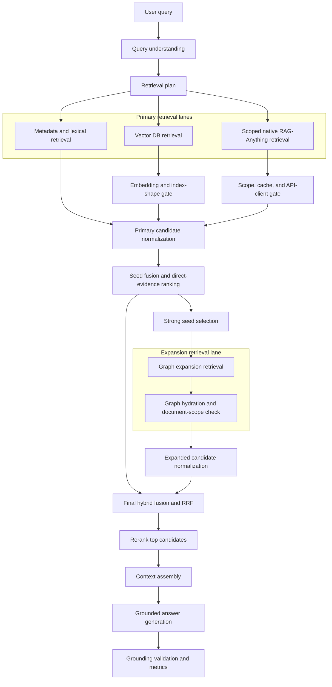

# Retrieval Orchestrator Improvement Actions

## Purpose

Design the next retrieval-orchestrator improvements around the failures already seen in Ragstudio and around production RAG best practices from RAG-Anything, LightRAG, and the local RAG architecture checklist.

The core goal is simple: native RAG-Anything should improve answer quality when healthy, but it must not make scoped user queries brittle. When native retrieval cannot enforce document scope, initialize LightRAG safely, match embedding dimensions, or respond within budget, Ragstudio should degrade to scoped Studio evidence and still answer from grounded sources.

## Prior Failures To Design Against

- `native_document_scope_unsupported` when selected `document_ids` could not be enforced by native LightRAG storage.
- `native_document_scope_filter_failed ... 'OPENAI_API_KEY'` when OpenAI-compatible local endpoints triggered an unexpected environment fallback.
- Embedding dimension mismatch where the configured index expected `1536` dimensions while `Qwen/Qwen3-Embedding-8B` returned `4096` by default.
- Native timeout or native runtime failure causing hard query failure instead of metadata fallback.
- Graph expansion producing preview candidates that required Postgres hydration before they could be trusted.
- Correct evidence existing in chunks, but not entering the candidate pool because the query wording was noisy or too specific.

## Target Architecture



## Architecture Principles

1. **Measure before tuning.** Define retrieval quality gates before changing chunk sizes, weights, or model settings.
2. **Hybrid retrieval is the production default.** Dense vectors alone are not enough for Quran, Hadith, reference, Arabic token, or count-style queries.
3. **Scoped retrieval must fail soft.** A selected-document query should return scoped metadata evidence when native scope cannot be trusted.
4. **Native evidence is conditional.** RAG-Anything/LightRAG evidence is accepted only after storage filtering, API client setup, embedding dimensions, and cache behavior are verified.
5. **Graph evidence must hydrate.** Neo4j candidates are not answer sources until they resolve to in-scope Postgres chunks.
6. **Context assembly is a retrieval stage.** The answer model should receive ordered, source-preserving evidence, not an arbitrary concatenation of chunks.
7. **Grounding validation is mandatory.** The final answer should be checked against the retrieved evidence before the run is marked successful.

## Improved Actions

### 1. Define Retrieval SLAs

Set explicit pass/fail thresholds for the known regression set:

- Precision@5: `>= 0.75`
- Recall@10: `>= 0.70`
- MRR: `>= 0.80`
- Faithfulness: `>= 0.90`
- Hit rate for exact reference and Arabic-token queries: `1.00`
- p95 retrieval latency: bounded per stage and visible in run timings

Checkpoint:

```python
assert metrics.precision_at_5 >= 0.75
assert metrics.recall_at_10 >= 0.70
assert metrics.mrr >= 0.80
```

### 2. Add Scoped Native Preflight

Before native RAG-Anything is trusted for selected-document queries, verify:

- LightRAG chunk storage is initialized.
- Storage supports `full_doc_id` filtering or the scoped native path is disabled.
- Local OpenAI-compatible endpoints receive a harmless placeholder key such as `unused` when no real key is configured.
- The embedding wrapper sends the configured dimensions.
- The first embedding vector length matches the active index shape.
- Scoped native query disables LLM cache so prior unscoped answers cannot leak into scoped results.

Primary files:

- `backend/src/ragstudio/services/native_raganything_adapter.py`
- `backend/tests/test_native_raganything_adapter.py`

### 3. Make Native Retrieval Degradable By Contract

Treat these as recoverable native degradations when metadata evidence exists:

- `native_document_scope_unsupported`
- `native_document_scope_filter_failed`
- `native_query_timeout`
- OpenAI-compatible client setup failure
- Embedding dimension mismatch
- Native runtime exception

The orchestrator should preserve the native error in `timings` and traces, then continue with scoped metadata retrieval.

Primary files:

- `backend/src/ragstudio/services/retrieval_orchestrator.py`
- `backend/src/ragstudio/services/query_service.py`
- `backend/tests/test_retrieval_orchestrator.py`
- `backend/tests/test_runtime_query_service.py`

### 4. Replace Single Metadata Search With Multi-Pass Retrieval

Run bounded retrieval passes before fusion:

- `reference_exact`: direct reference lookup.
- `arabic_exact_token`: normalized Arabic token lookup.
- `phrase_exact`: exact or normalized phrase lookup.
- `title_count`: title and count-bearing metadata lookup.
- `semantic_metadata`: current hybrid chunk search.
- `native_vector`: RAG-Anything/LightRAG native vector retrieval when preflight passes.
- `graph_neighbors`: Neo4j expansion after strong seed evidence exists.

Each pass should emit candidate count, latency, and top candidate IDs.

Primary files:

- `backend/src/ragstudio/services/retrieval_evidence.py`
- `backend/src/ragstudio/services/hybrid_chunk_search.py`
- `backend/src/ragstudio/services/chunk_lexical_search_repository.py`
- `backend/src/ragstudio/services/retrieval_orchestrator.py`

### 5. Normalize Every Candidate Into One Evidence Schema

Extend the candidate model so every source can be scored and audited consistently:

- `candidate_id`
- `chunk_id`
- `document_id`
- `text`
- `source_location`
- `retrieval_tool`
- `retrieval_pass`
- `base_score`
- `match_features`
- `canonical_reference`
- `embedding_profile`
- `index_shape`
- `scope_status`
- `source_quality`
- `risk_flags`

This prevents ad hoc score and reason fields from spreading across services.

### 6. Use Deterministic Hybrid Fusion

Fuse candidates with deterministic rules:

- Exact reference and Arabic lexical hits outrank broad semantic hits.
- Metadata/reference evidence receives a precision boost.
- Native vector evidence receives a semantic boost only after scoped preflight passes.
- Graph candidates receive a boost only after hydration to an in-scope Postgres chunk.
- Deduplicate by chunk ID, runtime source ID, then normalized text fingerprint.
- Preserve all retrieval tools and passes in metadata.

Recommended first algorithm: Reciprocal Rank Fusion with domain-specific boosts.

Primary files:

- `backend/src/ragstudio/services/retrieval_fusion.py`
- `backend/tests/test_rag_retrieval_fusion.py`

### 7. Rerank After Broad Retrieval

Do not rerank a narrow pool. Retrieve broadly, fuse, then rerank:

- Retrieve 40 to 80 candidates across passes.
- Fuse down to 20 to 30 candidates.
- Rerank to final 5 to 8 evidence chunks.
- If reranking fails or times out, keep deterministic fusion order and mark reranker degradation.

Reranker input should include retrieval reasons, reference labels, match features, and parser quality warnings.

Primary files:

- `backend/src/ragstudio/services/reranker_service.py`
- `backend/src/ragstudio/services/llm_reranker_service.py`
- `backend/src/ragstudio/services/retrieval_orchestrator.py`

### 8. Build Context Deliberately

Context assembly should:

- Pin direct evidence first.
- Add limited neighbors only after strong seed evidence.
- Preserve original MinerU text for citations.
- Deduplicate repeated chunks.
- Enforce token budget.
- Record included and dropped evidence.
- Avoid letting parser warning evidence silently dominate the answer.

Primary files:

- `backend/src/ragstudio/services/context_assembly_service.py`
- `backend/src/ragstudio/services/retrieval_observability.py`

### 9. Validate Grounding After Answer Generation

Add a deterministic validation stage after answer generation:

- Every cited source label must exist in retrieved sources.
- Exact-reference answers must cite the expected reference when present.
- The answer must not say evidence is missing when a high-confidence exact or phrase candidate exists.
- Any named reference should appear in source metadata or source text.
- Validation result should be recorded in traces and run timings.

Primary files:

- `backend/src/ragstudio/services/runtime_answer_service.py`
- `backend/src/ragstudio/services/retrieval_orchestrator.py`
- `backend/tests/test_rag_evaluation_gates.py`

### 10. Add Regression And Monitoring Gates

Create a fixed regression set for the failures above plus known Quran/Bukhari examples:

- Selected-document query where native scope is unsupported.
- Native filter failure involving OpenAI-compatible API-key fallback.
- Embedding dimension mismatch.
- Native timeout with metadata fallback.
- Graph unavailable with metadata fallback.
- Arabic exact-token query.
- Exact Quran reference query.
- Count/title query such as Hadith collection total.

For every run, record:

- Candidate counts by pass.
- First relevant rank.
- Precision@K, Recall@K, MRR, and NDCG where labels exist.
- Reranker status.
- Context utilization.
- Faithfulness or deterministic grounding status.
- Stage latencies.
- Degradation reason.

## Vector Store And Index Policy

Ragstudio should keep the current production direction:

- Postgres stores canonical chunks, metadata, Arabic search material, and run records.
- PGVector stores dense vectors with an explicit embedding dimension and index shape.
- Neo4j stores graph relationships and is used only after seed evidence exists.
- RAG-Anything/LightRAG remains the native multimodal/vector-graph runtime, wrapped by Ragstudio readiness and degradation gates.

Index readiness must fail clearly when:

- Stored vector dimensions do not match the active embedding profile.
- PGVector extension or vector index is unavailable.
- The active profile does not match the indexed profile.
- The document is not indexed successfully for the selected runtime profile.

## Chunking Strategy

Chunking should optimize retrieval, not just parsing:

- Use MinerU-aware, document-aware chunking.
- Preserve page, section, table, image, caption, and reference metadata.
- Avoid splitting inside detected Quran verse or Hadith reference spans.
- Store normalized Arabic search fields without replacing original text.
- Add bounded neighbor links for answer context.
- Validate chunk quality before marking the document ready.

Do not use a default chunk size blindly. Evaluate chunk size and overlap on this corpus with retrieval metrics.

## Retrieval Flow

```text
QueryService.run_query()
  -> validate variant and document inputs
  -> load active runtime profile
  -> validate runtime, index, and graph readiness
  -> RetrievalOrchestrator.query()
     -> understand query
     -> build retrieval plan
     -> run scoped native preflight
     -> run metadata and lexical passes
     -> run native retrieval if trusted
     -> run graph expansion from strong seeds
     -> hydrate graph candidates from Postgres
     -> normalize candidates
     -> fuse candidates
     -> rerank candidates
     -> assemble answer context
     -> generate grounded answer
     -> validate grounding
     -> return answer, sources, traces, timings, metrics
```

## Evaluation Plan

### Unit Tests

- Query intent and retrieval plan selection.
- Scoped native preflight success and failure.
- Native degradation matrix.
- Arabic normalization and exact token matching.
- Candidate normalization.
- Hybrid fusion ranking.
- Graph hydration and scope rejection.
- Context assembly ordering and budget drops.
- Grounding validation.

### Service Tests

- `QueryService` uses metadata fallback when native retrieval fails.
- Runtime index degradation forces metadata retrieval.
- Graph degradation disables graph expansion without failing the run.
- Reranker degradation preserves deterministic ranking.

### Evaluation Gates

Use labeled examples and require:

- Precision@5 `>= 0.75`
- Recall@10 `>= 0.70`
- MRR `>= 0.80`
- Exact-reference hit rate `1.00`
- Faithfulness `>= 0.90`
- No ungrounded answer accepted as successful

### Live Arabic Data Gate

The retrieval layer is considered correct when a persisted chunk containing `[19:13] وَحَنَانًا` stores normalized tokens `وحنانا` and `حنانا`, and `ChunkService.search(query="حنانا")` returns that chunk. If the live UI returns zero sources while the regression passes, treat the failure as an indexing/parser data-quality issue and reindex the Quran document with the parser-normalization quality gates before tuning retrieval.

## Implementation Order

1. Add evaluation fixtures for the previous failures.
2. Add native scoped preflight and explicit degradation traces.
3. Add multi-pass metadata and lexical retrieval.
4. Extend candidate schema and fusion traces.
5. Add deterministic RRF fusion with domain boosts.
6. Feed broader fused candidates into reranking.
7. Add grounding validation.
8. Wire metrics into run traces and eval reports.
9. Add browser/API smoke tests for selected-document queries.
10. Tune thresholds only after metrics are visible.

## Source Guidance

- RAG-Anything: https://github.com/HKUDS/RAG-Anything
- RAG-Anything context-aware processing: https://github.com/HKUDS/RAG-Anything/blob/main/docs/context_aware_processing.md
- LightRAG core docs: https://github.com/HKUDS/LightRAG/blob/main/docs/ProgramingWithCore.md
- Local architecture checklist: `/Users/meet/.codex/skills/rag-architect-jeffallan/SKILL.md`
