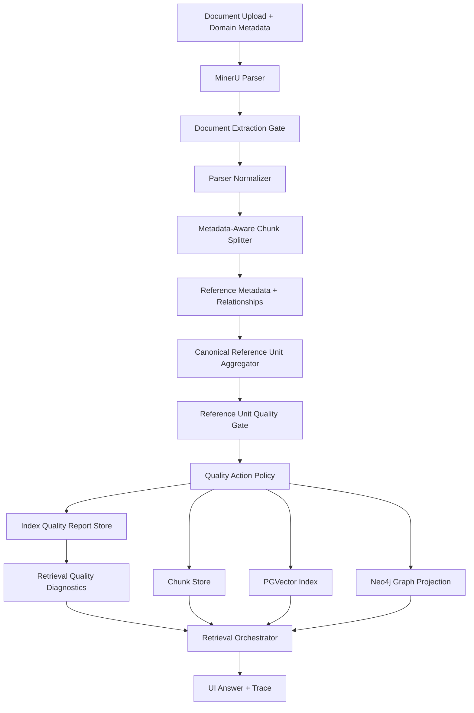

# Metadata-Aware Index Quality Gate Design

Date: 2026-05-12
Status: Proposed, review-updated
Scope: Ragstudio ingestion, indexing, retrieval traces, vector store, and graph projection

## Goal

Improve the index quality gate so it validates chunks against the document metadata contract, not only generic document-level text quality. The immediate failure to prevent is a Quran/Tafseer upload where the document contains Arabic overall, but a specific verse chunk such as `[19:13]` keeps only the English translation while the Arabic source text is lost or converted into math-like parser artifacts. In that state, Arabic query terms such as `حنانا` cannot be retrieved even though the upload appears indexed.

## Why The Current Gate Is Not Enough

The current `IndexQualityGate` protects against raw PDF syntax and checks that Arabic/Quran documents contain at least one Arabic token across all chunks. That catches total extraction failure, but it misses reference-level loss.

For metadata-rich domains, the unit of trust is not the whole file. It is the reference unit promised by metadata:

- Quran/Tafseer: chapter and verse.
- Hadith: collection, book, hadith number.
- Legal/standards documents: section, clause, article.
- Scientific papers: page, section, figure, table, equation.

If metadata says `reference_pattern=surah_number:verse_number`, `expected_structure=surah_ayah_sections`, and `custom_json.chunking.preserve_parallel_text=true`, then every referenced verse chunk should be checked for the expected script and parallel text, not just the document as a whole.

## Metadata Contract

The quality gate should derive validation rules from `DomainMetadata`.

Important fields:

- `domain`: selects domain-specific expectations, for example `quran_tafseer`.
- `language` and `script`: determine expected scripts, for example `mixed`, `arabic`, `latin`.
- `tags`: strengthens inference, for example `quran`, `tafseer`, `arabic`, `english`.
- `citation_style`: identifies how references are cited, for example `surah_ayah`.
- `expected_structure`: declares the intended chunk shape, for example `surah_ayah_sections`.
- `reference_pattern`: declares the reference key, for example `surah_number:verse_number`.
- `custom_json.reference_schema`: defines reference type and display format.
- `custom_json.chunking.unit`: defines the required chunking unit, for example `verse`.
- `custom_json.chunking.preserve_parallel_text`: declares whether Arabic and translation must survive together.

Derived quality profile:

```python
MetadataQualityProfile(
    domain="quran_tafseer",
    reference_type="chapter_verse",
    reference_unit="verse",
    expected_scripts={"arabic", "latin"},
    require_parallel_text=True,
    require_expected_script_per_reference=True,
    equation_blocks_allowed=False,
    exact_reference_retrieval_required=True,
)
```

Metadata normalization rules:

- Normalize `mixed`, `arabic_english`, and `arabic_latin` into expected scripts `arabic` and `latin`.
- Normalize `english`, `latin`, and `translation` into expected script `latin`.
- Treat `reference_pattern` values such as `surah_number:verse_number` as semantic pattern names unless they are explicitly configured as regex fields.
- Accept `custom_json.reference_schema.reference_regex`, `pattern`, and `regex`, but normalize them into one internal regex list.
- Emit metadata validation warnings for conflicting script claims, unknown reference pattern names, or missing reference schemas in structured domains.

Quality policy inputs can live in `DomainMetadata.custom_json.quality_policy` until the API exposes a first-class `quality_policy` field:

```json
{
  "sentinel_references": ["19:13"],
  "required_references": ["1:1", "19:13"],
  "min_reference_script_coverage": 0.95,
  "strict_missing_script_action": "fail_indexing",
  "legacy_quality_action": "quality_unknown"
}
```

## Architecture



Quality gates by layer:

- **Document Extraction Gate**: validates the parser output is non-empty, not raw PDF syntax, has expected page coverage, and contains expected scripts at document level.
- **Parser Normalizer**: classifies blocks and warns when text domains contain equation/math artifacts where prose is expected.
- **Canonical Reference Unit Aggregator**: resolves chunks and parser blocks into the reference unit promised by metadata, for example one Quran verse.
- **Reference Unit Quality Gate**: validates each metadata reference unit after chunking and relationship annotation.
- **Quality Action Policy**: decides whether to fail indexing, index with warnings, quarantine affected chunks, or block vector/graph materialization for unsafe chunks.
- **Index Quality Report Store**: persists document/reference quality status so retrieval can diagnose zero-candidate failures.
- **Retrieval Trace Gate**: exposes quality warnings during retrieval so a zero-result Arabic query explains whether the term is absent from the corpus or absent because a parser-quality issue removed expected script.

## Canonical Reference Unit Contract

For metadata-rich domains, quality is measured on canonical reference units, not raw chunks. Chunking remains an implementation detail; the gate must be able to say what happened to each promised reference.

For `custom_json.chunking.unit=verse`, persisted content must satisfy one of these contracts:

1. A canonical chunk contains exactly one reference unit, for example `19:13`.
2. A multi-reference chunk includes `quality.by_reference` records for every reference carried by the chunk.

Required per-reference record:

```json
{
  "reference": "19:13",
  "text_span": {"start": 0, "end": 104},
  "source_location": {"page": 312, "artifact_ref": "source/auto/source.md"},
  "arabic_token_count": 0,
  "latin_token_count": 12,
  "parser_warning_codes": ["suspected_text_misclassified_as_equation"],
  "status": "missing_expected_script"
}
```

Reference isolation rules:

- If a structured-domain chunk has no resolvable `reference_metadata`, emit `reference_unit_unresolved`.
- If one chunk contains multiple references and only one has Arabic, Arabic in the healthy reference must not satisfy the missing-script requirement for the damaged reference.
- If the parser loses both the reference label and expected script, the gate should use page/block provenance and nearby references to mark the unit `unresolved` rather than treating it as healthy.
- If a reference cannot be isolated safely, the affected chunk or unit is quarantined before vector or graph materialization.

## Reference Unit Quality Gate

The gate should run after chunks have text, parser provenance, and `reference_metadata`, then aggregate by canonical reference unit before making pass/fail decisions.

Inputs:

- `adapter_chunks`
- `domain_metadata`
- parser normalization warnings
- relationship annotations from `MinerURelationshipBuilder`
- parser block provenance: `artifact_ref`, `content_list_ref`, block index, page, recovered source, and affected text span

For each canonical reference unit:

1. Resolve the quality profile from `domain_metadata`.
2. Resolve reference metadata, for example `19:13`.
3. Aggregate text spans and parser warnings for that reference.
4. Count expected-script tokens per reference unit.
5. Detect parser substitutions such as LaTeX/math blocks in text-first domains.
6. Compare observed reference-unit contents against metadata promises.
7. Emit a structured finding with severity, reference, evidence, and suggested action.

Example finding:

```json
{
  "code": "reference_unit_missing_expected_script",
  "severity": "error",
  "reference": "19:13",
  "expected_script": "arabic",
  "domain": "quran_tafseer",
  "evidence": {
    "arabic_token_count": 0,
    "latin_token_count": 12,
    "math_artifact_detected": true
  },
  "action": "block_reference_materialization"
}
```

Unresolved reference example:

```json
{
  "code": "reference_unit_unresolved",
  "severity": "error",
  "domain": "quran_tafseer",
  "evidence": {
    "page": 312,
    "content_list_ref": "source_content_list.json",
    "nearby_references": ["19:12", "19:14"]
  },
  "action": "quarantine_reference_unit"
}
```

## Action Policy

The gate should not use one universal failure rule. It should choose an action from metadata and severity.

| Condition | Action | Reason |
| --- | --- | --- |
| Quran/Tafseer metadata requires parallel text and a configured sentinel reference loses Arabic | Fail indexing | The index cannot support promised Arabic exact-reference retrieval. |
| Quran/Tafseer metadata requires parallel text and a small number of non-sentinel references lose Arabic | Ready with warnings, quarantine affected references | The document may still be useful, but retrieval must not claim full Arabic coverage. |
| Arabic-only document has no Arabic at document level | Fail indexing | Parser or upload is fundamentally wrong. |
| Science/math document contains equations | Pass | Equations are expected in that domain. |
| Text-first domain has equation-like artifacts replacing prose | Warn or fail depending on reference coverage | This is a parser quality issue, not useful content. |

Recommended initial thresholds:

- `quran_tafseer` with `preserve_parallel_text=true`: require at least `95%` reference units with Arabic tokens.
- Required sentinel references from the evaluation set: require `100%` expected-script coverage.
- Any exact reference selected by the user during upload validation: require `100%` expected-script coverage.
- Unknown/mixed metadata: keep the existing document-level gate, but emit coverage metrics.

Concrete policy object emitted per chunk or reference unit:

```json
{
  "reference": "19:13",
  "persist_chunk": true,
  "index_vector": false,
  "index_exact_arabic": false,
  "project_graph": false,
  "graph_confidence": "blocked",
  "quality_flags": ["missing_expected_script", "math_artifact_detected"]
}
```

Every materialization path must consume this object before it writes:

- Studio chunk persistence may retain quarantined content for inspection, but it must carry `quality_flags`.
- PGVector/native runtime indexing must exclude or flag chunks where `index_vector=false`.
- Exact Arabic lexical indexing must not advertise a reference when `index_exact_arabic=false`.
- Neo4j projection must skip or degrade relationships when `project_graph=false` or `graph_confidence=blocked`.

## Chunking Strategy

For Quran/Tafseer metadata, chunking should prefer the metadata unit over generic token windows.

Recommended shape:

```json
{
  "chunk_unit": "verse",
  "reference": "19:13",
  "text_ar": "...",
  "text_translation": "And affection from Us and purity, and he was fearing of Allah",
  "neighbors": ["19:12", "19:14"],
  "quality": {
    "expected_script_present": true,
    "parallel_text_present": true
  }
}
```

The gate should fail or flag chunks where the shape becomes:

```json
{
  "chunk_unit": "verse",
  "reference": "19:13",
  "text_ar": "",
  "text_translation": "And affection from Us and purity, and he was fearing of Allah",
  "quality": {
    "expected_script_present": false,
    "parallel_text_present": false
  }
}
```

This keeps retrieval honest: the system can still answer English translation queries, but it cannot silently pretend Arabic retrieval is available for that verse.

Multi-reference masking regression:

```json
{
  "chunk_unit": "multi_verse",
  "references": ["19:12", "19:13"],
  "quality": {
    "by_reference": [
      {"reference": "19:12", "arabic_token_count": 8, "status": "passed"},
      {"reference": "19:13", "arabic_token_count": 0, "status": "missing_expected_script"}
    ]
  }
}
```

The gate must fail or quarantine `19:13` even though `19:12` has valid Arabic in the same chunk.

## Vector And Graph Impact

The storage architecture does not need to change. The quality gate should protect what enters the existing stores.

- **PGVector** remains the semantic retrieval store.
- **Postgres lexical/metadata fields** remain the exact token and metadata retrieval surface.
- **Neo4j** remains the graph projection for references, neighbors, citations, and relationships.

New rule: vector and graph materialization must respect `QualityActionPolicy`.

- Healthy reference units can be embedded and projected normally.
- Corrupt reference units can be embedded only when `index_vector=true` and quality flags are carried into the payload.
- Native vector payloads must include quality flags if retained; otherwise corrupted units are removed before `index_preparsed_chunks`.
- Exact Arabic lexical retrieval must be disabled for references where `index_exact_arabic=false`.
- Graph projection should not create high-confidence `HAS_VERSE_TEXT` or `PARALLEL_TRANSLATION` relationships when the expected source script is missing.
- Graph projection should mark retained uncertain relationships with `graph_confidence=degraded`, never `high`.
- Retrieval traces should surface quality warnings when a query targets an affected reference or script.

## Persisted Index Quality Report

Candidate-level warnings are not enough for zero-result retrieval because the damaged reference may never become a candidate. Each index build should write an `IndexQualityReport` keyed by:

- `document_id`
- `runtime_profile_id` or `index_record_id`
- `quality_report_version`
- `domain_profile`
- `created_at`

The report can start as JSON in job/index metadata and later move to first-class tables if querying volume requires it.

Required reference entry:

```json
{
  "reference": "19:13",
  "expected_scripts": ["arabic", "latin"],
  "observed_scripts": ["latin"],
  "status": "missing_expected_script",
  "action": "block_exact_arabic_retrieval",
  "quality_flags": ["missing_expected_script"],
  "source_location": {"page": 312},
  "parser_warning_codes": ["suspected_text_misclassified_as_equation"]
}
```

Legacy and migration behavior:

- Add `quality_report_version`.
- Existing indexes without this report are `quality_unknown`, not healthy.
- Backfill best-effort reports from `chunks.metadata_json`, `tokens_ar`, `reference_metadata`, and `extraction_quality.parser_warnings`.
- Mark vector/graph materialization stale when the quality report is missing or obsolete for metadata-rich domains.
- Retrieval traces should say `quality_status=unknown` for legacy indexes rather than silently passing.

## Retrieval Orchestrator Impact

When a query contains Arabic:

1. Planner detects script: `arabic`.
2. Metadata search checks Arabic lexical fields.
3. Vector search runs as normal.
4. Retrieval inspects candidate warnings and the persisted `IndexQualityReport`.
5. If no candidates are found and the selected document has missing expected-script coverage, the trace should include:

```json
{
  "stage": "quality_diagnostics",
  "status": "warning",
  "message": "Arabic content is missing for one or more expected reference units in this document.",
  "affected_references": ["19:13"]
}
```

The diagnostic query must work even when `metadata_candidates`, `native_candidates`, and `graph_candidates` are all empty. Retrieval should look up quality reports by selected `document_ids`, query script, and reference hints extracted from the query. If the query has no reference hint, the trace should report aggregate script coverage and the top affected references, capped for UI readability.

The user-facing answer can stay conservative:

> The available evidence does not support an answer to this question.

But the trace should explain why the system could not retrieve the expected Arabic evidence.

## Evaluation Plan

Add an indexing-quality evaluation pack based on metadata profiles.

Required tests:

- Quran chunk with `[19:13]`, English text only, and math-like parser artifact where Arabic should be: gate emits `reference_unit_missing_expected_script`.
- Quran chunk with `[19:13]` and Arabic plus English translation: gate passes.
- Multi-reference Quran chunk where `[19:12]` has Arabic and `[19:13]` lacks Arabic: only `[19:13]` is flagged or quarantined.
- Structured Quran chunk with no resolvable `reference_metadata`: gate emits `reference_unit_unresolved`.
- Quran/Tafseer profile with `preserve_parallel_text=false`: gate warns but does not fail per-reference Arabic absence.
- Arabic-only document with zero Arabic tokens: gate fails.
- Science/math document with equation blocks: gate passes.
- Retrieval test for Arabic query `حنانا`: if the term is not indexed because the verse Arabic is missing, retrieval trace includes quality diagnostics.
- Arabic zero-result query emits `quality_diagnostics` from the persisted report even when no candidates are returned.
- Native `index_preparsed_chunks` excludes or flags quarantined references.
- Graph materialization does not create high-confidence relationships for quarantined references.
- Legacy indexed document without a report returns `quality_status=unknown`.

Metrics:

- `document_arabic_token_count`
- `reference_unit_count`
- `reference_units_with_expected_script`
- `reference_units_missing_expected_script`
- `reference_script_coverage_ratio`
- `math_artifact_reference_count`
- `quarantined_reference_count`
- `reference_unit_unresolved_count`
- `quality_unknown_document_count`
- `materialization_blocked_reference_count`

Pass/fail reporting:

```json
{
  "quality_gate": {
    "status": "ready_with_warnings",
    "profile": "quran_tafseer",
    "reference_script_coverage_ratio": 0.972,
    "missing_expected_script_count": 12,
    "sentinel_failures": ["19:13"],
    "actions": ["block_reference_materialization", "show_retrieval_warning"]
  }
}
```

## Implementation Plan

1. Add a `MetadataQualityProfile` resolver from `DomainMetadata`.
2. Normalize metadata aliases and quality policy inputs.
3. Extend `IndexQualityGate.validate_adapter_chunks(...)` to accept `domain_metadata`, not only `language`.
4. Add the canonical reference unit aggregator after chunking and relationship annotation.
5. Add `ReferenceUnitQualityGate` for per-reference validation.
6. Add `QualityActionPolicy` and require vector, lexical, and graph materialization to consume it.
7. Persist `IndexQualityReport` into job/index metadata with a versioned schema.
8. Add retrieval trace diagnostics that read the report for script-specific zero-result cases.
9. Add a legacy/backfill path that marks unknown quality explicitly.
10. Add tests for Quran/Tafseer, Arabic-only, translation-only, science/math, no-candidate retrieval diagnostics, native materialization, graph materialization, and legacy unknown-quality behavior.

## Acceptance Criteria

- A Quran/Tafseer upload with Arabic missing for `[19:13]` no longer passes as a fully healthy index.
- Arabic in `[19:12]` cannot mask missing Arabic in `[19:13]` inside a multi-reference chunk.
- Structured-domain chunks with unresolved references are flagged before materialization.
- The UI can show that indexing completed with parser-quality warnings, or failed if the metadata policy is strict.
- Arabic query `حنانا` produces either matching Arabic evidence or a trace explaining expected-script loss.
- Arabic zero-result retrieval can explain missing expected script from the persisted quality report without needing a returned chunk candidate.
- Non-Arabic and equation-heavy documents do not get blocked by Quran-specific rules.
- Graph and vector indexes do not materialize corrupted reference units as high-confidence canonical content.
- Legacy indexes without a quality report are surfaced as `quality_unknown`.

## Review Resolution Map

This update resolves the design-review blockers and warnings as follows:

| Review item | Resolution in this spec |
| --- | --- |
| CR-01 chunk-shaped validation | Added canonical reference unit contract, `quality.by_reference`, unresolved-reference handling, and multi-reference masking regression. |
| CR-02 zero-result diagnostics | Added persisted `IndexQualityReport` and retrieval lookup behavior for empty candidate sets. |
| CR-03 vector/graph policy | Added concrete `QualityActionPolicy` consumed by persistence, vector, exact Arabic, and graph paths. |
| WR-01 sentinels undefined | Added `custom_json.quality_policy` inputs. |
| WR-02 metadata drift | Added metadata normalization and validation rules. |
| WR-03 warning provenance | Added parser provenance requirements and per-reference report merge behavior. |
| WR-04 migration missing | Added quality report versioning, backfill, and `quality_unknown` behavior. |
| WR-05 eval gaps | Added tests for multi-reference chunks, unresolved references, no-candidate diagnostics, materialization enforcement, and legacy unknown quality. |
