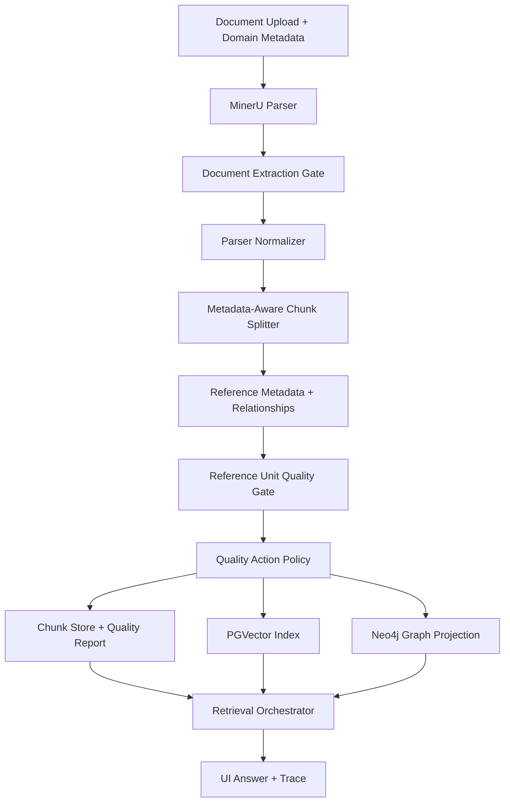

# Metadata-Aware Index Quality Gate Design

Date: 2026-05-12
Status: Proposed
Scope: Ragstudio ingestion, indexing, retrieval traces, vector store, and graph projection

## Goal

Improve the index quality gate so it validates chunks against the document metadata contract, not only generic document-level text quality. The immediate failure to prevent is a Quran/Tafseer upload where the document contains Arabic overall, but a specific verse chunk such as `[19:13]` keeps only the English translation while the Arabic source text is lost or converted into math-like parser artifacts. In that state, Arabic query terms such as `حنانا` cannot be retrieved even though the upload appears indexed.

## Why The Current Gate Is Not Enough

The current `IndexQualityGate` protects against raw PDF syntax and checks that Arabic/Quran documents contain at least one Arabic token across all chunks. That catches total extraction failure, but it misses reference-level loss.

For metadata-rich domains, the unit of trust is not the whole file. It is the reference unit promised by metadata:

- Quran/Tafseer: chapter and verse.
- Hadith: collection, book, hadith number.
- Legal/standards documents: section, clause, article.
- Scientific papers: page, section, figure, table, equation.

If metadata says `reference_pattern=surah_number:verse_number`, `expected_structure=surah_ayah_sections`, and `custom_json.chunking.preserve_parallel_text=true`, then every referenced verse chunk should be checked for the expected script and parallel text, not just the document as a whole.

## Metadata Contract

The quality gate should derive validation rules from `DomainMetadata`.

Important fields:

- `domain`: selects domain-specific expectations, for example `quran_tafseer`.
- `language` and `script`: determine expected scripts, for example `mixed`, `arabic`, `latin`.
- `tags`: strengthens inference, for example `quran`, `tafseer`, `arabic`, `english`.
- `citation_style`: identifies how references are cited, for example `surah_ayah`.
- `expected_structure`: declares the intended chunk shape, for example `surah_ayah_sections`.
- `reference_pattern`: declares the reference key, for example `surah_number:verse_number`.
- `custom_json.reference_schema`: defines reference type and display format.
- `custom_json.chunking.unit`: defines the required chunking unit, for example `verse`.
- `custom_json.chunking.preserve_parallel_text`: declares whether Arabic and translation must survive together.

Derived quality profile:

```python
MetadataQualityProfile(
    domain="quran_tafseer",
    reference_type="chapter_verse",
    reference_unit="verse",
    expected_scripts={"arabic", "latin"},
    require_parallel_text=True,
    require_expected_script_per_reference=True,
    equation_blocks_allowed=False,
    exact_reference_retrieval_required=True,
)
```

## Architecture



Quality gates by layer:

- **Document Extraction Gate**: validates the parser output is non-empty, not raw PDF syntax, has expected page coverage, and contains expected scripts at document level.
- **Parser Normalizer**: classifies blocks and warns when text domains contain equation/math artifacts where prose is expected.
- **Reference Unit Quality Gate**: validates each metadata reference unit after chunking and relationship annotation.
- **Quality Action Policy**: decides whether to fail indexing, index with warnings, quarantine affected chunks, or block vector/graph materialization for unsafe chunks.
- **Retrieval Trace Gate**: exposes quality warnings during retrieval so a zero-result Arabic query explains whether the term is absent from the corpus or absent because a parser-quality issue removed expected script.

## Reference Unit Quality Gate

The new gate should run after chunks have both text and `reference_metadata`.

Inputs:

- `adapter_chunks`
- `domain_metadata`
- parser normalization warnings
- relationship annotations from `MinerURelationshipBuilder`

For each chunk:

1. Resolve the quality profile from `domain_metadata`.
2. Find reference metadata, for example `19:13`.
3. Count expected-script tokens per reference unit.
4. Detect parser substitutions such as LaTeX/math blocks in text-first domains.
5. Compare observed chunk contents against metadata promises.
6. Emit a structured finding with severity, reference, evidence, and suggested action.

Example finding:

```json
{
  "code": "reference_unit_missing_expected_script",
  "severity": "error",
  "reference": "19:13",
  "expected_script": "arabic",
  "domain": "quran_tafseer",
  "evidence": {
    "arabic_token_count": 0,
    "latin_token_count": 12,
    "math_artifact_detected": true
  },
  "action": "block_reference_materialization"
}
```

## Action Policy

The gate should not use one universal failure rule. It should choose an action from metadata and severity.

| Condition | Action | Reason |
| --- | --- | --- |
| Quran/Tafseer metadata requires parallel text and a configured sentinel reference loses Arabic | Fail indexing | The index cannot support promised Arabic exact-reference retrieval. |
| Quran/Tafseer metadata requires parallel text and a small number of non-sentinel references lose Arabic | Ready with warnings, quarantine affected references | The document may still be useful, but retrieval must not claim full Arabic coverage. |
| Arabic-only document has no Arabic at document level | Fail indexing | Parser or upload is fundamentally wrong. |
| Science/math document contains equations | Pass | Equations are expected in that domain. |
| Text-first domain has equation-like artifacts replacing prose | Warn or fail depending on reference coverage | This is a parser quality issue, not useful content. |

Recommended initial thresholds:

- `quran_tafseer` with `preserve_parallel_text=true`: require at least `95%` reference units with Arabic tokens.
- Required sentinel references from the evaluation set: require `100%` expected-script coverage.
- Any exact reference selected by the user during upload validation: require `100%` expected-script coverage.
- Unknown/mixed metadata: keep the existing document-level gate, but emit coverage metrics.

## Chunking Strategy

For Quran/Tafseer metadata, chunking should prefer the metadata unit over generic token windows.

Recommended shape:

```json
{
  "chunk_unit": "verse",
  "reference": "19:13",
  "text_ar": "...",
  "text_translation": "And affection from Us and purity, and he was fearing of Allah",
  "neighbors": ["19:12", "19:14"],
  "quality": {
    "expected_script_present": true,
    "parallel_text_present": true
  }
}
```

The gate should fail or flag chunks where the shape becomes:

```json
{
  "chunk_unit": "verse",
  "reference": "19:13",
  "text_ar": "",
  "text_translation": "And affection from Us and purity, and he was fearing of Allah",
  "quality": {
    "expected_script_present": false,
    "parallel_text_present": false
  }
}
```

This keeps retrieval honest: the system can still answer English translation queries, but it cannot silently pretend Arabic retrieval is available for that verse.

## Vector And Graph Impact

The storage architecture does not need to change. The quality gate should protect what enters the existing stores.

- **PGVector** remains the semantic retrieval store.
- **Postgres lexical/metadata fields** remain the exact token and metadata retrieval surface.
- **Neo4j** remains the graph projection for references, neighbors, citations, and relationships.

New rule: vector and graph materialization must respect parser quality status.

- Healthy reference units can be embedded and projected normally.
- Corrupt reference units can be embedded only with quality flags, or skipped from exact-reference Arabic retrieval.
- Graph projection should not create high-confidence `HAS_VERSE_TEXT` or `PARALLEL_TRANSLATION` relationships when the expected source script is missing.
- Retrieval traces should surface quality warnings when a query targets an affected reference or script.

## Retrieval Orchestrator Impact

When a query contains Arabic:

1. Planner detects script: `arabic`.
2. Metadata search checks Arabic lexical fields.
3. Vector search runs as normal.
4. Retrieval inspects document/reference quality coverage.
5. If no candidates are found and the selected document has missing expected-script coverage, the trace should include:

```json
{
  "stage": "quality_diagnostics",
  "status": "warning",
  "message": "Arabic content is missing for one or more expected reference units in this document.",
  "affected_references": ["19:13"]
}
```

The user-facing answer can stay conservative:

> The available evidence does not support an answer to this question.

But the trace should explain why the system could not retrieve the expected Arabic evidence.

## Evaluation Plan

Add an indexing-quality evaluation pack based on metadata profiles.

Required tests:

- Quran chunk with `[19:13]`, English text only, and math-like parser artifact where Arabic should be: gate emits `reference_unit_missing_expected_script`.
- Quran chunk with `[19:13]` and Arabic plus English translation: gate passes.
- Quran/Tafseer profile with `preserve_parallel_text=false`: gate warns but does not fail per-reference Arabic absence.
- Arabic-only document with zero Arabic tokens: gate fails.
- Science/math document with equation blocks: gate passes.
- Retrieval test for Arabic query `حنانا`: if the term is not indexed because the verse Arabic is missing, retrieval trace includes quality diagnostics.

Metrics:

- `document_arabic_token_count`
- `reference_unit_count`
- `reference_units_with_expected_script`
- `reference_units_missing_expected_script`
- `reference_script_coverage_ratio`
- `math_artifact_reference_count`
- `quarantined_reference_count`

Pass/fail reporting:

```json
{
  "quality_gate": {
    "status": "ready_with_warnings",
    "profile": "quran_tafseer",
    "reference_script_coverage_ratio": 0.972,
    "missing_expected_script_count": 12,
    "sentinel_failures": ["19:13"],
    "actions": ["block_reference_materialization", "show_retrieval_warning"]
  }
}
```

## Implementation Plan

1. Add a `MetadataQualityProfile` resolver from `DomainMetadata`.
2. Extend `IndexQualityGate.validate_adapter_chunks(...)` to accept `domain_metadata`, not only `language`.
3. Add `ReferenceUnitQualityGate` for per-reference validation after chunking and relationship annotation.
4. Persist quality reports into job/index metadata so the UI and retrieval orchestrator can read them.
5. Update vector and graph materialization to skip or flag corrupted reference units.
6. Add retrieval trace diagnostics for script-specific zero-result cases.
7. Add tests for Quran/Tafseer, Arabic-only, translation-only, and science/math profiles.

## Acceptance Criteria

- A Quran/Tafseer upload with Arabic missing for `[19:13]` no longer passes as a fully healthy index.
- The UI can show that indexing completed with parser-quality warnings, or failed if the metadata policy is strict.
- Arabic query `حنانا` produces either matching Arabic evidence or a trace explaining expected-script loss.
- Non-Arabic and equation-heavy documents do not get blocked by Quran-specific rules.
- Graph and vector indexes do not materialize corrupted reference units as high-confidence canonical content.

