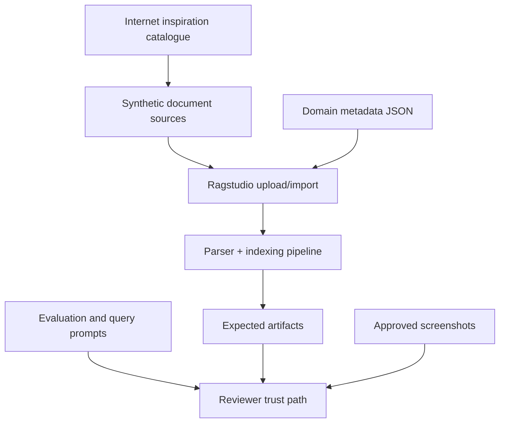

# Ragstudio Sample Pack Design

Date: 2026-05-15
Status: Approved for specification
Scope: Public `examples/sample-pack` content, app verification runbook, screenshot signoff, and proof-safe sample workflows

## Goal

Create a publishable sample pack under `examples/sample-pack/` that gives new Ragstudio users a compact, realistic way to inspect document parsing, chunk metadata, runtime retrieval, reranker traces, graph projection, evaluation, and quality-gated materialization.

The pack must support the public launch story: RAG failures often start before retrieval, and Ragstudio makes those failures visible, traceable, and gateable before they become answer evidence.

## Decisions

- The sample content is synthetic only.
- Internet sources are used only as inspiration and provenance for use-case selection.
- The pack is static and self-contained in the repository.
- The pack also includes a guided live-app verification path. The implementation can use the operator-provided LAN URL during the local test run, but committed public docs should refer to a configurable `RAGSTUDIO_FRONTEND_URL` and default to `http://127.0.0.1:5173`.
- V1 coverage is broad but compact: 8 synthetic mini-documents.
- Screenshots are publishable only after explicit signoff in `examples/sample-pack/screenshots/signoff.json`.

## Non-Goals

- Do not redistribute real text from IETF RFCs, SEC filings, Federal Register notices, PMC articles, NASA reports, Project Gutenberg/Wikisource books, or CourtListener opinions in V1.
- Do not require private providers, unpublished model hosts, API keys, private endpoints, or local absolute paths.
- Do not make claims that require a live provider unless the claim is marked as a limitation or future proof path.
- Do not replace the existing proof packet under `docs/benchmarks/ragstudio-oss-proof-v1/`.

## Public Source Inspiration Catalogue

The pack should include `sources/catalogue.md` with official source links, why each source class matters for RAG quality, and a clear statement that all shipped document text is synthetic.

Initial source classes:

- IETF/RFC-style protocol documents: section references, normative language, cross-references, and exact clause retrieval.
- SEC/EDGAR-style financial filings: fiscal periods, risk factors, numeric tables, and cautious financial grounding.
- Federal Register-style regulatory notices: agency metadata, dates, docket-like references, and legal-style document structure.
- PMC-style scientific articles: abstracts, methods, figures, citations, and evidence-bound scientific answers.
- NASA technical reports: report metadata, acronyms, units, and engineering tables.
- Project Gutenberg/Wikisource-style public-domain books: chapters, footnotes, long prose, and multilingual phrase retrieval.
- CourtListener-style legal opinions: docket metadata, holdings, citations, concurring notes, and citation graph projection.

The catalogue should link to official source or policy pages checked during design:

- RFC rights and IETF Trust terms: https://www.rfc-editor.org/rfc/rfc5378.html
- SEC EDGAR search guidance: https://www.sec.gov/search-filings/edgar-search-assistance/how-do-i-use-edgar
- Federal Register API documentation: https://www.federalregister.gov/reader-aids/developer-resources/rest-api
- PMC Open Access Subset terms: https://pmc.ncbi.nlm.nih.gov/tools/openftlist/
- NASA Technical Reports Server: https://ntrs.nasa.gov/
- Wikisource copyright policy: https://wikisource.org/wiki/Wikisource%3ACopyright_policy
- Project Gutenberg terms: https://www.gutenberg.org/policy/terms_of_use.html
- CourtListener bulk data: https://www.courtlistener.com/help/api/bulk-data/

## Directory Structure

```text
examples/sample-pack/
  README.md
  RUNBOOK.md
  sources/
    catalogue.md
  documents/
    protocol-spec.synthetic.md
    financial-filing.synthetic.md
    regulatory-notice.synthetic.md
    scientific-article.synthetic.md
    technical-report.synthetic.md
    public-domain-book.synthetic.md
    legal-opinion.synthetic.md
    ocr-stress.synthetic.md
  metadata/
    protocol-spec.metadata.json
    financial-filing.metadata.json
    regulatory-notice.metadata.json
    scientific-article.metadata.json
    technical-report.metadata.json
    public-domain-book.metadata.json
    legal-opinion.metadata.json
    ocr-stress.metadata.json
  evaluations/
    sample-pack-evaluation-set.json
    expected-answers.md
    should-not-answer.md
  expected-artifacts/
    parser-warnings.synthetic.json
    chunks.synthetic.json
    retrieval-traces.synthetic.json
    graph-reranker.synthetic.json
  screenshots/
    signoff.json
```

The implementation may add generated PDF versions of the synthetic documents if the current app upload path requires PDFs. Markdown remains the canonical source so reviewers can inspect the synthetic content directly.

## Coverage Matrix

| Document | Inspired By | Primary Use Case | Ragstudio Surfaces |
| --- | --- | --- | --- |
| `protocol-spec.synthetic.md` | IETF/RFC | MUST/SHOULD language, exact section retrieval, cross-references | Documents, Chunks, Query |
| `financial-filing.synthetic.md` | SEC/EDGAR | risk factors, fiscal periods, numeric tables, missing-quarter refusal | Documents, Chunks, Query, Evaluation |
| `regulatory-notice.synthetic.md` | Federal Register | agency/action/date metadata, legal-style citations | Documents, Query, Metadata filters |
| `scientific-article.synthetic.md` | PMC | abstract, methods, figure caption, citation preservation | Chunks, Query, Evaluation |
| `technical-report.synthetic.md` | NASA NTRS | acronyms, units, mission/report sections, engineering table rows | Chunks, Query, Graph |
| `public-domain-book.synthetic.md` | Gutenberg/Wikisource | long prose, chapters, footnotes, multilingual phrase retrieval | Documents, Chunks, Query |
| `legal-opinion.synthetic.md` | CourtListener | docket, holding, citations, concurring note, citation chains | Query, Graph, Reranker |
| `ocr-stress.synthetic.md` | OCR/parser failures | mixed Arabic/English, broken columns, repeated headers, malformed labels | Pipeline, Parser warnings, Quality gates |

Each synthetic document should have:

- domain metadata for upload or reindex workflows,
- 3-5 evaluation questions,
- at least one exact-reference query,
- at least one ambiguous or unsupported query,
- expected parser/chunk/retrieval behavior documented in `expected-artifacts/`,
- a short limitation note explaining what the synthetic case proves and what it does not prove.

## Live App Verification

`RUNBOOK.md` should guide reviewers through a configurable live app URL:

```bash
export RAGSTUDIO_FRONTEND_URL="${RAGSTUDIO_FRONTEND_URL:-http://127.0.0.1:5173}"
```

During implementation, the local verification run can use the operator-provided LAN URL. That URL must not be hard-coded into public sample-pack files or screenshot manifests.

The runbook should ask the reviewer to:

1. Open the Documents page.
2. Upload or import the sample-pack documents.
3. Attach matching domain metadata.
4. Wait for indexing, or inspect failed/pending jobs if the app reports them.
5. Inspect Documents, Pipeline, Chunks, Query, Graph, Evaluation, Variants, Experiments, Comparison, Optimizer, and Settings/Diagnostics where the current app supports the path.
6. Capture screenshots into `examples/sample-pack/screenshots/`.
7. Update `examples/sample-pack/screenshots/signoff.json` with approval status, redaction status, timestamp, and reviewer note.

The first screenshot set should target:

- Documents page with uploaded sample docs,
- Pipeline/parser warnings for the OCR stress document,
- Chunk inspector showing metadata and quality policy,
- Query trace for an exact reference answer,
- Query trace for a should-not-answer case,
- Graph page showing legal/scientific citation relationships when graph projection is available,
- Evaluation or comparison page showing the sample-pack eval run when the app supports it cleanly.

If a live surface is unavailable, broken, or not configured, the runbook records the limitation instead of treating it as a successful proof.

## Data Flow



## Redaction And Safety

The sample pack must fail closed on public safety:

- no API keys, tokens, private endpoints, private hostnames, LAN-only provider hosts, or local absolute paths,
- no private corpora or customer content,
- no real excerpts from source websites unless a future publishability review explicitly approves them,
- no screenshots without `signoff.json` approval,
- no claims based on unavailable live providers.

The source catalogue should explain that even public sources can have license, trademark, jurisdiction, or reuse constraints. Synthetic examples avoid those risks while preserving the structural failure modes Ragstudio needs to demonstrate.

## Testing And Verification

Implementation should include lightweight repository checks:

- static file presence check for the expected `examples/sample-pack/` structure,
- JSON validation for metadata, evaluation, expected artifacts, and screenshot signoff,
- redaction scan for secrets, private hosts, LAN IPs, and local absolute paths,
- `./scripts/proof.sh --strict --json` remains passing,
- live app screenshot capture against the configured app URL when the app is reachable.

The live app test is observational. It should not mutate private data outside the sample-pack workflow.

## Acceptance Criteria

- `examples/sample-pack/README.md` explains the sample pack in simple terms.
- `examples/sample-pack/RUNBOOK.md` gives a repeatable live app test path.
- `sources/catalogue.md` lists the official inspiration sources and license cautions.
- 8 synthetic mini-documents exist with matching metadata.
- Evaluation prompts include exact-reference, table/numeric, graph/citation, multilingual, and should-not-answer cases.
- Expected artifacts document parser warnings, chunk metadata, retrieval traces, graph state, and reranker examples.
- Screenshots are either approved in `screenshots/signoff.json` or explicitly marked pending/unpublished.
- Existing proof-packet validation still passes.

## Implementation Planning Boundary

After this spec is reviewed, create an implementation plan with the Superpowers `writing-plans` skill. The plan should break work into small steps: create pack files, generate/validate JSON, add redaction checks, run live app verification, capture screenshots, and rerun proof validation.
