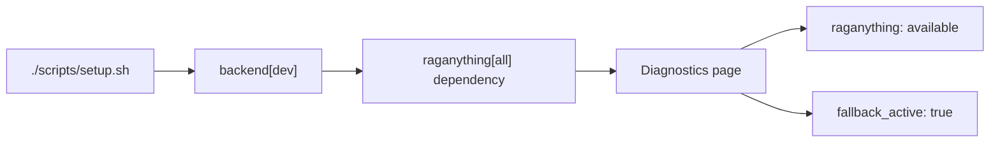
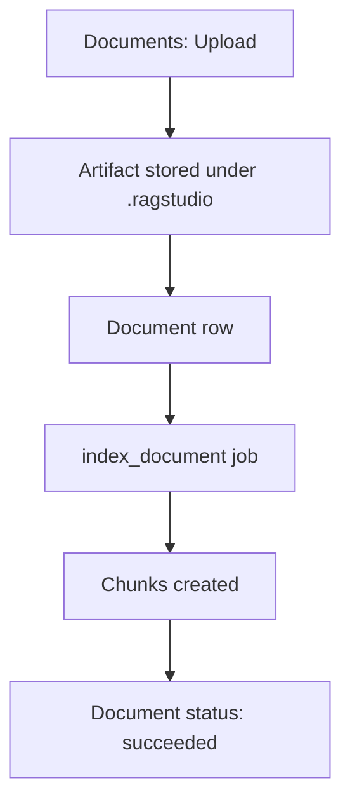
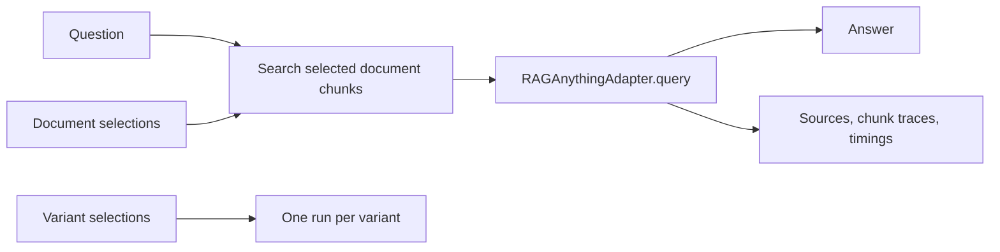
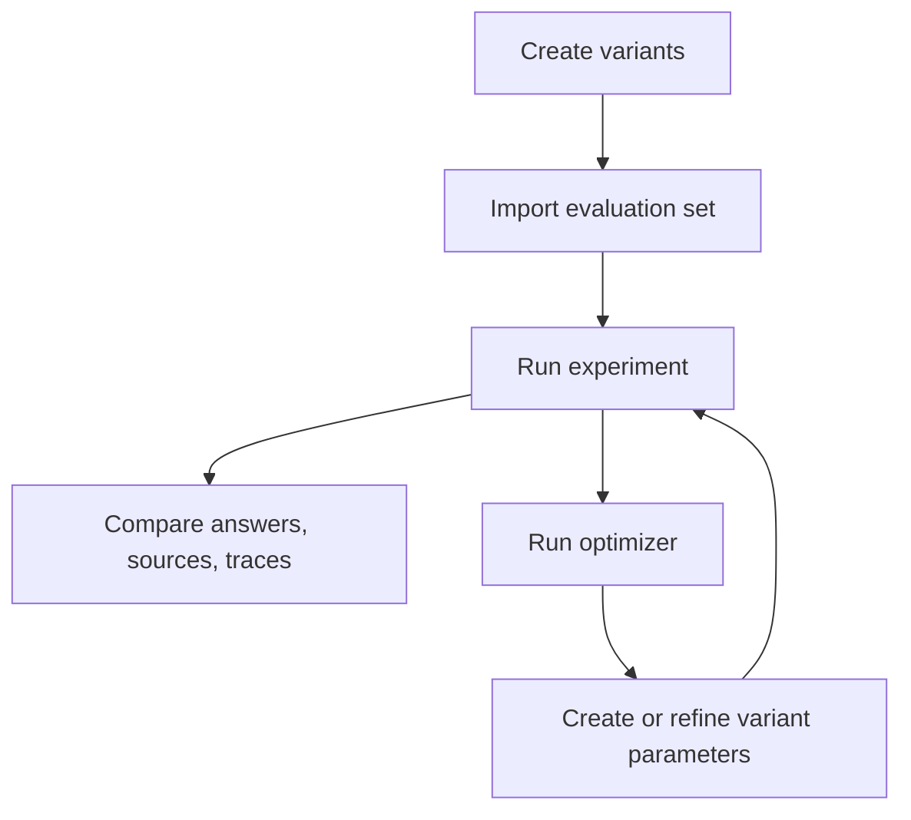

<!-- generated-by: gsd-doc-writer -->
# RAG-Anything Studio Workflows

RAG-Anything Studio is a local workbench for uploading source files, indexing chunks, running scoped RAG queries, comparing variants, importing expected-output evaluations, and inspecting runtime diagnostics.

## Start the Studio

Install backend and frontend dependencies from the project root:

```bash
./scripts/setup.sh
```

The setup script runs:

```bash
python -m pip install -e "backend[dev]"
npm --prefix frontend install
```

The backend package declares `raganything[all]` as an install dependency, so the backend install step is the normal way to bring in the full RAG-Anything dependency set.

Start the local backend and Vite frontend:

```bash
./scripts/dev.sh
```

The dev script starts FastAPI on `http://127.0.0.1:8000` and Vite on `http://127.0.0.1:5173`. The FastAPI app also serves a built frontend from `frontend/dist` or the packaged static directory when those files exist.

The backend targets local Postgres/PGVector and Neo4j runtime stores by default, while uploaded artifacts and runtime working files remain under `.ragstudio/`.

## Fallback vs `raganything[all]`

Studio isolates upstream RAG-Anything calls behind `RAGAnythingAdapter`. The adapter checks whether the `raganything` Python package can be imported.



With the fallback adapter active:

- Document indexing uses a line-splitting fallback and stores one chunk per non-empty line.
- Query generation returns a simple answer built from selected chunks.
- Graph responses are placeholder-backed and can return no nodes or edges.
- Diagnostics reports `raganything` as `missing` and shows a warning with the install command.

When `raganything` is installed, the dependency warning clears. The current adapter boundary can still report `active_backend: fallback` for execution paths that have not yet been wired to upstream RAG-Anything APIs.

Use the Diagnostics page to verify the active mode. It shows Capabilities, Dependencies, Warnings, and Raw diagnostics from `/api/diagnostics`.

## Configure Defaults

Open **Settings** to edit the default runtime profile. The form fields are:

- Provider
- Runtime mode and storage backend
- PGVector schema and table prefix
- Neo4j URI, username, and optional password
- LLM provider, model, base URL, optional API key, timeout, and read-only capabilities
- Vision model, base URL, optional API key, and timeout
- Reranker provider, model, base URL, optional API key, and timeout
- Embedding provider
- Embedding model
- Embedding base URL
- Optional embedding API key
- Embedding timeout, dimensions, batch size, and TLS verification
- Parser, parse method, chunk sizing, and context controls
- Query defaults, rerank toggle, cache flags, and concurrency limits

Use **Provider sync** to preview a hosted HPC provider manifest before saving runtime changes. Enter a manifest URL such as `https://updates.jihadaj.com/providers.json`, click **Sync**, and review the updated LLM, embeddings, and MinerU fields. Sync only updates the form preview. Click **Save** to persist the reviewed settings.

The supported manifest sections are `reasoning`, `embeddings`, and `hpcMineru`. `reasoning` configures the OpenAI-compatible LLM endpoint and shows read-only capability badges for Text, Vision, and Reasoning.

Click **Test LLM** to validate an OpenAI-compatible generation endpoint through `POST /api/settings/default/test-llm`. The backend sends one tiny request to `{base_url}/chat/completions` and checks that the response includes choices.

Click **Test connection** to validate a vLLM/OpenAI-compatible embeddings endpoint through `POST /api/settings/default/test-embedding`. The backend sends one request to `{base_url}/embeddings`, checks that a vector is returned, and verifies the configured dimension count.

Click **Save** to persist the default profile through `PUT /api/settings/default`. Saved LLM and embedding API keys are masked in responses. Click **Reload** to refetch the saved profile. If no profile exists yet, the page shows `No default profile saved`.

These defaults are stored as the `default` settings profile. Runtime indexing and query execution use that profile when backend settings are available; direct fallback behavior remains explicit through `runtime_mode="fallback"` or through legacy paths that are called without runtime settings.

For UAEU HPC vLLM embeddings, prefer the Meeting Copilot/model-training pattern: run the vLLM job on the cluster, expose the service through an SSH tunnel or stable internal alias, then configure Studio with a local URL such as `http://127.0.0.1:8001/v1` and the served model name.

### Rotate HPC Runtime Endpoints

1. Publish or refresh the Cloudflare-hosted provider manifest after the HPC services are running behind stable aliases.
2. Open Ragstudio Settings.
3. Enter the manifest URL in **Provider sync**.
4. Click **Sync** and review the changed fields.
5. Click **Test LLM**, **Test connection** for embeddings, and **Test MinerU** as needed.
6. Click **Save** after the preview matches the intended runtime profile.

## Upload and Index Documents

Open **Documents** to upload source files and monitor ingestion jobs.

1. Choose a file in **Upload file**.
2. Click **Upload**.
3. Watch the Documents table for filename, content type, status, and SHA-256.
4. Watch the Jobs table for job type, target id, progress, status, and latest log.

Uploading a new document creates an `index_document` job and indexes the document immediately. Re-uploading the same content reuses the existing document by SHA-256 and ensures chunks exist.



The upload API is `POST /api/documents` with a multipart `file` field. Document listing uses `GET /api/documents`.

## MinerU Parsing Workflow

Ragstudio targets the Meeting Copilot MinerU contract:

1. `POST /parse-async`
2. `GET /parse-jobs/{job_id}`
3. `GET /parse-jobs/{job_id}/artifacts`

Artifacts are stored under `.ragstudio/mineru-artifacts/<document_id>/`. Ragstudio extracts the artifact zip safely, rejects unsafe paths, normalizes text/table/media entries into chunks, and keeps the `chunks` table as the source of truth for search, query, experiments, and comparison.

Domain metadata is applied before parsing. Parser metadata is added after parsing. Chunk metadata therefore has two top-level groups: `domain_metadata` and `parser_metadata`.

## Inspect and Search Chunks

Open **Chunks** to index individual documents again or search indexed chunks.

1. Select one or more documents in the Documents list.
2. Click **Index** beside a document when you need to rebuild its chunks.
3. Enter **Question or search text**.
4. Set **Limit** from 1 to 100.
5. Click **Search**.

The page requires at least one selected document before searching. Results show each chunk id, document id, score, chunk text, Source location JSON, and Metadata JSON.

Chunk search uses `POST /api/chunks/search` with:

```json
{
  "query": "renewal term",
  "document_ids": ["doc_id"],
  "variant_id": null,
  "limit": 10
}
```

The backend ranks chunks by term overlap, density, phrase match, and original source order. Empty search text returns chunks in indexed order up to the requested limit.

## Create Variants

Open **Variants** to create retrieval and generation variants.

1. Enter a **Name**.
2. Choose a **Preset**: Balanced, Precise, Broad, or Fast.
3. Edit **Parameters** as a JSON object.
4. Click **Create**.

The default parameter JSON in the UI is:

```json
{
  "top_k": 5,
  "temperature": 0.2
}
```

The page validates that Parameters is valid JSON and that it parses to an object. Created variants appear in the Variant matrix with name, id, preset, and parameter badges.

## Run RAG Queries

Open **Query** to run a question against selected documents and variants.

1. Enter a **Question**.
2. Select at least one document.
3. Select at least one variant.
4. Set **Chunk limit** from 0 to 50.
5. Click **Run**.



The query API is `POST /api/query` with:

```json
{
  "query": "What changed in the contract?",
  "document_ids": ["doc_id"],
  "variant_ids": ["variant_id"],
  "limit": 8
}
```

The response contains `runs`. Each run includes `id`, `variant_id`, `experiment_id`, `query`, `status`, `answer`, `sources`, `chunk_traces`, `timings`, and `error`.

The Query page displays each returned run in **Answers and traces**. For successful runs, inspect:

- **Answer**: the generated or fallback answer text.
- **Sources**: selected chunks used as source evidence when the adapter does not return explicit sources.
- **Chunk traces**: adapter trace objects such as rank, source location, metadata, and inclusion status.
- **Timings**: search, query, and total elapsed milliseconds.

## View RAGed Results and Evidence

Use **Comparison** after running queries or experiments. It loads recorded runs from `GET /api/runs` and variants from `GET /api/variants`.

The Runs table lets you select runs to compare. By default, the page compares the two most recent runs until you edit the selection. The comparison cards show:

- Query text
- Variant name or id
- Run status
- Answer or error
- Sources JSON
- Traces JSON
- Timings JSON

This is the primary place to review RAGed results side by side and check whether evidence changed across variants.

## Import Expected-Output Evaluation Files

Open **Evaluation** to import expected-output files.

1. Enter a **Set name**.
2. Choose an **Upload evaluation file**.
3. Click **Import**.
4. Select a set in the Sets table to inspect its Cases.

Supported extensions are `.csv`, `.json`, `.yaml`, `.yml`, `.jsonl`, and `.ndjson`. Files must be valid UTF-8 and contain at least one case. Each case must include a query and at least one expected-output signal.

Recognized case fields include:

- `id`
- `query`
- `documents`
- `expected_answer`
- `expected_sources`
- `must_include`
- `must_avoid`
- `expected_media`
- `expected_structure`
- `rubric`
- `objective`
- `variant_hints`

Accepted aliases include `question`, `prompt`, `expected_output`, `expected`, `answer`, and `sources`.

JSON can be a single case object, an array of cases, an object with `cases`, or an object with `items`:

```json
{
  "cases": [
    {
      "id": "case-1",
      "query": "What changed in the contract?",
      "expected_answer": "The renewal term changed.",
      "must_include": ["renewal term"]
    }
  ]
}
```

CSV list fields use pipe-delimited values:

```csv
id,query,expected_answer,must_include,expected_sources
case-1,What changed in the contract?,The renewal term changed.,renewal term|effective date,contract.pdf
```

Structured CSV cells for dictionary fields must contain valid JSON.

## Run Experiments

Open **Experiments** to execute an evaluation set across selected variants.

1. Enter a **Name**.
2. Choose an **Evaluation set**.
3. Select at least one document.
4. Select at least one variant.
5. Edit **Objective JSON** as a JSON object.
6. Click **Run**.

The default objective is:

```json
{
  "metric": "total"
}
```

Experiments call the query service once per evaluation case and variant. If an evaluation case includes `documents`, those case-specific document ids override the experiment-level document selection for that case.

Scoring is term-based:

- `expected_answer` terms can contribute up to 50 weighted points.
- `must_include` terms can contribute up to 35 weighted points.
- `must_avoid` terms can contribute up to 15 weighted points by avoiding forbidden terms.
- If none of those three signals are present, the score defaults to 100.

The **Runs and scores** area shows Experiment, Experiment ID, run count, score count, a run table, and a score table. Score details include expected terms, hits, missing include terms, and avoid-term hits.

## Compare Variants

A practical variant comparison loop is:



Use **Comparison** for answer-level review and **Experiments** for scored evaluation runs. Variants are only selected by id at execution time; the backend stores the variant id on each run so historical runs remain comparable even after more variants are created.

## Use Optimizer Recommendations

Open **Optimizer** after at least one experiment has created runs.

1. Use the recent experiment id suggested by the page, or enter an **Experiment ID** manually.
2. Edit **Objective JSON** as a JSON object.
3. Click **Recommend**.

The optimizer loads the experiment, groups runs by variant id, and chooses the variant with the highest average score. Ties are resolved by total score and run count. When persisted scores are missing, successful runs receive a fallback score based on source count, and failed runs score 0.

The recommendation output shows:

- Selected variant
- Explanation
- Candidate summaries with variant id, run count, average score, and best score
- Recommendation details JSON
- Recorded runs

Use the selected variant and candidate summaries to decide whether to keep the current variant, copy its parameters into a new variant, or adjust another variant and rerun the experiment.

## Inspect Graph and Diagnostics

Open **Graph** to inspect the graph payload returned by `/api/graph`. The page shows node and edge counts, then previews up to 50 nodes and 50 edges as JSON. In fallback mode, the graph can be empty because the adapter returns placeholder graph data.

Open **Diagnostics** to inspect runtime capability and dependency status. The page shows:

- Overall runtime status and mode
- Runtime health checks
- Capabilities
- Dependencies
- Warnings
- Raw diagnostics JSON

Use Diagnostics when:

- The graph is empty and you need to know whether graph support is available.
- Query or indexing behavior looks like fallback behavior.
- You need to confirm whether `raganything` is available in the current Python environment.

## Use the Pipeline View

Open **Pipeline** for an operational map of the Studio flow. The canvas is read-only and shows:

```text
Documents -> Chunking -> Retrieval -> Generation -> Answer
                 |            ^
                 v            |
               Graph      Variants
```

The page reads live counts from documents, variants, runs, graph, and diagnostics. Use **Refresh** when another page has changed state.

## Minimal End-to-End Checklist

1. Run `./scripts/setup.sh`.
2. Run `./scripts/dev.sh`.
3. Open the Vite URL from the dev server, normally `http://127.0.0.1:5173`.
4. Open Settings and save Provider, LLM model, Storage backend, and Embeddings settings.
5. Open Documents, upload a file, and confirm indexing succeeds.
6. Open Chunks, select the document, and search for a known phrase.
7. Open Variants and create at least one variant.
8. Open Query, select the document and variant, then run a question.
9. Open Comparison to inspect answer, sources, traces, and timings.
10. Open Evaluation, import expected-output cases, and inspect the imported Cases.
11. Open Experiments, run the evaluation set against one or more variants, and review scores.
12. Open Optimizer, recommend a variant for the experiment, and use the candidate summary for the next run.
13. Open Graph and Diagnostics when you need to confirm graph payloads or dependency mode.
